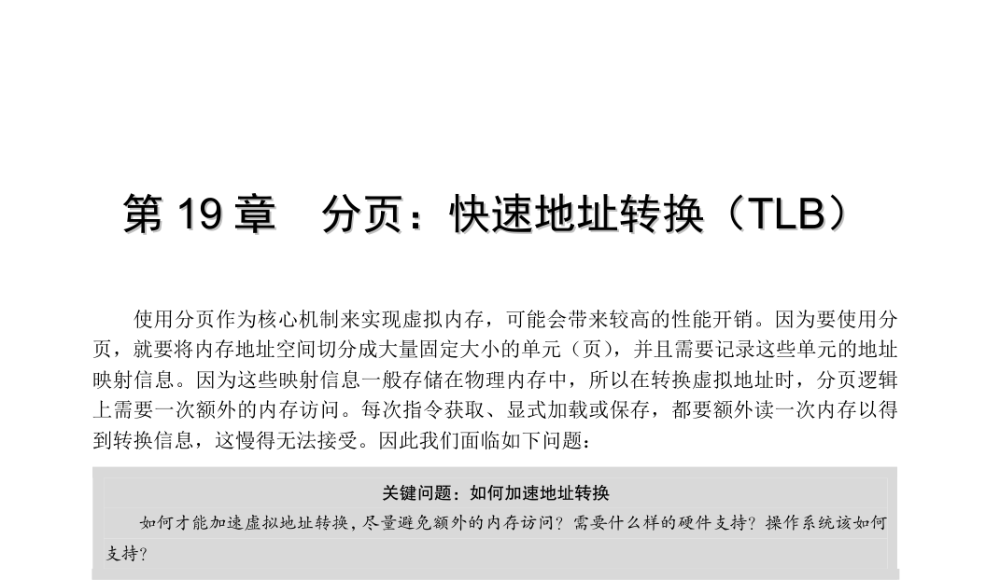
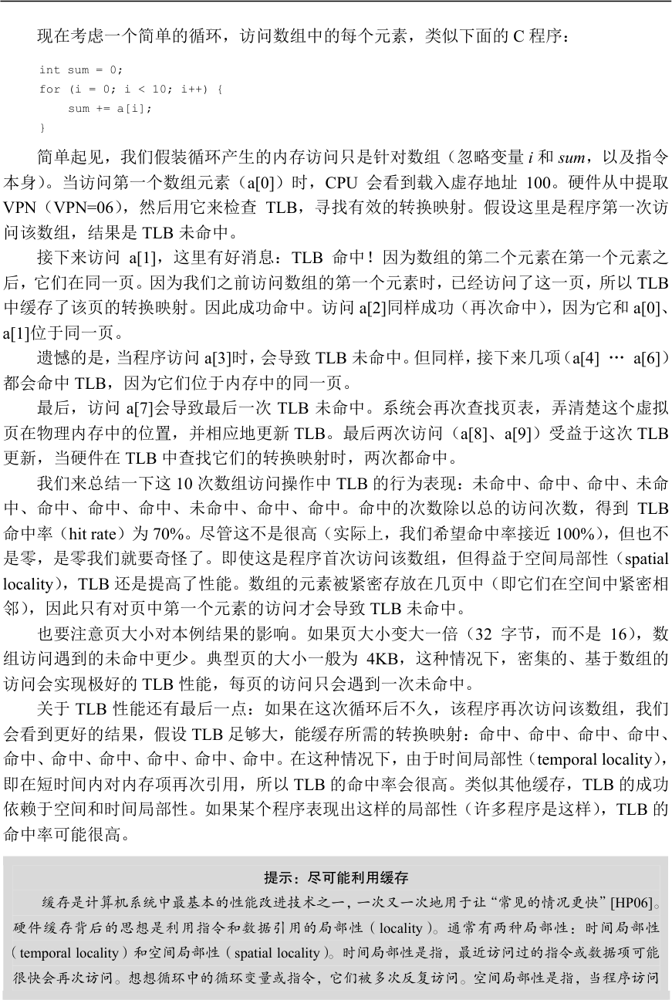
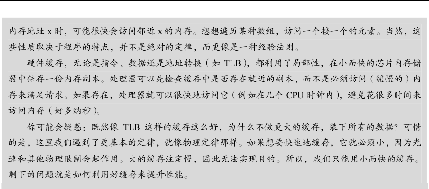
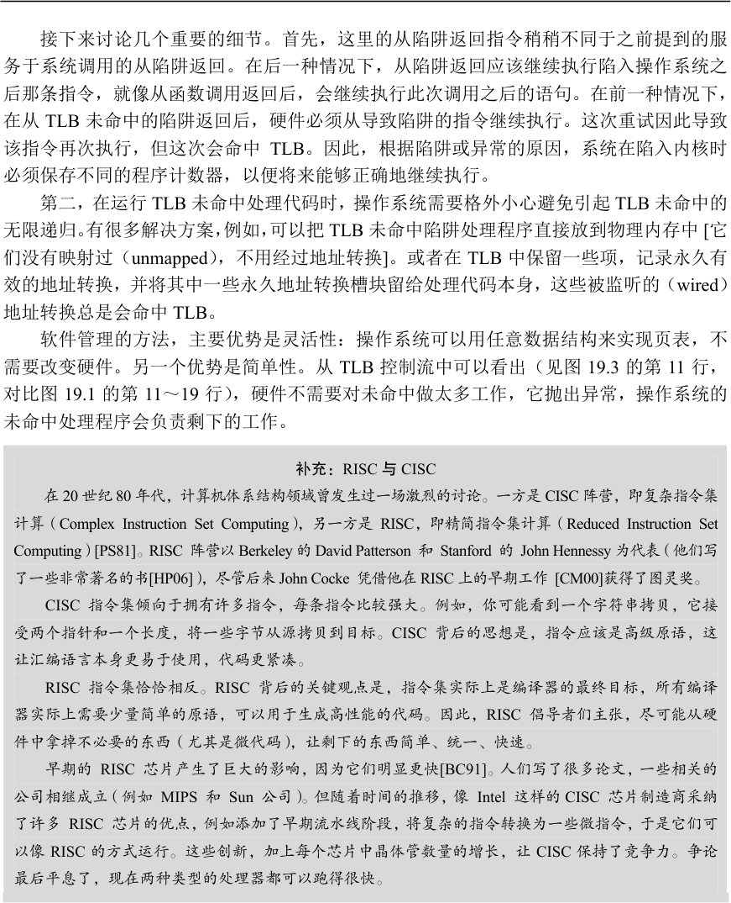
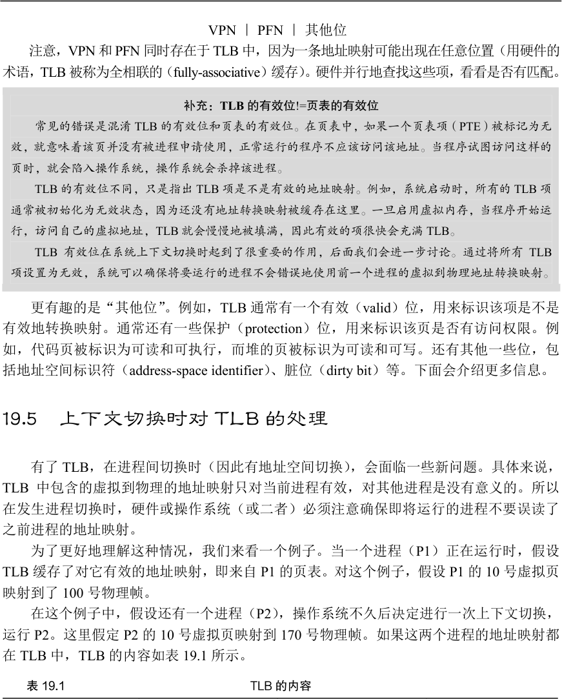
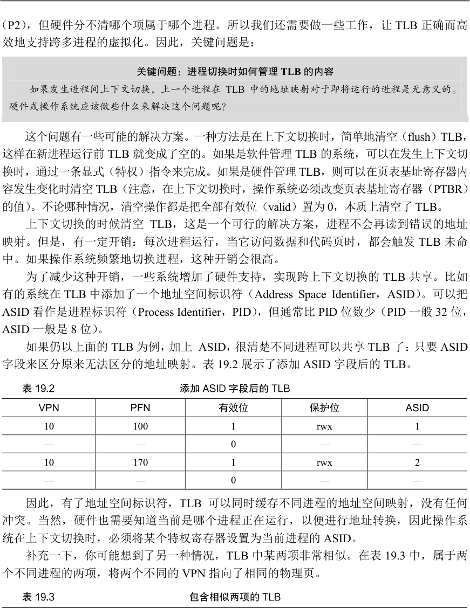
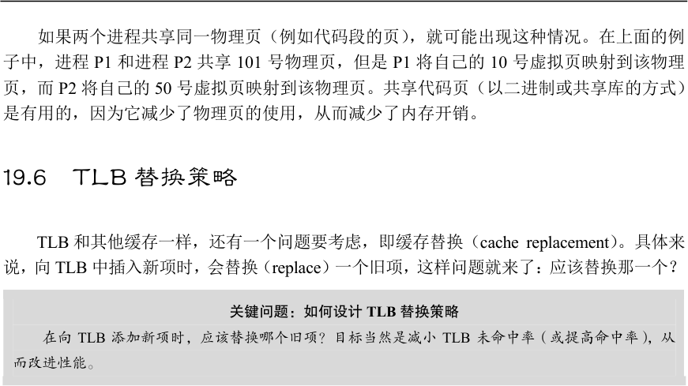
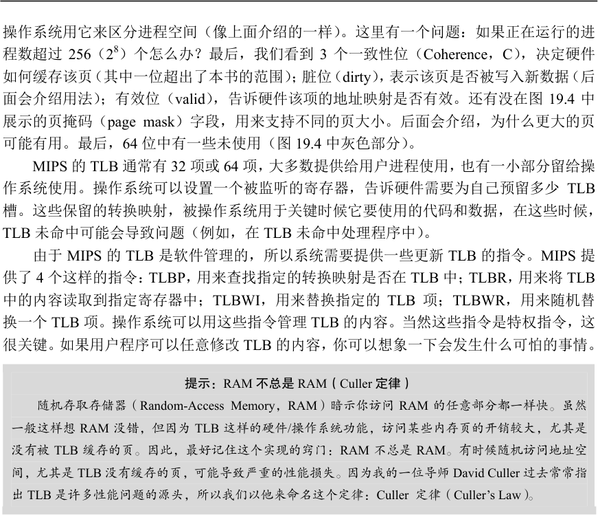

# 第19 章  分页：快速地址转换（TLB）

使用分页作为核心机制来实现虚拟内存，可能会带来较高的性能开销。因为要使用分页，就要将内存地址空间切分成大量固定大小的单元（页），并且需要记录这些单元的地址映射信息。因为这些映射信息一般存储在物理内存中，所以在转换虚拟地址时，分页逻辑上需要一次额外的内存访问。每次指令获取、显式加载或保存，都要额外读一次内存以得到转换信息，这慢得无法接受。因此我们面临如下问题：

关键问题：如何加速地址转换

如何才能加速虚拟地址转换，尽量避免额外的内存访问？需要什么样的硬件支持？操作系统该如何

支持？

想让某些东西更快，操作系统通常需要一些帮助。帮助常常来自操作系统的老朋友：硬件。我们要增加所谓的（由于历史原因[CP78]）地址转换旁路缓冲存储器（translation-lookaside buffer，TLB[CG68,C95]），它就是频繁发生的虚拟到物理地址转换的硬件缓存（cache）。因此，更好的名称应该是地址转换缓存（address-translation cache）。对每次内存访问，硬件先检查TLB，看看其中是否有期望的转换映射，如果有，就完成转换（很快），不用访问页表（其中有全部的转换映射）。TLB 带来了巨大的性能提升，实际上，因此它使得虚拟内存成

为可能[C95]。

## 19.1  TLB 的基本算法

图19.1 展示了一个大体框架，说明硬件如何处理虚拟地址转换，假定使用简单的线性页表（linear page table，即页表是一个数组）和硬件管理的TLB（hardware-managed TLB，即硬件承担许多页表访问的责任，下面会有更多解释）。

1    VPN = (VirtualAddress & VPN_MASK) >> SHIFT

2    (Success, TlbEntry) = TLB_Lookup(VPN)

3    if (Success == True)    // TLB Hit

4        if (CanAccess(TlbEntry.ProtectBits) == True)

5            Offset   = VirtualAddress & OFFSET_MASK

6            PhysAddr = (TlbEntry.PFN << SHIFT) | Offset

7            AccessMemory(PhysAddr)

8        else

9            RaiseException(PROTECTION_FAULT)

10   else    // TLB Miss

11       PTEAddr = PTBR + (VPN * sizeof(PTE))

12       PTE = AccessMemory(PTEAddr)

13       if (PTE.Valid == False)

14           RaiseException(SEGMENTATION_FAULT)

15       else if (CanAccess(PTE.ProtectBits) == False)

16           RaiseException(PROTECTION_FAULT)

17       else

18           TLB_Insert(VPN, PTE.PFN, PTE.ProtectBits)

19           RetryInstruction()

图19.1  TLB 控制流算法

硬件算法的大体流程如下：首先从虚拟地址中提取页号（VPN）（见图19.1 第1 行），然后检查TLB 是否有该VPN 的转换映射（第2 行）。如果有，我们有了TLB 命中（TLB hit），这意味着TLB 有该页的转换映射。成功！接下来我们就可以从相关的TLB 项中取出页帧号（PFN），与原来虚拟地址中的偏移量组合形成期望的物理地址（PA），并访问内存（第5～7

行），假定保护检查没有失败（第4 行）。

如果CPU 没有在TLB 中找到转换映射（TLB 未命中），我们有一些工作要做。在本例中，硬件访问页表来寻找转换映射（第11～12 行），并用该转换映射更新TLB（第18 行），假设该虚拟地址有效，而且我们有相关的访问权限（第13、15 行）。上述系列操作开销较大，主要是因为访问页表需要额外的内存引用（第12 行）。最后，当TLB 更新成功后，系统会重新尝试该指令，这时TLB 中有了这个转换映射，内存引用得到很快处理。

TLB 和其他缓存相似，前提是在一般情况下，转换映射会在缓存中（即命中）。如果是这样，只增加了很少的开销，因为TLB 处理器核心附近，设计的访问速度很快。如果TLB未命中，就会带来很大的分页开销。必须访问页表来查找转换映射，导致一次额外的内存引用（或者更多，如果页表更复杂）。如果这经常发生，程序的运行就会显著变慢。相对于大多数CPU 指令，内存访问开销很大，TLB 未命中导致更多内存访问。因此，我们希望尽可能避免TLB 未命中。

## 19.2  示例：访问数组

为了弄清楚TLB 的操作，我们来看一个简单虚拟地址追踪，看看TLB 如何提高它的性能。在本例中，假设有一个由10 个4 字节整型数组成的数组，起始虚地址是100。进一步假定，有一个8 位的小虚地址空间，页大小为16B。我们可以把虚地址划分为4 位的VPN（有16 个虚拟内存页）和4 位的偏移量（每个页中有16 个字节）。

图19.2  示例：小地址

图19.2 展示了该数组的布局，在系统的16 个16 字节的页上。如你所见，数组的第一项（a[0]）开始于（VPN=06，offset=04），只有3 个4 字节整型数存放在该页。数组在下一页（VPN=07）继续，其中有接下来4 项（a[3] … a[6]）。10 个元素的数组的最后3 项（a[7] … a[9]）位于地址空间的下一页（VPN=08）。

空间中的一个数组

现在考虑一个简单的循环，访问数组中的每个元素，类似下面的C 程序：

int sum = 0;

for (i = 0; i < 10; i++) {

sum += a[i];

}  简单起见，我们假装循环产生的内存访问只是针对数组（忽略变量i 和sum，以及指令本身）。当访问第一个数组元素（a[0]）时，CPU 会看到载入虚存地址100。硬件从中提取VPN（VPN=06），然后用它来检查TLB，寻找有效的转换映射。假设这里是程序第一次访问该数组，结果是TLB 未命中。

接下来访问a[1]，这里有好消息：TLB 命中！因为数组的第二个元素在第一个元素之后，它们在同一页。因为我们之前访问数组的第一个元素时，已经访问了这一页，所以TLB中缓存了该页的转换映射。因此成功命中。访问a[2]同样成功（再次命中），因为它和a[0]、a[1]位于同一页。

遗憾的是，当程序访问a[3]时，会导致TLB 未命中。但同样，接下来几项（a[4] … a[6]）都会命中TLB，因为它们位于内存中的同一页。

最后，访问a[7]会导致最后一次TLB 未命中。系统会再次查找页表，弄清楚这个虚拟页在物理内存中的位置，并相应地更新TLB。最后两次访问（a[8]、a[9]）受益于这次TLB更新，当硬件在TLB 中查找它们的转换映射时，两次都命中。

我们来总结一下这10 次数组访问操作中TLB 的行为表现：未命中、命中、命中、未命中、命中、命中、命中、未命中、命中、命中。命中的次数除以总的访问次数，得到TLB命中率（hit rate）为70%。尽管这不是很高（实际上，我们希望命中率接近100%），但也不是零，是零我们就要奇怪了。即使这是程序首次访问该数组，但得益于空间局部性（spatial locality），TLB 还是提高了性能。数组的元素被紧密存放在几页中（即它们在空间中紧密相邻），因此只有对页中第一个元素的访问才会导致TLB 未命中。

也要注意页大小对本例结果的影响。如果页大小变大一倍（32 字节，而不是16），数组访问遇到的未命中更少。典型页的大小一般为4KB，这种情况下，密集的、基于数组的访问会实现极好的TLB 性能，每页的访问只会遇到一次未命中。

关于TLB 性能还有最后一点：如果在这次循环后不久，该程序再次访问该数组，我们会看到更好的结果，假设TLB 足够大，能缓存所需的转换映射：命中、命中、命中、命中、命中、命中、命中、命中、命中、命中。在这种情况下，由于时间局部性（temporal locality），即在短时间内对内存项再次引用，所以TLB 的命中率会很高。类似其他缓存，TLB 的成功依赖于空间和时间局部性。如果某个程序表现出这样的局部性（许多程序是这样），TLB 的命中率可能很高。

提示：尽可能利用缓存

缓存是计算机系统中最基本的性能改进技术之一，一次又一次地用于让“常见的情况更快”[HP06]。

硬件缓存背后的思想是利用指令和数据引用的局部性（locality）。通常有两种局部性：时间局部性

（temporal locality）和空间局部性（spatial locality）。时间局部性是指，最近访问过的指令或数据项可能

很快会再次访问。想想循环中的循环变量或指令，它们被多次反复访问。空间局部性是指，当程序访问

内存地址x 时，可能很快会访问邻近x 的内存。想想遍历某种数组，访问一个接一个的元素。当然，这

些性质取决于程序的特点，并不是绝对的定律，而更像是一种经验法则。

硬件缓存，无论是指令、数据还是地址转换（如TLB），都利用了局部性，在小而快的芯片内存储

器中保存一份内存副本。处理器可以先检查缓存中是否存在就近的副本，而不是必须访问（缓慢的）内

存来满足请求。如果存在，处理器就可以很快地访问它（例如在几个CPU 时钟内），避免花很多时间来

访问内存（好多纳秒）。

你可能会疑惑：既然像TLB 这样的缓存这么好，为什么不做更大的缓存，装下所有的数据？可惜

的是，这里我们遇到了更基本的定律，就像物理定律那样。如果想要快速地缓存，它就必须小，因为光

速和其他物理限制会起作用。大的缓存注定慢，因此无法实现目的。所以，我们只能用小而快的缓存。

剩下的问题就是如何利用好缓存来提升性能。

## 19.3  谁来处理TLB 未命中

有一个问题我们必须回答：谁来处理TLB 未命中？可能有两个答案：硬件或软件（操作系统）。以前的硬件有复杂的指令集（有时称为复杂指令集计算机，Complex-Instruction Set Computer，CISC），造硬件的人不太相信那些搞操作系统的人。因此，硬件全权处理TLB未命中。为了做到这一点，硬件必须知道页表在内存中的确切位置（通过页表基址寄存器，page-table base register，在图19.1 的第11 行使用），以及页表的确切格式。发生未命中时，硬件会“遍历”页表，找到正确的页表项，取出想要的转换映射，用它更新TLB，并重试该指令。这种“旧”体系结构有硬件管理的TLB，一个例子是x86 架构，它采用固定的多级页表（multi-level page table，详见第20 章），当前页表由CR3 寄存器指出[I09]。

更现代的体系结构（例如，MIPS R10k[H93]、Sun 公司的SPARC v9[WG00]，都是精简指令集计算机，Reduced-Instruction Set Computer，RISC），有所谓的软件管理TLB（software- managed TLB）。发生TLB 未命中时，硬件系统会抛出一个异常（见图19.3 第11 行），这会暂停当前的指令流，将特权级提升至内核模式，跳转至陷阱处理程序（trap handler）。接下来你可能已经猜到了，这个陷阱处理程序是操作系统的一段代码，用于处理TLB 未命中。这段代码在运行时，会查找页表中的转换映射，然后用特别的“特权”指令更新TLB，并从陷阱返回。此时，硬件会重试该指令（导致TLB 命中）。

1    VPN = (VirtualAddress & VPN_MASK) >> SHIFT

2    (Success, TlbEntry) = TLB_Lookup(VPN)

3    if (Success == True)    // TLB Hit

4        if (CanAccess(TlbEntry.ProtectBits) == True)

5            Offset    = VirtualAddress & OFFSET_MASK

6            PhysAddr = (TlbEntry.PFN << SHIFT) | Offset

7            Register = AccessMemory(PhysAddr)

8        else

9            RaiseException(PROTECTION_FAULT)

10   else                    // TLB Miss

11       RaiseException(TLB_MISS) 图19.3  TLB 控制流算法（操作系统处理）

接下来讨论几个重要的细节。首先，这里的从陷阱返回指令稍稍不同于之前提到的服务于系统调用的从陷阱返回。在后一种情况下，从陷阱返回应该继续执行陷入操作系统之后那条指令，就像从函数调用返回后，会继续执行此次调用之后的语句。在前一种情况下，在从TLB 未命中的陷阱返回后，硬件必须从导致陷阱的指令继续执行。这次重试因此导致该指令再次执行，但这次会命中TLB。因此，根据陷阱或异常的原因，系统在陷入内核时必须保存不同的程序计数器，以便将来能够正确地继续执行。

第二，在运行TLB 未命中处理代码时，操作系统需要格外小心避免引起TLB 未命中的无限递归。有很多解决方案，例如，可以把TLB 未命中陷阱处理程序直接放到物理内存中 [它们没有映射过（unmapped），不用经过地址转换]。或者在TLB 中保留一些项，记录永久有效的地址转换，并将其中一些永久地址转换槽块留给处理代码本身，这些被监听的（wired）地址转换总是会命中TLB。

软件管理的方法，主要优势是灵活性：操作系统可以用任意数据结构来实现页表，不需要改变硬件。另一个优势是简单性。从TLB 控制流中可以看出（见图19.3 的第11 行，对比图19.1 的第11～19 行），硬件不需要对未命中做太多工作，它抛出异常，操作系统的未命中处理程序会负责剩下的工作。

补充：RISC 与CISC

在20 世纪80 年代，计算机体系结构领域曾发生过一场激烈的讨论。一方是CISC 阵营，即复杂指令集

计算（Complex Instruction Set Computing），另一方是RISC，即精简指令集计算（Reduced Instruction Set

Computing）[PS81]。RISC 阵营以Berkeley 的David Patterson 和 Stanford 的 John Hennessy 为代表（他们写

了一些非常著名的书[HP06]），尽管后来John Cocke 凭借他在RISC 上的早期工作 [CM00]获得了图灵奖。

CISC 指令集倾向于拥有许多指令，每条指令比较强大。例如，你可能看到一个字符串拷贝，它接

受两个指针和一个长度，将一些字节从源拷贝到目标。CISC 背后的思想是，指令应该是高级原语，这

让汇编语言本身更易于使用，代码更紧凑。

RISC 指令集恰恰相反。RISC 背后的关键观点是，指令集实际上是编译器的最终目标，所有编译

器实际上需要少量简单的原语，可以用于生成高性能的代码。因此，RISC 倡导者们主张，尽可能从硬

件中拿掉不必要的东西（尤其是微代码），让剩下的东西简单、统一、快速。

早期的 RISC 芯片产生了巨大的影响，因为它们明显更快[BC91]。人们写了很多论文，一些相关的

公司相继成立（例如 MIPS 和 Sun 公司）。但随着时间的推移，像 Intel 这样的CISC 芯片制造商采纳

了许多 RISC 芯片的优点，例如添加了早期流水线阶段，将复杂的指令转换为一些微指令，于是它们可

以像RISC 的方式运行。这些创新，加上每个芯片中晶体管数量的增长，让CISC 保持了竞争力。争论

最后平息了，现在两种类型的处理器都可以跑得很快。

## 19.4  TLB 的内容

我们来详细看一下硬件TLB 中的内容。典型的TLB 有32 项、64 项或128 项，并且是全相联的（fully associative）。基本上，这就意味着一条地址映射可能存在TLB 中的任意位置，硬件会并行地查找TLB，找到期望的转换映射。一条TLB 项内容可能像下面这样：

VPN ｜ PFN ｜ 其他位 注意，VPN 和PFN 同时存在于TLB 中，因为一条地址映射可能出现在任意位置（用硬件的术语，TLB 被称为全相联的（fully-associative）缓存）。硬件并行地查找这些项，看看是否有匹配。

补充：TLB 的有效位!=页表的有效位

常见的错误是混淆TLB 的有效位和页表的有效位。在页表中，如果一个页表项（PTE）被标记为无

效，就意味着该页并没有被进程申请使用，正常运行的程序不应该访问该地址。当程序试图访问这样的

页时，就会陷入操作系统，操作系统会杀掉该进程。

TLB 的有效位不同，只是指出TLB 项是不是有效的地址映射。例如，系统启动时，所有的TLB 项

通常被初始化为无效状态，因为还没有地址转换映射被缓存在这里。一旦启用虚拟内存，当程序开始运

行，访问自己的虚拟地址，TLB 就会慢慢地被填满，因此有效的项很快会充满TLB。

TLB 有效位在系统上下文切换时起到了很重要的作用，后面我们会进一步讨论。通过将所有TLB

项设置为无效，系统可以确保将要运行的进程不会错误地使用前一个进程的虚拟到物理地址转换映射。

更有趣的是“其他位”。例如，TLB 通常有一个有效（valid）位，用来标识该项是不是有效地转换映射。通常还有一些保护（protection）位，用来标识该页是否有访问权限。例如，代码页被标识为可读和可执行，而堆的页被标识为可读和可写。还有其他一些位，包括地址空间标识符（address-space identifier）、脏位（dirty bit）等。下面会介绍更多信息。

## 19.5  上下文切换时对TLB 的处理

有了TLB，在进程间切换时（因此有地址空间切换），会面临一些新问题。具体来说，TLB 中包含的虚拟到物理的地址映射只对当前进程有效，对其他进程是没有意义的。所以在发生进程切换时，硬件或操作系统（或二者）必须注意确保即将运行的进程不要误读了之前进程的地址映射。

为了更好地理解这种情况，我们来看一个例子。当一个进程（P1）正在运行时，假设TLB 缓存了对它有效的地址映射，即来自P1 的页表。对这个例子，假设P1 的10 号虚拟页映射到了100 号物理帧。

在这个例子中，假设还有一个进程（P2），操作系统不久后决定进行一次上下文切换，运行P2。这里假定P2 的10 号虚拟页映射到170 号物理帧。如果这两个进程的地址映射都在TLB 中，TLB 的内容如表19.1 所示。

表19.1   TLB 的内容

VPN PFN 有效位 保护位

10 100 1 rwx

— — 0 —

10 170 1 rwx

— — 0 —  在上面的TLB 中，很明显有一个问题：VPN 10 被转换成了 PFN 100（P1）和PFN 170

（P2），但硬件分不清哪个项属于哪个进程。所以我们还需要做一些工作，让TLB 正确而高

效地支持跨多进程的虚拟化。因此，关键问题是：

关键问题：进程切换时如何管理TLB 的内容

如果发生进程间上下文切换，上一个进程在TLB 中的地址映射对于即将运行的进程是无意义的。

硬件或操作系统应该做些什么来解决这个问题呢？

这个问题有一些可能的解决方案。一种方法是在上下文切换时，简单地清空（flush）TLB，这样在新进程运行前TLB 就变成了空的。如果是软件管理TLB 的系统，可以在发生上下文切换时，通过一条显式（特权）指令来完成。如果是硬件管理TLB，则可以在页表基址寄存器内容发生变化时清空TLB（注意，在上下文切换时，操作系统必须改变页表基址寄存器（PTBR）的值）。不论哪种情况，清空操作都是把全部有效位（valid）置为0，本质上清空了TLB。

上下文切换的时候清空TLB，这是一个可行的解决方案，进程不会再读到错误的地址映射。但是，有一定开销：每次进程运行，当它访问数据和代码页时，都会触发TLB 未命中。如果操作系统频繁地切换进程，这种开销会很高。

为了减少这种开销，一些系统增加了硬件支持，实现跨上下文切换的TLB 共享。比如有的系统在TLB 中添加了一个地址空间标识符（Address Space Identifier，ASID）。可以把ASID 看作是进程标识符（Process Identifier，PID），但通常比PID 位数少（PID 一般32 位，ASID 一般是8 位）。

如果仍以上面的TLB 为例，加上 ASID，很清楚不同进程可以共享TLB 了：只要ASID字段来区分原来无法区分的地址映射。表19.2 展示了添加ASID 字段后的TLB。

表19.2 添加ASID 字段后的TLB

VPN PFN 有效位 保护位 ASID

10 100 1 rwx 1

— — 0 — —

10 170 1 rwx 2

— — 0 — —  因此，有了地址空间标识符，TLB 可以同时缓存不同进程的地址空间映射，没有任何冲突。当然，硬件也需要知道当前是哪个进程正在运行，以便进行地址转换，因此操作系统在上下文切换时，必须将某个特权寄存器设置为当前进程的ASID。

补充一下，你可能想到了另一种情况，TLB 中某两项非常相似。在表19.3 中，属于两个不同进程的两项，将两个不同的VPN 指向了相同的物理页。

表19.3 包含相似两项的TLB

VPN PFN 有效位 保护位 ASID

10 101 1 r-x 1

— — 0 — —

50 101 1 r-x 2

— — 0 — —

如果两个进程共享同一物理页（例如代码段的页），就可能出现这种情况。在上面的例子中，进程P1 和进程P2 共享101 号物理页，但是P1 将自己的10 号虚拟页映射到该物理页，而P2 将自己的50 号虚拟页映射到该物理页。共享代码页（以二进制或共享库的方式）是有用的，因为它减少了物理页的使用，从而减少了内存开销。

## 19.6  TLB 替换策略

TLB 和其他缓存一样，还有一个问题要考虑，即缓存替换（cache replacement）。具体来说，向TLB 中插入新项时，会替换（replace）一个旧项，这样问题就来了：应该替换那一个？

关键问题：如何设计TLB 替换策略

在向TLB 添加新项时，应该替换哪个旧项？目标当然是减小TLB 未命中率（或提高命中率），从

而改进性能。

在讨论页换出到磁盘的问题时，我们将详细研究这样的策略。这里我们先简单指出几个典型的策略。一种常见的策略是替换最近最少使用（least-recently-used，LRU）的项。LRU尝试利用内存引用流中的局部性，假定最近没有用过的项，可能是好的换出候选项。另一种典型策略就是随机（random）策略，即随机选择一项换出去。这种策略很简单，并且可以避免一种极端情况。例如，一个程序循环访问n+1 个页，但TLB 大小只能存放n 个页。这时之前看似“合理”的LRU 策略就会表现得不可理喻，因为每次访问内存都会触发TLB未命中，而随机策略在这种情况下就好很多。

## 19.7  实际系统的TLB 表项

最后，我们简单看一下真实的TLB。这个例子来自MIPS R4000[H93]，它是一种现代的系统，采用软件管理TLB。图19.4 展示了稍微简化的MIPS TLB 项。

图19.4  MIPS 的TLB 项

MIPS R4000 支持32 位的地址空间，页大小为4KB。所以在典型的虚拟地址中，预期会看到20 位的VPN 和12 位的偏移量。但是，你可以在TLB 中看到，只有19 位的VPN。事实上，用户地址只占地址空间的一半（剩下的留给内核），所以只需要19 位的 VPN。VPN转换成最大24 位的物理帧号（PFN），因此可以支持最多有64GB 物理内存（224 个4KB 内存页）的系统。

MIPS TLB 还有一些有趣的标识位。比如全局位（Global，G），用来指示这个页是不是所有进程全局共享的。因此，如果全局位置为1，就会忽略ASID。我们也看到了8 位的ASID，

操作系统用它来区分进程空间（像上面介绍的一样）。这里有一个问题：如果正在运行的进程数超过256（28）个怎么办？最后，我们看到3 个一致性位（Coherence，C），决定硬件如何缓存该页（其中一位超出了本书的范围）；脏位（dirty），表示该页是否被写入新数据（后面会介绍用法）；有效位（valid），告诉硬件该项的地址映射是否有效。还有没在图19.4 中展示的页掩码（page mask）字段，用来支持不同的页大小。后面会介绍，为什么更大的页可能有用。最后，64 位中有一些未使用（图19.4 中灰色部分）。

MIPS 的TLB 通常有32 项或64 项，大多数提供给用户进程使用，也有一小部分留给操作系统使用。操作系统可以设置一个被监听的寄存器，告诉硬件需要为自己预留多少TLB槽。这些保留的转换映射，被操作系统用于关键时候它要使用的代码和数据，在这些时候，TLB 未命中可能会导致问题（例如，在TLB 未命中处理程序中）。

由于MIPS 的TLB 是软件管理的，所以系统需要提供一些更新TLB 的指令。MIPS 提供了4 个这样的指令：TLBP，用来查找指定的转换映射是否在TLB 中；TLBR，用来将TLB中的内容读取到指定寄存器中；TLBWI，用来替换指定的TLB 项；TLBWR，用来随机替换一个TLB 项。操作系统可以用这些指令管理TLB 的内容。当然这些指令是特权指令，这很关键。如果用户程序可以任意修改TLB 的内容，你可以想象一下会发生什么可怕的事情。

提示：RAM 不总是RAM（Culler 定律）

随机存取存储器（Random-Access Memory，RAM）暗示你访问RAM 的任意部分都一样快。虽然

一般这样想RAM 没错，但因为TLB 这样的硬件/操作系统功能，访问某些内存页的开销较大，尤其是

没有被TLB 缓存的页。因此，最好记住这个实现的窍门：RAM 不总是RAM。有时候随机访问地址空

间，尤其是TLB 没有缓存的页，可能导致严重的性能损失。因为我的一位导师David Culler 过去常常指

出TLB 是许多性能问题的源头，所以我们以他来命名这个定律：Culler 定律（Culler’s Law）。

## 19.8  小结

我们了解了硬件如何让地址转换更快的方法。通过增加一个小的、芯片内的TLB 作为地址转换的缓存，大多数内存引用就不用访问内存中的页表了。因此，在大多数情况下，程序的性能就像内存没有虚拟化一样，这是操作系统的杰出成就，当然对现代操作系统中的分页非常必要。

但是，TLB 也不能满足所有的程序需求。具体来说，如果一个程序短时间内访问的页数超过了TLB 中的页数，就会产生大量的TLB 未命中，运行速度就会变慢。这种现象被称为超出TLB 覆盖范围（TLB coverage），这对某些程序可能是相当严重的问题。解决这个问题的一种方案是支持更大的页，把关键数据结构放在程序地址空间的某些区域，这些区域被映射到更大的页，使TLB 的有效覆盖率增加。对更大页的支持通常被数据库管理系统（Database Management System，DBMS）这样的程序利用，它们的数据结构比较大，而且是

随机访问。

另一个TLB 问题值得一提：访问TLB 很容易成为CPU 流水线的瓶颈，尤其是有所谓

的物理地址索引缓存（physically-indexed cache）。有了这种缓存，地址转换必须发生在访问该缓存之前，这会让操作变慢。为了解决这个潜在的问题，人们研究了各种巧妙的方法，用虚拟地址直接访问缓存，从而在缓存命中时避免昂贵的地址转换步骤。像这种虚拟地址索引缓存（virtually-indexed cache）解决了一些性能问题，但也为硬件设计带来了新问题。更多细节请参考 Wiggins 的调查[W03]。

## 参考资料

[BC91]“Performance from Architecture: Comparing a RISC and a CISC with Similar Hardware Organization”

D. Bhandarkar and Douglas W. Clark

Communications of the ACM, September 1991

关于RISC 和CISC 的一篇很好的、公平的比较性的文章。本质上，在类似的硬件上，RISC 的性能是CISC

的3 倍。

[CM00]“The evolution of RISC technology at IBM”John Cocke and V. Markstein

IBM Journal of Research and Development, 44:1/2

IBM 801 的概念和工作总结，许多人认为它是第一款真正的RISC 微处理器。

[C95]“The Core of the Black Canyon Computer Corporation”John Couleur

IEEE Annals of History of Computing, 17:4, 1995

在这个引人入胜的计算历史讲义中，Couleur 谈到了他在1964 年为通用电气公司工作时如何发明了TLB，

以及与麻省理工学院的MAC 项目人员之间偶然而幸运的合作。

[CG68]“Shared-access Data Processing System”John F. Couleur and Edward L. Glaser

Patent 3412382, November 1968

包含用关联存储器存储地址转换的想法的专利。据Couleur 说，这个想法产生于1964 年。

[CP78]“The architecture of the IBM System/370”

R.P. Case and A. Padegs

Communications of the ACM. 21:1, 73-96, January 1978

也许是第一篇使用术语“地址转换旁路缓冲存储器（translation lookaside buffer）”的文章。 这个名字来源

于缓存的历史名称，即旁路缓冲存储器（lookaside buffer），在曼彻斯特大学开发Atlas 系统的人这样叫它。

地址转换缓存因此成为地址转换旁路缓冲存储器。尽管术语“旁路缓冲存储器”不再流行，但TLB 似乎仍

在持续使用，其原因不明。

[H93]“MIPS R4000 Microprocessor User’s Manual”. Joe Heinrich, Prentice-Hall, June 1993

[HP06]“Computer Architecture: A Quantitative Approach” John Hennessy and David Patterson

Morgan-Kaufmann,  2006

一本关于计算机架构的好书。我们对经典的第1 版特别有感情。

[I09]“Intel 64 and IA-32 Architectures Software Developer’s Manuals”Intel, 2009

Available.

尤其要注意《卷3A：系统编程指南第1 部分》和《卷3B：系统编程指南第2 部分》。

[PS81]“RISC-I: A Reduced Instruction Set VLSI Computer”

D.A．Patterson and C.H. Sequin ISCA ’81, Minneapolis, May 1981

这篇文章介绍了RISC 这个术语，开启了为性能而简化计算机芯片的研究狂潮。

[SB92]“CPU Performance Evaluation and Execution Time Prediction Using Narrow Spectrum Benchmarking”

Rafael H. Saavedra-Barrera

EECS Department, University of California, Berkeley Technical Report No. UCB/CSD-92-684, February 1992

一篇卓越的论文，探讨将应用的执行时间分解为组成部分，知道每个部分的成本，从而预测应用的执行时

间。也许这项工作最有趣的部分是衡量缓存层次结构细节的工具（在第5 章中介绍）。一定要看看其中的精

彩图表。

[W03]“A Survey on the Interaction Between Caching, Translation and Protection”Adam Wiggins

University of New South Wales TR UNSW-CSE-TR-0321, August, 2003

关于TLB 如何与CPU 管道的其他部分（即硬件缓存）进行交互的一次很好的调查。

[WG00]“The SPARC Architecture Manual: Version 9”David L. Weaver and Tom Germond, September 2000

SPARC International, San Jose, California

## 作业（测量）

本次作业要测算一下TLB 的容量和访问TLB 的开销。这个想法参考了Saavedra-Barrera 的工作[SB92]，他用设计了一个简单而漂亮的用户级程序，来测算缓存层级结构的方方面面。更多细节请阅读他的论文。

基本原理就是访问一个跨多个内存页的大尺寸数据结构（例如数组），然后统计访问时间。例如，假设一个机器的TLB 大小为4（这很小，但对这个讨论有用）。如果写一个程序访问4 个或更少的页，每次访问都会命中TLB，因此相对较快。但是，如果在一个循环里反复访问5 个或者更多的页，每次访问的开销就会突然跃升，因为发生TLB 未命中。

循环遍历数组一次的基本代码应该像这样：

int jump = PAGESIZE / sizeof(int);

for (i = 0; i < NUMPAGES * jump; i += jump) {

a[i] += 1;

}  在这个循环中，数组a 中每页的一个整数被更新，直到NUMPAGES 指定的页数。通过对这个循环反复执行计时（比如，在外层循环中执行几亿次这个循环，或者运行几秒钟所需的次数），就可以计算出平均每次访问所用的时间。随着NUMPAGES 的增加，寻找开销

的跃升，可以大致确定第一级TLB 的大小，确定是否存在第二级TLB（如果存在，确定它的大小），总体上很好地理解TLB 命中和未命中对于性能的影响。

图19.5 是一张示意图。

从图19.5 中可以看出，如果只访问少数页（8 或更少），平均访问时间大约是5ns。如果访问16 页或更多，每次访问时间突然跃升到20ns。最后一次开销跃升发生在1024 页时，这时每次访问大约要70ns。通过这些数据，我们可以总结出这是一个二级的TLB，第一级较小（大约能存放8～16 项），第二级较大，但较慢（大约能

存放512 项）。第一级TLB 的命中和完全未命中的总体差距非常大，大约有14 倍。TLB 的性能很重要！

图19.5  发现TLB 大小和未命中开销

## 问题

1．为了计时，可能需要一个计时器，例如gettimeofday()提供的。这种计时器的精度如何？操作要花多少时间，才能让你对它精确计时？（这有助于确定需要循环多少次，反复访问内存页，才能对它成功计时。）

2．写一个程序，命名为tlb.c，大体测算一下每个页的平均访问时间。程序的输入参数有：页的数目和尝试的次数。

3．用你喜欢的脚本语言（csh、Python 等）写一段脚本来运行这个程序，当访问页面从1 增长到几千，也许每次迭代都乘2。在不同的机器上运行这段脚本，同时收集相应数据。需要试多少次才能获得可信的测量结果？

4．接下来，将结果绘图，类似于上图。可以用ploticus 这样的好工具画图。可视化使数据更容易理解，你认为是什么原因？

5．要注意编译器优化带来的影响。编译器做各种聪明的事情，包括优化掉循环，如果循环中增加的变量后续没有使用。如何确保编译器不优化掉你写的TLB 大小测算程序的主循环？

6．还有一个需要注意的地方，今天的计算机系统大多有多个CPU，每个CPU 当然有自己的TLB 结构。为了得到准确的测量数据，我们需要只在一个CPU 上运行程序，避免调度器把进程从一个CPU 调度到另一个去运行。如何做到？（提示：在Google 上搜索“pinning a thread”相关的信息）如果没有这样做，代码从一个CPU 移到了另一个，会发生什么情况？

7．另一个可能发生的问题与初始化有关。如果在访问数组a 之前没有初始化，第一次访问将非常耗时，由于初始访问开销，比如要求置0。这会影响你的代码及其计时吗？如何抵消这些潜在的开销？