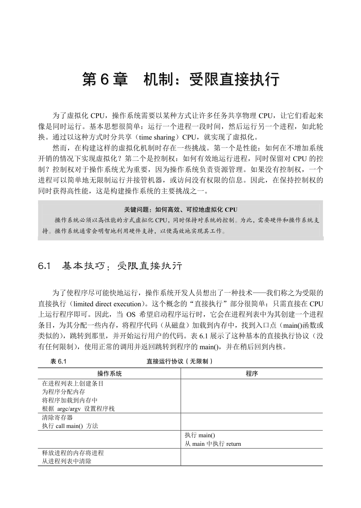
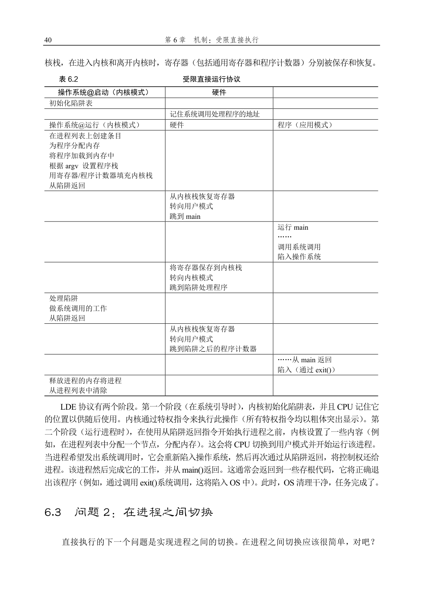
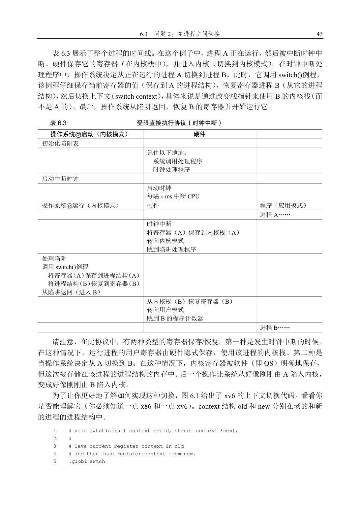

# 第6 章  机制：受限直接执行

听起来很简单，不是吗？但是，这种方法在我们的虚拟化CPU 时产生了一些问题。第一个问题很简单：如果我们只运行一个程序，操作系统怎么能确保程序不做任何我们不希望它做的事，同时仍然高效地运行它？第二个问题：当我们运行一个进程时，操作系统如何让它停下来并切换到另一个进程，从而实现虚拟化CPU 所需的时分共享？

下面在回答这些问题时，我们将更好地了解虚拟化CPU 需要什么。在开发这些技术时，我们还会看到标题中的“受限”部分来自哪里。如果对运行程序没有限制，操作系统将无法控制任何事情，因此会成为“仅仅是一个库”——对于有抱负的操作系统而言，这真是非常令人悲伤的事！

## 6.2  问题1：受限制的操作

直接执行的明显优势是快速。该程序直接在硬件CPU 上运行，因此执行速度与预期的一样快。但是，在CPU 上运行会带来一个问题——如果进程希望执行某种受限操作（如向磁盘发出I/O 请求或获得更多系统资源（如CPU 或内存）），该怎么办？

关键问题：如何执行受限制的操作

一个进程必须能够执行I/O 和其他一些受限制的操作，但又不能让进程完全控制系统。操作系统和

硬件如何协作实现这一点？

提示：采用受保护的控制权转移

硬件通过提供不同的执行模式来协助操作系统。在用户模式（user mode）下，应用程序不能完全访

问硬件资源。在内核模式（kernel mode）下，操作系统可以访问机器的全部资源。还提供了陷入（trap）

内核和从陷阱返回（return-from-trap）到用户模式程序的特别说明，以及一些指令，让操作系统告诉硬

件陷阱表（trap table）在内存中的位置。

对于I/O 和其他相关操作，一种方法就是让所有进程做所有它想做的事情。但是，这样做导致无法构建许多我们想要的系统。例如，如果我们希望构建一个在授予文件访问权限前检查权限的文件系统，就不能简单地让任何用户进程向磁盘发出I/O。如果这样做，一个进程就可以读取或写入整个磁盘，这样所有的保护都会失效。

因此，我们采用的方法是引入一种新的处理器模式，称为用户模式（user mode）。在用户模式下运行的代码会受到限制。例如，在用户模式下运行时，进程不能发出I/O 请求。这样做会导致处理器引发异常，操作系统可能会终止进程。

与用户模式不同的内核模式（kernel mode），操作系统（或内核）就以这种模式运行。在此模式下，运行的代码可以做它喜欢的事，包括特权操作，如发出I/O 请求和执行所有类型的受限指令。

但是，我们仍然面临着一个挑战——如果用户希望执行某种特权操作（如从磁盘读取），应该怎么做？为了实现这一点，几乎所有的现代硬件都提供了用户程序执行系统调用的能力。系统调用是在Atlas [K+61，L78]等古老机器上开创的，它允许内核小心地向用户程序暴露某些关键功能，例如访问文件系统、创建和销毁进程、与其他进程通信，以及分配更

多内存。大多数操作系统提供几百个调用（详见POSIX 标准[P10]）。早期的UNIX 系统公开了更简洁的子集，大约20 个调用。

要执行系统调用，程序必须执行特殊的陷阱（trap）指令。该指令同时跳入内核并将特权级别提升到内核模式。一旦进入内核，系统就可以执行任何需要的特权操作（如果允许），从而为调用进程执行所需的工作。完成后，操作系统调用一个特殊的从陷阱返回（return-from-trap）指令，如你期望的那样，该指令返回到发起调用的用户程序中，同时将

特权级别降低，回到用户模式。

执行陷阱时，硬件需要小心，因为它必须确保存储足够的调用者寄存器，以便在操作系统发出从陷阱返回指令时能够正确返回。例如，在x86 上，处理器会将程序计数器、标志和其他一些寄存器推送到每个进程的内核栈（kernel stack）上。从返回陷阱将从栈弹出这些值，并恢复执行用户模式程序（有关详细信息，请参阅英特尔系统手册[I11]）。其他硬件系统使用不同的约定，但基本概念在各个平台上是相似的。

补充：为什么系统调用看起来像过程调用

你可能想知道，为什么对系统调用的调用（如open()或read()）看起来完全就像C 中的典型过程调用。

也就是说，如果它看起来像一个过程调用，系统如何知道这是一个系统调用，并做所有正确的事情？原因

很简单：它是一个过程调用，但隐藏在过程调用内部的是著名的陷阱指令。更具体地说，当你调用open()

（举个例子）时，你正在执行对C 库的过程调用。其中，无论是对于open()还是提供的其他系统调用，库

都使用与内核一致的调用约定来将参数放在众所周知的位置（例如，在栈中或特定的寄存器中），将系统

调用号也放入一个众所周知的位置（同样，放在栈或寄存器中），然后执行上述的陷阱指令。库中陷阱之

后的代码准备好返回值，并将控制权返回给发出系统调用的程序。因此，C 库中进行系统调用的部分是用

汇编手工编码的，因为它们需要仔细遵循约定，以便正确处理参数和返回值，以及执行硬件特定的陷阱指

令。现在你知道为什么你自己不必写汇编代码来陷入操作系统了，因为有人已经为你写了这些汇编。

还有一个重要的细节没讨论：陷阱如何知道在OS 内运行哪些代码？显然，发起调用的过程不能指定要跳转到的地址（就像你在进行过程调用时一样），这样做让程序可以跳转到内核中的任意位置，这显然是一个糟糕的主意（想象一下跳到访问文件的代码，但在权限检查之后。实际上，这种能力很可能让一个狡猾的程序员令内核运行任意代码序列[S07]）。因此内核必须谨慎地控制在陷阱上执行的代码。

内核通过在启动时设置陷阱表（trap table）来实现。当机器启动时，它在特权（内核）模式下执行，因此可以根据需要自由配置机器硬件。操作系统做的第一件事，就是告诉硬件在发生某些异常事件时要运行哪些代码。例如，当发生硬盘中断，发生键盘中断或程序进行系统调用时，应该运行哪些代码？操作系统通常通过某种特殊的指令，通知硬件这些陷阱处理程序的位置。一旦硬件被通知，它就会记住这些处理程序的位置，直到下一次重新启动机器，并且硬件知道在发生系统调用和其他异常事件时要做什么（即跳转到哪段代码）。

最后再插一句：能够执行指令来告诉硬件陷阱表的位置是一个非常强大的功能。因此，你可能已经猜到，这也是一项特权（privileged）操作。如果你试图在用户模式下执行这个指令，硬件不会允许，你可能会猜到会发生什么（提示：再见，违规程序）。思考问题：如果可以设置自己的陷阱表，你可以对系统做些什么？你能接管机器吗？

时间线（随着时间的推移向下，在表6.2 中）总结了该协议。我们假设每个进程都有一个内

操作系统应该决定停止一个进程并开始另一个进程。有什么大不了的？但实际上这有点棘手，特别是，如果一个进程在CPU 上运行，这就意味着操作系统没有运行。如果操作系统没有运行，它怎么能做事情？（提示：它不能）虽然这听起来几乎是哲学，但这是真正的问题——如果操作系统没有在CPU 上运行，那么操作系统显然没有办法采取行动。因此，我们遇到了关键问题。

关键问题：如何重获CPU 的控制权

操作系统如何重新获得CPU 的控制权（regain control），以便它可以在进程之间切换？

协作方式：等待系统调用

过去某些系统采用的一种方式（例如，早期版本的Macintosh 操作系统[M11]或旧的Xerox Alto 系统[A79]）称为协作（cooperative）方式。在这种风格下，操作系统相信系统的进程会合理运行。运行时间过长的进程被假定会定期放弃CPU，以便操作系统可以决定运行其他任务。

因此，你可能会问，在这个虚拟的世界中，一个友好的进程如何放弃CPU？事实证明，大多数进程通过进行系统调用，将CPU 的控制权转移给操作系统，例如打开文件并随后读取文件，或者向另一台机器发送消息或创建新进程。像这样的系统通常包括一个显式的yield 系统调用，它什么都不干，只是将控制权交给操作系统，以便系统可以运行其他进程。

提示：处理应用程序的不当行为

操作系统通常必须处理不当行为，这些程序通过设计（恶意）或不小心（错误），尝试做某些不应

该做的事情。在现代系统中，操作系统试图处理这种不当行为的方式是简单地终止犯罪者。一击出局！

也许有点残酷，但如果你尝试非法访问内存或执行非法指令，操作系统还应该做些什么？

如果应用程序执行了某些非法操作，也会将控制转移给操作系统。例如，如果应用程序以0 为除数，或者尝试访问应该无法访问的内存，就会陷入（trap）操作系统。操作系统将再次控制CPU（并可能终止违规进程）。

因此，在协作调度系统中，OS 通过等待系统调用，或某种非法操作发生，从而重新获得CPU 的控制权。你也许会想：这种被动方式不是不太理想吗？例如，如果某个进程（无论是恶意的还是充满缺陷的）进入无限循环，并且从不进行系统调用，会发生什么情况？那时操作系统能做什么？

非协作方式：操作系统进行控制

事实证明，没有硬件的额外帮助，如果进程拒绝进行系统调用（也不出错），从而将控制权交还给操作系统，那么操作系统无法做任何事情。事实上，在协作方式中，当进程陷入无限循环时，唯一的办法就是使用古老的解决方案来解决计算机系统中的所有问题——重新启动计算机。因此，我们又遇到了请求获得CPU 控制权的一个子问题。

关键问题：如何在没有协作的情况下获得控制权

即使进程不协作，操作系统如何获得CPU 的控制权？操作系统可以做什么来确保流氓进程不会占

用机器？

答案很简单，许多年前构建计算机系统的许多人都发现了：时钟中断（timer interrupt）[M+63]。时钟设备可以编程为每隔几毫秒产生一次中断。产生中断时，当前正在运行的进程停止，操作系统中预先配置的中断处理程序（interrupt handler）会运行。此时，操作系统重新获得CPU 的控制权，因此可以做它想做的事：停止当前进程，并启动另一个进程。

提示：利用时钟中断重新获得控制权

即使进程以非协作的方式运行，添加时钟中断（timer interrupt）也让操作系统能够在CPU 上重新运

行。因此，该硬件功能对于帮助操作系统维持机器的控制权至关重要。

首先，正如我们之前讨论过的系统调用一样，操作系统必须通知硬件哪些代码在发生时钟中断时运行。因此，在启动时，操作系统就是这样做的。其次，在启动过程中，操作系统也必须启动时钟，这当然是一项特权操作。一旦时钟开始运行，操作系统就感到安全了，因为控制权最终会归还给它，因此操作系统可以自由运行用户程序。时钟也可以关闭（也是特权操作），稍后更详细地理解并发时，我们会讨论。

请注意，硬件在发生中断时有一定的责任，尤其是在中断发生时，要为正在运行的程序保存足够的状态，以便随后从陷阱返回指令能够正确恢复正在运行的程序。这一组操作与硬件在显式系统调用陷入内核时的行为非常相似，其中各种寄存器因此被保存（进入内核栈），因此从陷阱返回指令可以容易地恢复。

保存和恢复上下文

既然操作系统已经重新获得了控制权，无论是通过系统调用协作，还是通过时钟中断更强制执行，都必须决定：是继续运行当前正在运行的进程，还是切换到另一个进程。这个决定是由调度程序（scheduler）做出的，它是操作系统的一部分。我们将在接下来的几章中详细讨论调度策略。

如果决定进行切换，OS 就会执行一些底层代码，即所谓的上下文切换（context switch）。上下文切换在概念上很简单：操作系统要做的就是为当前正在执行的进程保存一些寄存器的值（例如，到它的内核栈），并为即将执行的进程恢复一些寄存器的值（从它的内核栈）。这样一来，操作系统就可以确保最后执行从陷阱返回指令时，不是返回到之前运行的进程，而是继续执行另一个进程。

为了保存当前正在运行的进程的上下文，操作系统会执行一些底层汇编代码，来保存通用寄存器、程序计数器，以及当前正在运行的进程的内核栈指针，然后恢复寄存器、程序计数器，并切换内核栈，供即将运行的进程使用。通过切换栈，内核在进入切换代码调用时，是一个进程（被中断的进程）的上下文，在返回时，是另一进程（即将执行的进程）的上下文。当操作系统最终执行从陷阱返回指令时，即将执行的进程变成了当前运行的进程。至此上下文切换完成。

6    swtch:

7      # Save old registers

8      movl 4(%esp), %eax # put old ptr into eax

9      popl 0(%eax)        # save the old IP

10     movl %esp, 4(%eax) # and stack

11     movl %ebx, 8(%eax) # and other registers

12     movl %ecx, 12(%eax)

13     movl %edx, 16(%eax)

14     movl %esi, 20(%eax)

15     movl %edi, 24(%eax)

16     movl %ebp, 28(%eax)

17

18     # Load new registers

19     movl 4(%esp), %eax # put new ptr into eax

20     movl 28(%eax), %ebp # restore other registers

21     movl 24(%eax), %edi

22     movl 20(%eax), %esi

23     movl 16(%eax), %edx

24     movl 12(%eax), %ecx

25     movl 8(%eax), %ebx

26     movl 4(%eax), %esp  # stack is switched here

27     pushl 0(%eax)       # return addr put in place

28     ret                 # finally return into new ctxt

图6.1  xv6 的上下文切换代码

## 6.4  担心并发吗

作为细心周到的读者，你们中的一些人现在可能会想：“呃……在系统调用期间发生时钟中断时会发生什么？”或“处理一个中断时发生另一个中断，会发生什么？这不会让内核难以处理吗？”好问题——我们真的对你抱有一点希望！

答案是肯定的，如果在中断或陷阱处理过程中发生另一个中断，那么操作系统确实需要关心发生了什么。实际上，这正是本书第2 部分关于并发的主题。那时我们将详细讨论。

补充：上下文切换要多长时间

你可能有一个很自然的问题：上下文切换需要多长时间？甚至系统调用要多长时间？如果感到好

奇，有一种称为lmbench [MS96]的工具，可以准确衡量这些事情，并提供其他一些可能相关的性能指标。

随着时间的推移，结果有了很大的提高，大致跟上了处理器的性能提高。例如，1996 年在200-MHz P6

CPU 上运行Linux 1.3.37，系统调用花费了大约4μs，上下文切换时间大约为6μs[MS96]。现代系统的性能

几乎可以提高一个数量级，在具有2 GHz 或3 GHz 处理器的系统上的性能可以达到亚微秒级。

应该注意的是，并非所有的操作系统操作都会跟踪CPU 的性能。正如Ousterhout 所说的，许多操

作系统操作都是内存密集型的，而随着时间的推移，内存带宽并没有像处理器速度那样显著提高[O90]。

因此，根据你的工作负载，购买最新、性能好的处理器可能不会像你希望的那样加速操作系统。

为了让你开开胃，我们只是简单介绍了操作系统如何处理这些棘手的情况。操作系统可能简单地决定，在中断处理期间禁止中断（disable interrupt）。这样做可以确保在处理一个中断时，不会将其他中断交给CPU。当然，操作系统这样做必须小心。禁用中断时间过长可能导致丢失中断，这（在技术上）是不好的。

操作系统还开发了许多复杂的加锁（locking）方案，以保护对内部数据结构的并发访问。这使得多个活动可以同时在内核中进行，特别适用于多处理器。我们在本书下一部分关于并发的章节中将会看到，这种锁可能会变得复杂，并导致各种有趣且难以发现的错误。

## 6.5  小结

我们已经描述了一些实现CPU 虚拟化的关键底层机制，并将其统称为受限直接执行（limited direct execution）。基本思路很简单：就让你想运行的程序在CPU 上运行，但首先确

保设置好硬件，以便在没有操作系统帮助的情况下限制进程可以执行的操作。

这种一般方法也在现实生活中采用。例如，那些有孩子或至少听说过孩子的人可能会熟悉宝宝防护（baby proofing）房间的概念——锁好包含危险物品的柜子，并掩盖电源插座。当这些都准备妥当时，你可以让宝宝自由行动，确保房间最危险的方面受到限制。

提示：重新启动是有用的

之前我们指出，在协作式抢占时，无限循环（以及类似行为）的唯一解决方案是重启（reboot）机

器。虽然你可能会嘲笑这种粗暴的做法，但研究表明，重启（或在通常意义上说，重新开始运行一些软

件）可能是构建强大系统的一个非常有用的工具[C+04]。

具体来说，重新启动很有用，因为它让软件回到已知的状态，很可能是经过更多测试的状态。重新

启动还可以回收旧的或泄露的资源（例如内存），否则这些资源可能很难处理。最后，重启很容易自动

化。由于所有这些原因，在大规模集群互联网服务中，系统管理软件定期重启一些机器，重置它们并因

此获得以上好处，这并不少见。

因此，下次重启时，要相信自己不是在进行某种丑陋的粗暴攻击。实际上，你正在使用经过时间考

验的方法来改善计算机系统的行为。干得漂亮！

通过类似的方式，OS 首先（在启动时）设置陷阱处理程序并启动时钟中断，然后仅在受限模式下运行进程，以此为CPU 提供“宝宝防护”。这样做，操作系统能确信进程可以高效运行，只在执行特权操作，或者当它们独占CPU 时间过长并因此需要切换时，才需要操作系统干预。

至此，我们有了虚拟化CPU 的基本机制。但一个主要问题还没有答案：在特定时间，我们应该运行哪个进程？调度程序必须回答这个问题，因此这也是我们研究的下一个主题。

## 参考资料

[A79]“Alto User’s Handbook”

Xerox Palo Alto Research Center, September 1979

这是一个惊人的系统，其影响远超它的预期。之所以出名，是因为史蒂夫·乔布斯读过它，他记了笔记，

由此创建了Lisa，最终将其变成了Mac。

[C+04]“Microreboot — A Technique for Cheap Recovery”

George Candea, Shinichi Kawamoto, Yuichi Fujiki, Greg Friedman, Armando Fox OSDI ’04, San Francisco, CA,

December 2004

一篇优秀的论文，指出了在建立更健壮的系统时重启可以做到什么程度。

[I11]“Intel 64 and IA-32 Architectures Software Developer’s Manual”Volume 3A and 3B: System Programming

Guide

Intel Corporation, January 2011

[K+61]“One-Level Storage System”

T. Kilburn, D.B.G. Edwards, M.J. Lanigan, F.H. Sumner IRE Transactions on Electronic Computers, April 1962

Atlas 开创了你在现代系统中看到的大部分技术。但是，这篇论文并不是最好的一篇。如果你只打算阅读一

篇，不妨看看其中历史观点[L78]。

[L78]“The Manchester Mark I and Atlas: A Historical Perspective”

S. H. Lavington

Communications of the ACM, 21:1, January 1978

计算机早期发展的历史和Atlas 的开拓性工作。

[M+63]“A Time-Sharing Debugging System for a Small Computer”

J. McCarthy, S. Boilen, E. Fredkin, J. C. R. Licklider AFIPS ’63 (Spring), May, 1963, New York, USA

关于分时共享的早期文章，提出使用时钟中断。这篇文章讨论了这个问题：“通道17 时钟例程的基本任务，

是决定是否将当前用户从核心中移除，如果移除，则决定在移除它时换成哪个用户程序。”

[MS96]“lmbench: Portable tools for performance analysis”Larry McVoy and Carl Staelin

USENIX Annual Technical Conference, January 1996

一篇有趣的文章，关于如何测量关于操作系统及其性能的许多不同指标。请下载lmbench 并试一试。

[M11]“macOS 9”

January 2011

[O90]“Why Aren’t Operating Systems Getting Faster as Fast as Hardware?”

J. Ousterhout

USENIX Summer Conference, June 1990

一篇关于操作系统性能本质的经典论文。

[P10]“The Single UNIX Specification, Version 3”The Open Group, May 2010

该文读起来晦涩难懂，不建议阅读。

[S07]“The Geometry of Innocent Flesh on the Bone: Return-into-libc without Function Calls (on the x86)”Hovav

Shacham

CCS ’07, October 2007

有些文章会让你在研读过程中不时看到一些令人惊叹、令人兴奋的想法，这就是其中之一。作者告诉你，

如果你可以随意跳入代码，就可以将你喜欢的任何代码序列（给定一个大代码库）进行基本拼接。请阅读

文中的细节。这项技术使得抵御恶意攻击更难。

## 作业（测量）

补充：测量作业

测量作业是小型练习。你可以编写代码在真实机器上运行，从而测量操作系统或硬件性能的某些方

面。这样的作业背后的想法是给你一点实际操作系统的实践经验。

在这个作业中，你将测量系统调用和上下文切换的成本。测量系统调用的成本相对容易。例如，你可以重复调用一个简单的系统调用（例如，执行0 字节读取）并记下所花的时间。将时间除以迭代次数，就可以估计系统调用的成本。

你必须考虑的一件事是时钟的精确性和准确性。你可以使用的典型时钟是gettimeofday()。详细信息请阅读手册页。你会看到，gettimeofday()返回自1970 年以来的微秒时间。然而，这并不意味着时钟精确到微秒。测量gettimeofday()的连续调用，以了解时钟的精确度。这会告诉你为了获得一个好的测量结果，需要让空系统调用测试的迭代运行多少次。如果gettimeofday()对你来说不够精确，可以考虑利用x86 机器提供的rdtsc 指令。

测量上下文切换的成本有点棘手。lmbench 基准测试的实现方法，是在单个CPU 上运行两个进程并在它们之间设置两个UNIX 管道。管道只是UNIX 系统中的进程可以相互通信的许多方式之一。第一个进程向第一个管道写入数据，然后等待第二个数据的读取。由于看到第一个进程等待从第二个管道读取的内容，OS 将第一个进程置于阻塞状态，并切换到另一个进程，该进程从第一个管道读取数据，然后写入第二个管理。当第二个进程再次尝试从第一个管道读取时，它会阻塞，从而继续进行通信的往返循环。通过反复测量这种通信的成本，lmbench 可以很好地估计上下文切换的成本。你可以尝试使用管道或其他通信机制（例如UNIX 套接字），重新创建类似的东西。

在具有多个CPU 的系统中，测量上下文切换成本有一点困难。在这样的系统上，你需要确保你的上下文切换进程处于同一个处理器上。幸运的是，大多数操作系统都会提供系统调用，让一个进程绑定到特定的处理器。例如，在Linux 上，sched_setaffinity()调用就是你要查找的内容。通过确保两个进程位于同一个处理器上，你就能确保在测量操作系统停止一个进程并在同一个CPU 上恢复另一个进程的成本。