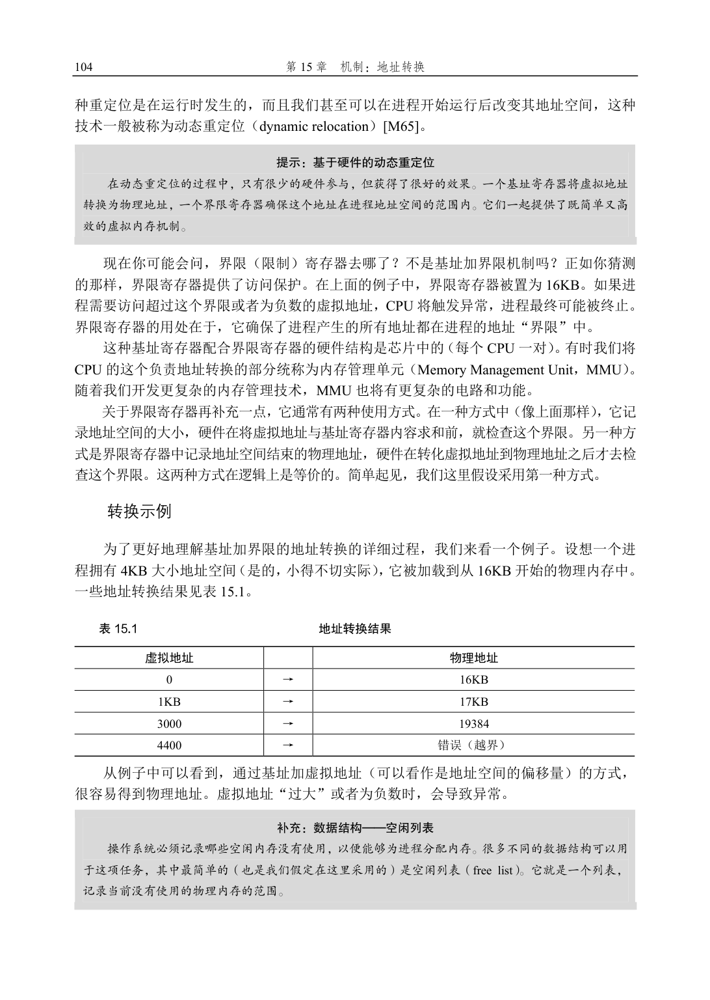
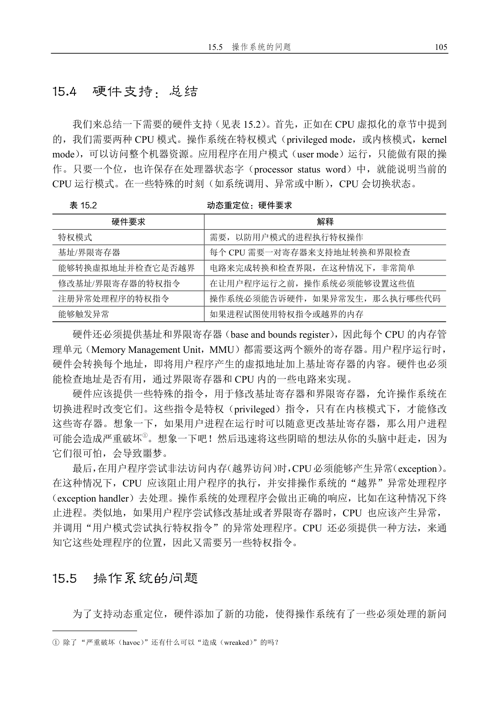
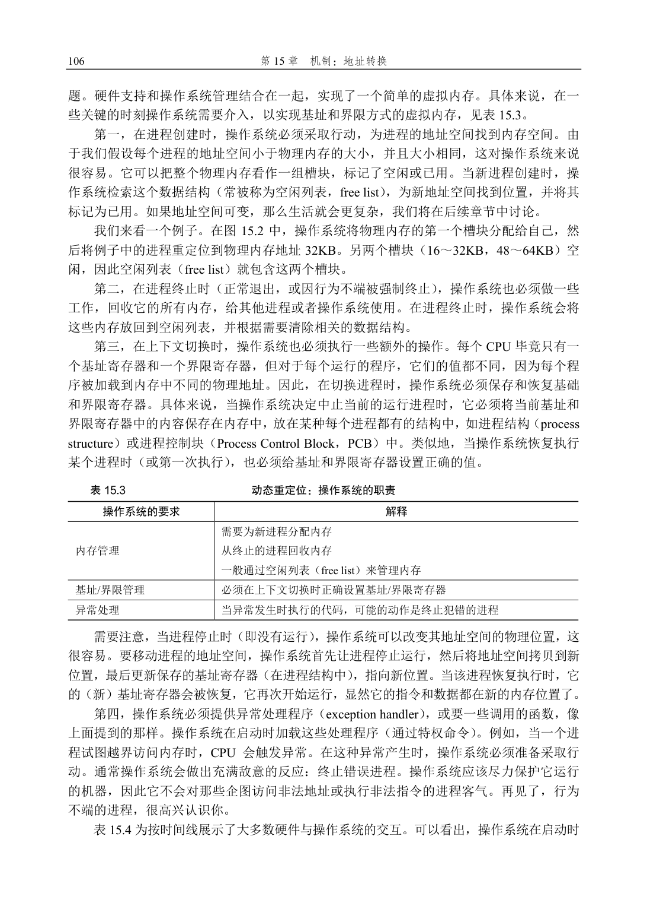
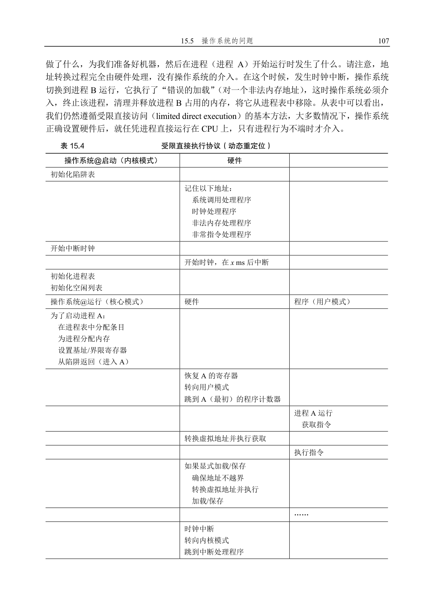
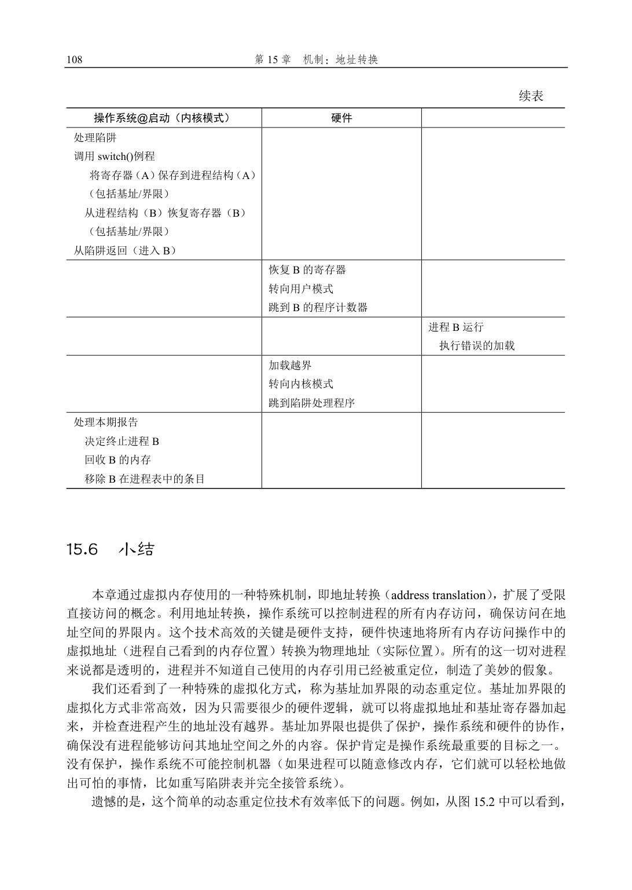

# 第15 章  机制：地址转换

在实现CPU 虚拟化时，我们遵循的一般准则被称为受限直接访问（Limited Direct Execution，LDE）。LDE 背后的想法很简单：让程序运行的大部分指令直接访问硬件，只在一些关键点（如进程发起系统调用或发生时钟中断）由操作系统介入来确保“在正确时间，正确的地点，做正确的事”。为了实现高效的虚拟化，操作系统应该尽量让程序自己运行，同时通过在关键点的及时介入（interposing），来保持对硬件的控制。高效和控制是现代操作系统的两个主要目标。

在实现虚拟内存时，我们将追求类似的战略，在实现高效和控制的同时，提供期望的虚拟化。高效决定了我们要利用硬件的支持，这在开始的时候非常初级（如使用一些寄存器），但会变得相当复杂（比如我们会讲到的TLB、页表等）。控制意味着操作系统要确保应用程序只能访问它自己的内存空间。因此，要保护应用程序不会相互影响，也不会影响操作系统，我们需要硬件的帮助。最后，我们对虚拟内存还有一点要求，即灵活性。具体来说，我们希望程序能以任何方式访问它自己的地址空间，从而让系统更容易编程。所以，关键问题在于：

关键问题：如何高效、灵活地虚拟化内存

如何实现高效的内存虚拟化？如何提供应用程序所需的灵活性？如何保持控制应用程序可访问的

内存位置，从而确保应用程序的内存访问受到合理的限制？如何高效地实现这一切？

我们利用了一种通用技术，有时被称为基于硬件的地址转换（hardware-based address translation），简称为地址转换（address translation）。它可以看成是受限直接执行这种一般方法的补充。利用地址转换，硬件对每次内存访问进行处理（即指令获取、数据读取或写入），将指令中的虚拟（virtual）地址转换为数据实际存储的物理（physical）地址。因此，在每次内存引用时，硬件都会进行地址转换，将应用程序的内存引用重定位到内存中实际的位置。

当然，仅仅依靠硬件不足以实现虚拟内存，因为它只是提供了底层机制来提高效率。操作系统必须在关键的位置介入，设置好硬件，以便完成正确的地址转换。因此它必须管理内存（manage memory），记录被占用和空闲的内存位置，并明智而谨慎地介入，保持对内存使用的控制。

同样，所有这些工作都是为了创造一种美丽的假象：每个程序都拥有私有的内存，那里存放着它自己的代码和数据。虚拟现实的背后是丑陋的物理事实：许多程序其实是在同一时间共享着内存，就像CPU（或多个CPU）在不同的程序间切换运行。通过虚拟化，操作系统（在硬件的帮助下）将丑陋的机器现实转化成一种有用的、强大的、易于使用的抽象。

## 15.1  假设

我们对内存虚拟化的第一次尝试非常简单，甚至有点可笑。如果你觉得可笑就笑吧，很快就轮到操作系统嘲笑你了。当你试图理解TLB 的换入换出、多级页表，和其他技术一样有奇迹之处的时候。不喜欢操作系统嘲笑你？很不幸，但这就是操作系统的运行方式。

具体来说，我们先假设用户的地址空间必须连续地放在物理内存中。同时，为了简单，我们假设地址空间不是很大，具体来说，小于物理内存的大小。最后，假设每个地址空间的大小完全一样。别担心这些假设听起来不切实际，我们会逐步地放宽这些假设，从而得到现实的内存虚拟化。

## 15.2  一个例子

为了更好地理解实现地址转换需要什么，以及为什么需要，我们先来看一个简单的例子。设想一个进程的地址空间如图15.1 所示。这里我们要检查一小段代码，它从内存中加载一个值，对它加3，然后将它存回内存。你可以设想，这段代码的C 语言形式可能像这样：

void func() {

int x;

x = x + 3; // this is the line of code we are interested in  编译器将这行代码转化为汇编语句，可能像下面这样（x86 汇编）。我们可以用Linux的objdump 或者Mac 的otool 将它反汇编：

128: movl 0x0(%ebx), %eax   ;load 0+ebx into eax

132: addl $0x03, %eax       ;add 3 to eax register

135: movl %eax, 0x0(%ebx)   ;store eax back to mem  这段代码相对简单，它假定x 的地址已经存入寄存器ebx，之后通过movl 指令将这个地址的值加载到通用寄存器eax（长字移动）。下一条指令对eax 的内容加3。最后一条指令将eax 中的值写回到内存的同一位置。

提示：介入（Interposition）很强大

介入是一种很常见又很有用的技术，计算机系统中使用介入常常能带来很好的效果。在虚拟内存中，

硬件可以介入到每次内存访问中，将进程提供的虚拟地址转换为数据实际存储的物理地址。但是，一般

化的介入技术有更广阔的应用空间，实际上几乎所有良好定义的接口都应该提供功能介入机制，以便增

加功能或者在其他方面提升系统。这种方式最基本的优点是透明（transparency），介入完成时通常不需

要改动接口的客户端，因此客户端不需要任何改动。

在图15.1 中，可以看到代码和数据都位于进程的地址空间，3 条指令序列位于地址128（靠近头部的代码段），变量x 的值位于地址15KB（在靠近底部的栈中）。如图15.1 所示，x

的初始值是3000。

如果这3 条指令执行，从进程的角度来看，发生了以下几次内存访问：    从地址128 获取指令；    执行指令（从地址15KB 加载数据）；    从地址132 获取命令；    执行命令（没有内存访问）；    从地址135 获取指令；    执行指令（新值存入地址15KB）。 从程序的角度来看，它的地址空间（address space）从0 开始到16KB 结束。它包含的所有内存引用都应该在这个范围内。然而，对虚拟内存来说，操作系统希望将这个进程地址空间放在物理内存的其他位置，并不一定从地址0 开始。因此我们遇到了如下问题：怎样在内存中重定位这个进程，同时对该进程透明（transparent）？怎么样提供一种虚拟地址空间从0 开始的假象，而实际上地址空间位于另外某个物理地址？

图15.2 展示了一个例子，说明这个进程的地址空间被放入物理内存后可能的样子。从图15.2 中可以看到，操作系统将第一块物理内存留给了自己，并将上述例子中的进程地址空间重定位到从32KB 开始的物理内存地址。剩下的两块内存空闲（16～32KB 和48～64KB）。

图15.1  进程及其地址空间                 图15.2  物理内存和单个重定位的进程

## 15.3  动态（基于硬件）重定位

为了更好地理解基于硬件的地址转换，我们先来讨论它的第一次应用。在20 世纪50年代后期，它在首次出现的时分机器中引入，那时只是一个简单的思想，称为基址加界限机制（base and bound），有时又称为动态重定位（dynamic relocation），我们将互换使用这两个术语[SS74]。

具体来说，每个CPU 需要两个硬件寄存器：基址（base）寄存器和界限（bound）寄存器，有时称为限制（limit）寄存器。这组基址和界限寄存器，让我们能够将地址空间放在物理内存的任何位置，同时又能确保进程只能访问自己的地址空间。

采用这种方式，在编写和编译程序时假设地址空间从零开始。但是，当程序真正执行时，操作系统会决定其在物理内存中的实际加载地址，并将起始地址记录在基址寄存器中。在上面的例子中，操作系统决定加载在物理地址32KB 的进程，因此将基址寄存器设置为这个值。

当进程运行时，有趣的事情发生了。现在，该进程产生的所有内存引用，都会被处理器通过以下方式转换为物理地址：

physical address = virtual address + base

补充：基于软件的重定位

在早期，在硬件支持重定位之前，一些系统曾经采用纯软件的重定位方式。基本技术被称为静态重

定位（static relocation），其中一个名为加载程序（loader）的软件接手将要运行的可执行程序，将它的

地址重写到物理内存中期望的偏移位置。

例如，程序中有一条指令是从地址1000 加载到寄存器（即movl 1000，%eax），当整个程序的地址

空间被加载到从3000（不是程序认为的0）开始的物理地址中，加载程序会重写指令中的地址（即movl

4000, %eax），从而完成简单的静态重定位。

然而，静态重定位有许多问题，首先也是最重要的是不提供访问保护，进程中的错误地址可能导致

对其他进程或操作系统内存的非法访问，一般来说，需要硬件支持来实现真正的访问保护[WL+93]。静

态重定位的另一个缺点是一旦完成，稍后很难将内存空间重定位到其他位置 [M65]。

进程中使用的内存引用都是虚拟地址（virtual address），硬件接下来将虚拟地址加上基址寄存器中的内容，得到物理地址（physical address），再发给内存系统。

为了更好地理解，让我们追踪一条指令执行的情况。具体来看前面序列中的一条指令：

128: movl 0x0(%ebx), %eax  程序计数器（PC）首先被设置为128。当硬件需要获取这条指令时，它先将这个值加上基址寄存器中的32KB(32768)，得到实际的物理地址32896，然后硬件从这个物理地址获取指令。接下来，处理器开始执行该指令。这时，进程发起从虚拟地址15KB 的加载，处理器同样将虚拟地址加上基址寄存器内容（32KB），得到最终的物理地址47KB，从而获得需要的数据。

将虚拟地址转换为物理地址，这正是所谓的地址转换（address translation）技术。也就是说，硬件取得进程认为它要访问的地址，将它转换成数据实际位于的物理地址。由于这

重定位的进程使用了从32KB 到48KB 的物理内存，但由于该进程的栈区和堆区并不很大，导致这块内存区域中大量的空间被浪费。这种浪费通常称为内部碎片（internal fragmentation），指的是已经分配的内存单元内部有未使用的空间（即碎片），造成了浪费。在我们当前的方式中，即使有足够的物理内存容纳更多进程，但我们目前要求将地址空间放在固定大小的槽块中，因此会出现内部碎片

①。所以，我们需要更复杂的机制，以便更好地利用物理内存，避免内部碎片。第一次尝试是将基址加界限的概念稍稍泛化，得到分段（segmentation）的概念，我们接下来将讨论。

## 参考资料

[M65]“On Dynamic Program Relocation”

W.C. McGee

IBM Systems Journal

Volume 4, Number 3, 1965, pages 184–199

本文对动态重定位的早期工作和静态重定位的一些基础知识进行了很好的总结。

[P90]“Relocating loader for MS-DOS .EXE executable files”Kenneth D. A. Pillay

Microprocessors & Microsystems archive Volume 14, Issue 7 (September 1990)

MS-DOS 重定位加载器的示例。不是第一个，而只是这样的系统如何工作的一个相对现代的例子。

[SS74]“The Protection of Information in Computer Systems”

J. Saltzer and M. Schroeder CACM, July 1974

摘自这篇论文：“在1957 年至1959 年间，在3 个有不同目标的项目中，显然独立出现了基址和界限寄存器

和硬件解释描述符的概念。在MIT，McCarthy 建议将基址和界限的想法作为内存保护系统的一部分，以

便让时分共享可行。IBM 独立开发了基本和界限寄存器，作为Stretch（7030）计算机系统支持可靠多道

程序的机制。在Burroughs，R. Barton 建议硬件解释描述符可以直接支持B5000 计算机系统中高级语言

的命名范围规则。”我们在Mark Smotherman 的超酷历史页面上找到了这段引用[S04]，更多信息请参见

这些页面。

[S04]“System Call Support”

Mark Smotherman, May 2004

系统调用支持的简洁历史。Smotherman 还收集了一些早期历史，包括中断和其他有趣方面的计算历史。可

以查看他的网页了解更多详情。

[WL+93]“Efficient Software-based Fault Isolation”

Robert Wahbe, Steven Lucco, Thomas E. Anderson, Susan L. Graham SOSP ’93

关于如何在没有硬件支持的情况下，利用编译器支持限定从程序中引用内存的一篇极好的论文。该论文引

① 另一种解决方另可能会在地址空间内放置一个固定大小的栈，位于代码区域的下方，并在栈下面让堆并长。 但是，这限制

了灵活性，让递归和深层嵌套函数调用变得具有挑战，因此我们希望避免这种情况。

发了人们对用于分离内存引用的软件技术的兴趣。

## 作业

程序relocation.py 让你看到，在带有基址和边界寄存器的系统中，如何执行地址转换。详情请参阅README 文件。

## 问题

1．用种子1、2 和3 运行，并计算进程生成的每个虚拟地址是处于界限内还是界限外?如果在界限内，请计算地址转换。

2．使用以下标志运行：-s 0 -n 10。为了确保所有生成的虚拟地址都处于边界内，要将-l（界限寄存器）设置为什么值？

3．使用以下标志运行：-s 1 -n 10 -l 100。可以设置界限的最大值是多少，以便地址空间仍然完全放在物理内存中？

4．运行和第3 题相同的操作，但使用较大的地址空间（-a）和物理内存（-p）。 5．作为边界寄存器的值的函数，随机生成的虚拟地址的哪一部分是有效的？画一个图，使用不同随机种子运行，限制值从0 到最大地址空间大小。