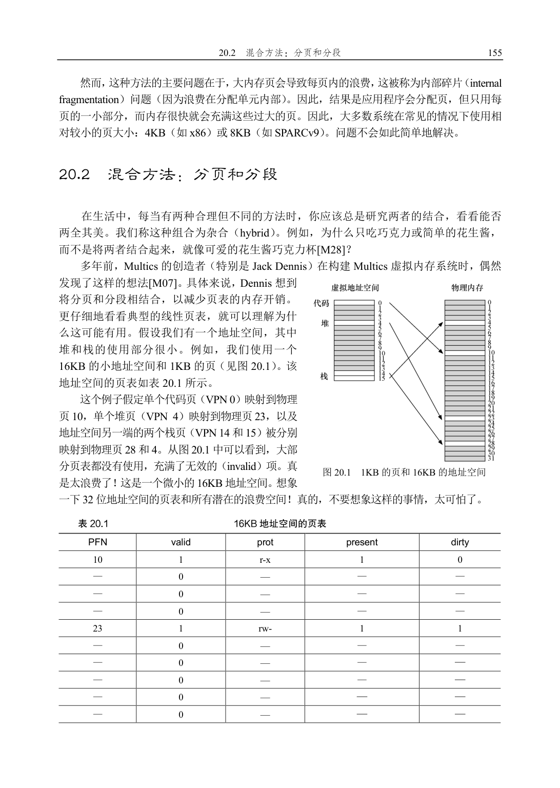
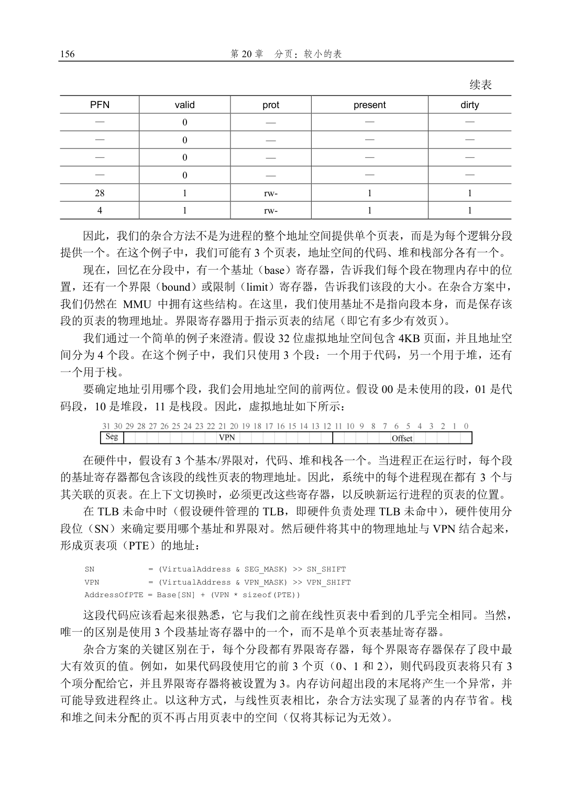
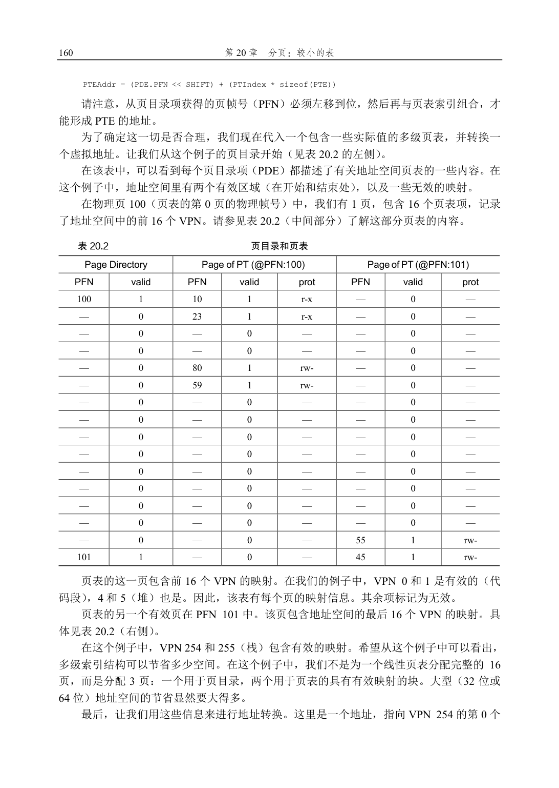

# 第20 章  分页：较小的表

我们现在来解决分页引入的第二个问题：页表太大，因此消耗的内存太多。让我们从线性页表开始。你可能会记得

①，线性页表变得相当大。假设一个32 位地址空间（232 字节），4KB（212 字节）的页和一个4 字节的页表项。一个地址空间中大约有一百万个虚拟页面（232/212）。乘以页表项的大小，你会发现页表大小为4MB。回想一下：通常系统中的每个

进程都有一个页表！有一百个活动进程（在现代系统中并不罕见），就要为页表分配数百兆的内存！因此，要寻找一些技术来减轻这种沉重的负担。有很多方法，所以我们开始吧。但先看我们的关键问题：

关键问题：如何让页表更小？

简单的基于数组的页表（通常称为线性页表）太大，在典型系统上占用太多内存。如何让页表更小？

关键的思路是什么？由于这些新的数据结构，会出现什么效率影响？

## 20.1  简单的解决方案：更大的页

可以用一种简单的方法减小页表大小：使用更大的页。再以32 位地址空间为例，但这次假设用16KB 的页。因此，会有18 位的VPN 加上14 位的偏移量。假设每个页表项（4字节）的大小相同，现在线性页表中有218 个项，因此每个页表的总大小为1MB，页表缩到四分之一。

补充：多种页大小

另外请注意，许多体系结构（例如MIPS、SPARC、x86-64）现在都支持多种页大小。通常使用一

个小的（4KB 或8KB）页大小。但是，如果一个“聪明的”应用程序请求它，则可以为地址空间的特定

部分使用一个大型页（例如，大小为4MB），从而让这些应用程序可以将常用的（大型的）数据结构放

入这样的空间，同时只占用一个TLB 项。这种类型的大页在数据库管理系统和其他高端商业应用程序

中很常见。然而，多种页面大小的主要原因并不是为了节省页表空间。这是为了减少TLB 的压力，让

程序能够访问更多的地址空间而不会遭受太多的TLB 未命中之苦。然而，正如研究人员已经说明[N+02]

一样，采用多种页大小，使操作系统虚拟内存管理程序显得更复杂，因此，有时只需向应用程序暴露一

个新接口，让它们直接请求大内存页，这样最容易。

① 或者实际上，你可能记不起来了。分页这件事正在失控，不是吗？虽然这样说，但在进入解决方案之前，一定要确保你理解

了正在解决的问题。事实上，如果你理解了问题，通常可以自己推导出解决方案。在这里，问题应该很清楚：简单的线性（基

于数组的）页表太大了。

提示：使用杂合

当你有两个看似相反的好主意时，你应该总是看到你是否可以将它们组合成一个能够实现两全其美

的杂合体（hybrid）。例如，杂交玉米物种已知比任何天然存在的物种更强壮。当然，并非所有的杂合都

是好主意，请参阅Zeedonk（或Zonkey），它是斑马和驴的杂交。如果你不相信这样的生物存在，就查

一下，你会大吃一惊。

但是，你可能会注意到，这种方法并非没有问题。首先，它仍然要求使用分段。正如我们讨论的那样，分段并不像我们需要的那样灵活，因为它假定地址空间有一定的使用模式。例如，如果有一个大而稀疏的堆，仍然可能导致大量的页表浪费。其次，这种杂合导致外部碎片再次出现。尽管大部分内存是以页面大小单位管理的，但页表现在可以是任意大小（是PTE 的倍数）。因此，在内存中为它们寻找自由空间更为复杂。出于这些原因，人们继续寻找更好的方式来实现更小的页表。

## 20.3  多级页表

另一种方法并不依赖于分段，但也试图解决相同的问题：如何去掉页表中的所有无效区域，而不是将它们全部保留在内存中？我们将这种方法称为多级页表（multi-level page table），因为它将线性页表变成了类似树的东西。这种方法非常有效，许多现代系统都用它（例如x86 [BOH10]）。我们现在详细描述这种方法。

多级页表的基本思想很简单。首先，将页表分成页大小的单元。然后，如果整页的页表项（PTE）无效，就完全不分配该页的页表。为了追踪页表的页是否有效（以及如果有效，它在内存中的位置），使用了名为页目录（page directory）的新结构。页目录因此可以告诉你页表的页在哪里，或者页表的整个页不包含有效页。

图20.2 展示了一个例子。图的左边是经典的线性页表。即使地址空间的大部分中间区域无效，我们仍然需要为这些区域分配页表空间（即页表的中间两页）。右侧是一个多级页表。页目录仅将页表的两页标记为有效（第一个和最后一个）；因此，页表的这两页就驻留在内存中。因此，你可以形象地看到多级页表的工作方式：它只是让线性页表的一部分消失（释放这些帧用于其他用途），并用页目录来记录页表的哪些页被分配。

在一个简单的两级页表中，页目录为每页页表包含了一项。它由多个页目录项（Page Directory Entries，PDE）组成。PDE（至少）拥有有效位（valid bit）和页帧号（page frame number，PFN），类似于PTE。但是，正如上面所暗示的，这个有效位的含义稍有不同：如果PDE 项是有效的，则意味着该项指向的页表（通过PFN）中至少有一页是有效的，即在该PDE 所指向的页中，至少一个PTE，其有效位被设置为1。如果PDE 项无效（即等于零），则PDE的其余部分没有定义。

与我们至今为止看到的方法相比，多级页表有一些明显的优势。首先，也许最明显的是，多级页表分配的页表空间，与你正在使用的地址空间内存量成比例。因此它通常很紧凑，并且支持稀疏的地址空间。

图20.2  线性（左）和多级（右）页表

其次，如果仔细构建，页表的每个部分都可以整齐地放入一页中，从而更容易管理内存。操作系统可以在需要分配或增长页表时简单地获取下一个空闲页。将它与一个简单的（非分页）线性页表相比

①，后者仅是按VPN 索引的PTE 数组。用这样的结构，整个线性页表必须连续驻留在物理内存中。对于一个大的页表（比如4MB），找到如此大量的、未使用的连续空闲物理内存，可能是一个相当大的挑战。有了多级结构，我们增加了一个间接层（level of indirection），使用了页目录，它指向页表的各个部分。这种间接方式，让我们能够

将页表页放在物理内存的任何地方。

提示：理解时空折中

在构建数据结构时，应始终考虑时间和空间的折中（time-space trade-off）。通常，如果你希望更快

地访问特定的数据结构，就必须为该结构付出空间的代价。

应该指出，多级页表是有成本的。在TLB 未命中时，需要从内存加载两次，才能从页表中获取正确的地址转换信息（一次用于页目录，另一次用于PTE 本身），而用线性页表只需要一次加载。因此，多级表是一个时间—空间折中（time-space trade-off）的小例子。我们想要更小的表（并得到了），但不是没代价。尽管在常见情况下（TLB 命中），性能显然是相同的，但TLB 未命中时，则会因较小的表而导致较高的成本。

另一个明显的缺点是复杂性。无论是硬件还是操作系统来处理页表查找（在TLB 未命中时），这样做无疑都比简单的线性页表查找更复杂。通常我们愿意增加复杂性以提高性能或降低管理费用。在多级表的情况下，为了节省宝贵的内存，我们使页表查找更加复杂。

详细的多级示例

为了更好地理解多级页表背后的想法，我们来看一个例子。设想一个大小为16KB 的小地址空间，其中包含64 个字节的页。因此，我们有一个14 位的虚拟地址空间，VPN 有8

① 我们在这里做了一些假设，所有的页表全部驻留在物理内存中（即它们没有交换到磁盘）。 我们很快就会放松这个假设。

位，偏移量有6 位。即使只有一小部分地址空间正在使用，线性页表也会有28（256）个项。图20.3 展示了这种地址空间的一个例子。

提示：对复杂性表示怀疑

系统设计者应该谨慎对待让系统增加复杂性。好的系统构建者所做的就是：实现最小复杂性的系统，

来完成手上的任务。例如，如果磁盘空间非常大，则不应该设计一个尽可能少使用字节的文件系统。同

样，如果处理器速度很快，建议在操作系统中编写一个干净、易于理解的模块，而不是CPU 优化的、

手写汇编的代码。注意过早优化的代码或其他形式的不必要的复杂性。这些方法会让系统难以理解、维

护和调试。正如Antoine de Saint-Exupery 的名言：“完美非无可增，乃不可减。”他没有写的是：“谈论

完美易，真正实现难。

在这个例子中，虚拟页0 和1 用于代码，虚拟页4 和5 用于堆，虚拟页254 和255 用于栈。地址空间的其余页未被使用。

要为这个地址空间构建一个两级页表，我们从完整的线性页表开始，将它分解成页大小的单元。回想一下我们的完整页表（在这个例子中）有256 个项；假设每个PTE 的大小是4个字节。因此，我们的页大小为1KB（256×4 字节）。鉴于我们有64 字节的页，1KB 页表可以分为16 个64 字节的页，每个页可以容纳16 个PTE。

图20.3  16KB 的地址空间

和64 字节的页

我们现在需要了解：如何获取VPN，并用它来首先索引到页目录中，然后再索引到页表的页中。请记住，每个都是一组项。因此，我们需要弄清楚，如何为每个VPN 构建索引。

我们首先索引到页目录。这个例子中的页表很小：256 个项，分布在16 个页上。页目录需要为页表的每页提供一个项。因此，它有16 个项。结果，我们需要4 位VPN 来索引目录。我们使用VPN 的前4 位，如下所示：

一旦从VPN 中提取了页目录索引（简称PDIndex），我们就可以通过简单的计算来找到页目录项（PDE）的地址：PDEAddr = PageDirBase +（PDIndex×sizeof（PDE））。这就得到了页目录，现在我们来看它，在地址转换上取得进一步进展。

如果页目录项标记为无效，则我们知道访问无效，从而引发异常。但是，如果PDE 有效，我们还有更多工作要做。具体来说，我们现在必须从页目录项指向的页表的页中获取页表项（PTE）。要找到这个PTE，我们必须使用VPN 的剩余位索引到页表的部分：

这个页表索引（Page-Table Index，PTIndex）可以用来索引页表本身，给出PTE 的地址：

字节：0x3F80，或二进制的11 1111 1000 0000。

回想一下，我们将使用VPN 的前4 位来索引页目录。因此，1111 会从上面的页目录中选择最后一个（第15 个，如果你从第0 个开始）。这就指向了位于地址101 的页表的有效页。然后，我们使用VPN 的下4 位（1110）来索引页表的那一页并找到所需的PTE。1110 是页面中的倒数第二（第14 个）条，并告诉我们虚拟地址空间的页254 映射到物理页55。通过连接PFN = 55（或十六进制0x37）和offset = 000000，可以形成我们想要的物理地址，并向内存系统发出请求：PhysAddr =（PTE.PFN << SHIFT）+ offset = 00 1101 1100 0000 = 0x0DC0。

你现在应该知道如何构建两级页表，利用指向页表页的页目录。但遗憾的是，我们的工作还没有完成。我们现在要讨论，有时两个页级别是不够的！

超过两级

在至今为止的例子中，我们假定多级页表只有两个级别：一个页目录和几页页表。在某些情况下，更深的树是可能的（并且确实需要）。

让我们举一个简单的例子，用它来说明为什么更深层次的多级页表可能有用。在这个例子中，假设我们有一个30 位的虚拟地址空间和一个小的（512 字节）页。因此我们的虚拟地址有一个21 位的虚拟页号和一个9 位偏移量。

请记住我们构建多级页表的目标：使页表的每一部分都能放入一个页。到目前为止，我们只考虑了页表本身。但是，如果页目录太大，该怎么办？

要确定多级表中需要多少级别才能使页表的所有部分都能放入一页，首先要确定多少页表项可以放入一页。鉴于页大小为512 字节，并且假设PTE 大小为4 字节，你应该看到，可以在单个页上放入128 个PTE。当我们索引页表时，我们可以得出结论，我们需要VPN的最低有效位7 位（log2128）作为索引：

在上面你还可能注意到，多少位留给了（大）页目录：14。如果我们的页目录有214个项，那么它不是一个页，而是128 个，因此我们让多级页表的每一个部分放入一页目标失败了。

为了解决这个问题，我们为树再加一层，将页目录本身拆成多个页，然后在其上添加另一个页目录，指向页目录的页。我们可以按如下方式分割虚拟地址：

现在，当索引上层页目录时，我们使用虚拟地址的最高几位（图中的PD 索引0）。该索引用于从顶级页目录中获取页目录项。如果有效，则通过组合来自顶级PDE 的物理帧号和VPN 的下一部分（PD 索引1）来查阅页目录的第二级。最后，如果有效，则可以通过使

用与第二级PDE 的地址组合的页表索引来形成PTE 地址。这会有很多工作。所有这些只是为了在多级页表中查找某些东西。

地址转换过程：记住TLB

为了总结使用两级页表的地址转换的整个过程，我们再次以算法形式展示控制流（见图20.4）。该图显示了每个内存引用在硬件中发生的情况（假设硬件管理的TLB）。

从图中可以看到，在任何复杂的多级页表访问发生之前，硬件首先检查TLB。在命中时，物理地址直接形成，而不像之前一样访问页表。只有在TLB 未命中时，硬件才需要执行完整的多级查找。在这条路径上，可以看到传统的两级页表的成本：两次额外的内存访问来查找有效的转换映射。

1    VPN = (VirtualAddress & VPN_MASK) >> SHIFT

2    (Success, TlbEntry) = TLB_Lookup(VPN)

3    if (Success == True)    // TLB Hit

4        if (CanAccess(TlbEntry.ProtectBits) == True)

5            Offset   = VirtualAddress & OFFSET_MASK

6            PhysAddr = (TlbEntry.PFN << SHIFT) | Offset

7            Register = AccessMemory(PhysAddr)

8        else

9            RaiseException(PROTECTION_FAULT)

10   else                  // TLB Miss

11       // first, get page directory entry

12       PDIndex = (VPN & PD_MASK) >> PD_SHIFT 13       PDEAddr = PDBR + (PDIndex * sizeof(PDE))

14       PDE     = AccessMemory(PDEAddr)

15       if (PDE.Valid == False)

16           RaiseException(SEGMENTATION_FAULT)

17       else

18           // PDE is valid: now fetch PTE from page table

19           PTIndex = (VPN & PT_MASK) >> PT_SHIFT 20           PTEAddr = (PDE.PFN << SHIFT) + (PTIndex * sizeof(PTE))

21           PTE     = AccessMemory(PTEAddr)

22           if (PTE.Valid == False)

23               RaiseException(SEGMENTATION_FAULT)

24           else if (CanAccess(PTE.ProtectBits) == False)

25               RaiseException(PROTECTION_FAULT)

26           else

27               TLB_Insert(VPN, PTE.PFN, PTE.ProtectBits)

28               RetryInstruction()

图20.4  多级页表控制流

## 20.4  反向页表

在反向页表（inverted page table）中，可以看到页表世界中更极端的空间节省。在这里，我们保留了一个页表，其中的项代表系统的每个物理页，而不是有许多页表（系统的每个进

程一个）。页表项告诉我们哪个进程正在使用此页，以及该进程的哪个虚拟页映射到此物理页。

现在，要找到正确的项，就是要搜索这个数据结构。线性扫描是昂贵的，因此通常在此基础结构上建立散列表，以加速查找。PowerPC 就是这种架构[JM98]的一个例子。

更一般地说，反向页表说明了我们从一开始就说过的内容：页表只是数据结构。你可以对数据结构做很多疯狂的事情，让它们更小或更大，使它们变得更慢或更快。多层和反向页表只是人们可以做的很多事情的两个例子。

## 20.5  将页表交换到磁盘

最后，我们讨论放松最后一个假设。到目前为止，我们一直假设页表位于内核拥有的物理内存中。即使我们有很多技巧来减小页表的大小，但是它仍然有可能是太大而无法一次装入内存。因此，一些系统将这样的页表放入内核虚拟内存（kernel virtual memory），从而允许系统在内存压力较大时，将这些页表中的一部分交换（swap）到磁盘。我们将在下一章（即VAX/VMS 的案例研究）中进一步讨论这个问题，在我们更详细地了解了如何将页移入和移出内存之后。

## 20.6  小结

我们现在已经看到了如何构建真正的页表。不一定只是线性数组，而是更复杂的数据结构。这样的页表体现了时间和空间上的折中（表格越大，TLB 未命中可以处理得更快，反之亦然），因此结构的正确选择强烈依赖于给定环境的约束。

在一个内存受限的系统中（像很多旧系统一样），小结构是有意义的。在具有较多内存，并且工作负载主动使用大量内存页的系统中，用更大的页表来加速TLB 未命中处理，可能是正确的选择。有了软件管理的TLB，数据结构的整个世界开放给了喜悦的操作系统创新者（提示：就是你）。你能想出什么样的新结构？它们解决了什么问题？当你入睡时想想这些问题，做一个只有操作系统开发人员才能做的大梦。

## 参考资料

[BOH10]“Computer Systems: A Programmer’s Perspective”Randal E. Bryant and David R. O’Hallaron

Addison-Wesley, 2010

我们还没有找到很好的多级页表首选参考。然而，Bryant 和O’Hallaron 编写的这本了不起的教科书深入探

讨了x86 的细节，至少这是一个使用这种结构的早期系统。这也是一本很棒的书。

[JM98]“Virtual Memory: Issues of Implementation”Bruce Jacob and Trevor Mudge

IEEE Computer, June 1998

对许多不同系统及其虚拟内存方法的优秀调查。其中有关于x86、PowerPC、MIPS 和其他体系结构的大量

细节内容。

[LL82]“Virtual Memory Management in the VAX/VMS Operating System”Hank Levy and P. Lipman

IEEE Computer, Vol. 15, No. 3, March 1982

一篇关于经典操作系统VMS 中真实虚拟内存管理程序的精彩论文。它非常棒，实际上，从现在开始的几

章，我们将利用它来复习目前为止我们学过的有关虚拟内存的所有内容。

[M28]“Reese’s Peanut Butter Cups”Mars Candy Corporation.

显然，这些精美的“甜点”是由Harry Burnett Reese 在1928 年发明的，他以前曾是奶牛场的农夫和Milton

S. Hershey 的运输工长。至少，维基百科上是这么说的。

[N+02]“Practical, Transparent Operating System Support for Superpages”Juan Navarro, Sitaram Iyer, Peter

Druschel, Alan Cox

OSDI ’02, Boston, Massachusetts, October 2002

一篇精彩的论文，展示了将大页或超大页并入现代操作系统中的所有细节。这篇文章阅读起来没有你想象

的那么容易。

[M07]“Multics: History”

这个神奇的网站提供了Multics 系统的大量历史记录，当然是OS 历史上最有影响力的系统之一。引文如下：

“麻省理工学院的Jack Dennis 为Multics 的开始提供了有影响力的架构理念，特别是将分页和分段相结合的

想法。”

## 作业

这个有趣的小作业会测试你是否了解多级页表的工作原理。是的，前面句子中使用的“有趣”一词有一些争议。该程序叫作“可能不太怪：paging-multilevel-translate.py”。详情请参阅README 文件。

## 问题

1．对于线性页表，你需要一个寄存器来定位页表，假设硬件在TLB 未命中时进行查找。你需要多少个寄存器才能找到两级页表？三级页表呢？

2．使用模拟器对随机种子0、1 和2 执行翻译，并使用-c 标志检查你的答案。需要多少内存引用来执行每次查找？

3．根据你对缓存内存的工作原理的理解，你认为对页表的内存引用如何在缓存中工作？它们是否会导致大量的缓存命中（并导致快速访问）或者很多未命中（并导致访问缓慢）？