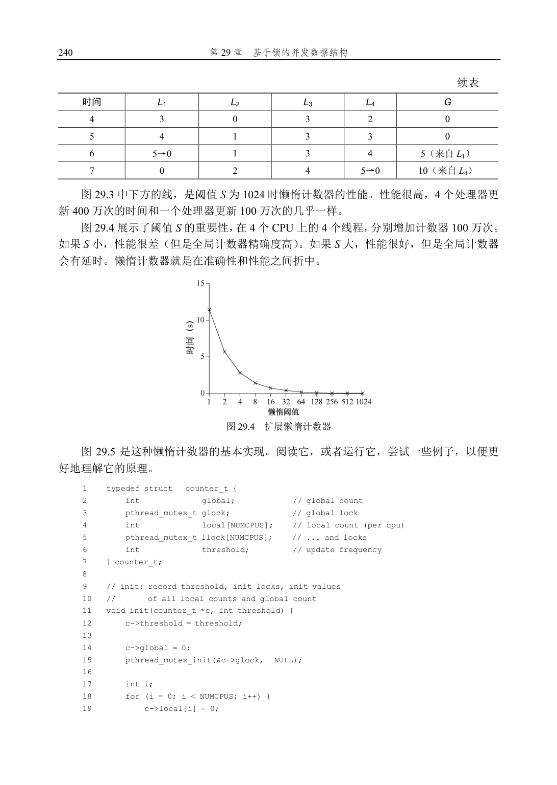

# 第29 章  基于锁的并发数据结构

在结束锁的讨论之前，我们先讨论如何在常见数据结构中使用锁。通过锁可以使数据结构线程安全（thread safe）。当然，具体如何加锁决定了该数据结构的正确性和效率？因此，我们的挑战是：

关键问题：如何给数据结构加锁？

对于特定数据结构，如何加锁才能让该结构功能正确？进一步，如何对该数据结构加锁，能够保证

高性能，让许多线程同时访问该结构，即并发访问（concurrently）？

当然，我们很难介绍所有的数据结构，或实现并发的所有方法，因为这是一个研究多年的议题，已经发表了数以千计的相关论文。因此，我们希望能够提供这类思考方式的足够介绍，同时提供一些好的资料，供你自己进一步研究。我们发现，Moir 和Shavit 的调查[MS04]就是很好的资料。

## 29.1  并发计数器

计数器是最简单的一种数据结构，使用广泛而且接口简单。图29.1 中定义了一个非并发的计数器。

1    typedef struct  counter_t {

2        int value;

3    } counter_t;

4 5    void init(counter_t *c) {

6        c->value = 0;

7    }

8 9    void increment(counter_t *c) {

10       c->value++;

11   }

12 13   void decrement(counter_t *c) {

14       c->value--;

15   }

16 17   int get(counter_t *c) {

18       return c->value;

19   } 图29.1  无锁的计数器

简单但无法扩展

你可以看到，没有同步机制的计数器很简单，只需要很少代码就能实现。现在我们的下一个挑战是：如何让这段代码线程安全（thread safe）？图29.2 展示了我们的做法。

1    typedef struct  counter_t {

2        int            value;

3        pthread_mutex_t lock;

4    } counter_t;

5 6    void init(counter_t *c) {

7        c->value = 0;

8        Pthread_mutex_init(&c->lock,  NULL);

9    }

10 11   void increment(counter_t *c) {

12       Pthread_mutex_lock(&c->lock);

13       c->value++;

14       Pthread_mutex_unlock(&c->lock);

15   }

16 17   void decrement(counter_t *c) {

18       Pthread_mutex_lock(&c->lock);

19       c->value--;

20       Pthread_mutex_unlock(&c->lock);

21   }

22 23   int get(counter_t *c) {

24       Pthread_mutex_lock(&c->lock);

25       int rc = c->value;

26       Pthread_mutex_unlock(&c->lock);

27       return rc;

28   } 图29.2  有锁的计数器

这个并发计数器简单、正确。实际上，它遵循了最简单、最基本的并发数据结构中常见的数据模式：它只是加了一把锁，在调用函数操作该数据结构时获取锁，从调用返回时释放锁。这种方式类似基于观察者（monitor）[BH73]的数据结构，在调用、退出对象方法时，会自动获取锁、释放锁。

现在，有了一个并发数据结构，问题可能就是性能了。如果这个结构导致运行速度太慢，那么除了简单加锁，还需要进行优化。如果需要这种优化，那么本章的余下部分将进行探讨。请注意，如果数据结构导致的运行速度不是太慢，那就没事！如果简单的方案就能工作，就不需要精巧的设计。

为了理解简单方法的性能成本，我们运行一个基准测试，每个线程更新同一个共享计数器固定次数，然后我们改变线程数。图29.3 给出了运行1 个线程到4 个线程的总耗时，其中每个线程更新100 万次计数器。本实验是在4 核Intel 2.7GHz i5 CPU 的iMac 上运行。通过增加CPU，我们希望单位时间能够完成更多的任务。

20           pthread_mutex_init(&c->llock[i],  NULL);

21       }

22   }

23

24   // update: usually, just grab local lock and update local amount

25   //        once local count has risen by 'threshold', grab global

26   //        lock and transfer local values to it 27   void update(counter_t *c, int threadID, int amt) {

28       pthread_mutex_lock(&c->llock[threadID]);

29       c->local[threadID] += amt;               // assumes amt > 0

30       if (c->local[threadID] >= c->threshold) { // transfer to global

31           pthread_mutex_lock(&c->glock);

32           c->global += c->local[threadID];

33           pthread_mutex_unlock(&c->glock);

34           c->local[threadID] = 0;

35       }

36       pthread_mutex_unlock(&c->llock[threadID]);

37   }

38

39   // get: just return global amount (which may not be perfect)

40   int get(counter_t *c) {

41       pthread_mutex_lock(&c->glock);

42       int val = c->global;

43       pthread_mutex_unlock(&c->glock);

44       return val; // only approximate!

45   } 图29.5  懒惰计数器的实现

## 29.2  并发链表

接下来看一个更复杂的数据结构，链表。同样，我们从一个基础实现开始。简单起见，我们只关注链表的插入操作，其他操作比如查找、删除等就交给读者了。图29.6 展示了这个基本数据结构的代码。

1    // basic node structure

2    typedef struct  node_t {

3        int                key; 4        struct  node_t        *next;

5    } node_t;

6

7    // basic list structure (one used per list)

8    typedef struct  list_t { 9        node_t                *head;

10       pthread_mutex_t    lock;

11   } list_t;

12 13   void List_Init(list_t *L) {

14       L->head = NULL;

15       pthread_mutex_init(&L->lock,  NULL);

16   }

17

18   int List_Insert(list_t *L, int key) {

19       pthread_mutex_lock(&L->lock);

20       node_t *new = malloc(sizeof(node_t));

21       if (new == NULL) {

22           perror("malloc");

23           pthread_mutex_unlock(&L->lock);

24           return -1; // fail

25       }

26       new->key = key;

27       new->next = L->head;

28       L->head = new;

29       pthread_mutex_unlock(&L->lock);

30       return 0; // success

31   }

32

33   int List_Lookup(list_t *L, int key) {

34       pthread_mutex_lock(&L->lock);

35       node_t *curr = L->head;

36       while (curr) {

37           if (curr->key == key) {

38               pthread_mutex_unlock(&L->lock);

39               return 0; // success

40           }

41           curr = curr->next;

42       }

43       pthread_mutex_unlock(&L->lock);

44       return -1; // failure

45   } 图29.6  并发链表

从代码中可以看出，代码插入函数入口处获取锁，结束时释放锁。如果malloc 失败（在极少的时候），会有一点小问题，在这种情况下，代码在插入失败之前，必须释放锁。

事实表明，这种异常控制流容易产生错误。最近一个Linux 内核补丁的研究表明，有40%都是这种很少发生的代码路径（实际上，这个发现启发了我们自己的一些研究，我们从Linux 文件系统中移除了所有内存失败的路径，得到了更健壮的系统[S+11]）。

因此，挑战来了：我们能够重写插入和查找函数，保持并发插入正确，但避免在失败情况下也需要调用释放锁吗？

在这个例子中，答案是可以。具体来说，我们调整代码，让获取锁和释放锁只环绕插入代码的真正临界区。前面的方法有效是因为部分工作实际上不需要锁，假定malloc()是线程安全的，每个线程都可以调用它，不需要担心竞争条件和其他并发缺陷。只有在更新共享列表时需要持有锁。图29.7 展示了这些修改的细节。

对于查找函数，进行了简单的代码调整，跳出主查找循环，到单一的返回路径。这样做减少了代码中需要获取锁、释放锁的地方，降低了代码中不小心引入缺陷（诸如在返回前忘记释放锁）的可能性。

1    void List_Init(list_t *L) {

2        L->head = NULL;

3        pthread_mutex_init(&L->lock,  NULL);

4    }

5

6    void List_Insert(list_t *L, int key) {

7        // synchronization not needed

8        node_t *new = malloc(sizeof(node_t));

9        if (new == NULL) {

10           perror("malloc");

11           return;

12       }

13       new->key = key;

14

15       // just lock critical section

16       pthread_mutex_lock(&L->lock);

17       new->next = L->head;

18       L->head = new;

19       pthread_mutex_unlock(&L->lock);

20   }

21

22   int List_Lookup(list_t *L, int key) {

23       int rv = -1;

24       pthread_mutex_lock(&L->lock);

25       node_t *curr = L->head;

26       while (curr) {

27           if (curr->key == key) {

28               rv = 0;

29               break;

30           }

31           curr = curr->next;

32       }

33       pthread_mutex_unlock(&L->lock);

34       return rv; // now both success and failure

35   } 图29.7  重写并发链表

扩展链表

尽管我们有了基本的并发链表，但又遇到了这个链表扩展性不好的问题。研究人员发现的增加链表并发的技术中，有一种叫作过手锁（hand-over-hand locking，也叫作锁耦合，lock coupling）[MS04]。

原理也很简单。每个节点都有一个锁，替代之前整个链表一个锁。遍历链表的时候，首先抢占下一个节点的锁，然后释放当前节点的锁。

从概念上说，过手锁链表有点道理，它增加了链表操作的并发程度。但是实际上，在遍历的时候，每个节点获取锁、释放锁的开销巨大，很难比单锁的方法快。即使有大量的线程和很大的链表，这种并发的方案也不一定会比单锁的方案快。也许某种杂合的方案（一

定数量的节点用一个锁）值得去研究。

提示：更多并发不一定更快

如果方案带来了大量的开销（例如，频繁地获取锁、释放锁），那么高并发就没有什么意义。如果

简单的方案很少用到高开销的调用，通常会很有效。增加更多的锁和复杂性可能会适得其反。话虽如此，

有一种办法可以获得真知：实现两种方案（简单但少一点并发，复杂但多一点并发），测试它们的表现。

毕竟，你不能在性能上作弊。结果要么更快，要么不快。

提示：当心锁和控制流

有一个通用建议，对并发代码和其他代码都有用，即注意控制流的变化导致函数返回和退出，或其

他错误情况导致函数停止执行。因为很多函数开始就会获得锁，分配内存，或者进行其他一些改变状态

的操作，如果错误发生，代码需要在返回前恢复各种状态，这容易出错。因此，最好组织好代码，减少

这种模式。

## 29.3  并发队列

你现在知道了，总有一个标准的方法来创建一个并发数据结构：添加一把大锁。对于一个队列，我们将跳过这种方法，假定你能弄明白。

我们来看看Michael 和Scott [MS98]设计的、更并发的队列。图29.8 展示了用于该队列的数据结构和代码。

1    typedef struct  node_t {

2        int                 value;

3        struct  node_t     *next;

4    } node_t;

5

6    typedef struct  queue_t {

7        node_t            *head;

8        node_t            *tail;

9        pthread_mutex_t    headLock;

10       pthread_mutex_t    tailLock;

11   } queue_t;

12

13   void Queue_Init(queue_t *q) {

14       node_t *tmp = malloc(sizeof(node_t));

15       tmp->next = NULL;

16       q->head = q->tail = tmp;

17       pthread_mutex_init(&q->headLock,  NULL);

18       pthread_mutex_init(&q->tailLock,  NULL);

19   }

20

21   void Queue_Enqueue(queue_t *q, int value) {

22       node_t *tmp = malloc(sizeof(node_t));

23       assert(tmp != NULL);

24       tmp->value = value;

25       tmp->next = NULL;

26

27       pthread_mutex_lock(&q->tailLock);

28       q->tail->next = tmp;

29       q->tail = tmp;

30       pthread_mutex_unlock(&q->tailLock);

31   }

32

33   int Queue_Dequeue(queue_t *q, int *value) {

34       pthread_mutex_lock(&q->headLock);

35       node_t *tmp = q->head;

36       node_t *newHead = tmp->next;

37       if (newHead == NULL) {

38           pthread_mutex_unlock(&q->headLock);

39           return -1; // queue was empty

40       }

41       *value = newHead->value;

42       q->head = newHead;

43       pthread_mutex_unlock(&q->headLock);

44       free(tmp);

45       return 0;

46   } 图29.8  Michael 和Scott 的并发队列

仔细研究这段代码，你会发现有两个锁，一个负责队列头，另一个负责队列尾。这两个锁使得入队列操作和出队列操作可以并发执行，因为入队列只访问tail 锁，而出队列只访问head 锁。

Michael 和Scott 使用了一个技巧，添加了一个假节点（在队列初始化的代码里分配的）。该假节点分开了头和尾操作。研究这段代码，或者输入、运行、测试它，以便更深入地理解它。

队列在多线程程序里广泛使用。然而，这里的队列（只是加了锁）通常不能完全满足这种程序的需求。更完善的有界队列，在队列空或者满时，能让线程等待。这是下一章探讨条件变量时集中研究的主题。读者需要看仔细了！

## 29.4  并发散列表

我们讨论最后一个应用广泛的并发数据结构，散列表（见图29.9）。我们只关注不需要调整大小的简单散列表。支持调整大小还需要一些工作，留给读者作为练习。

1    #define BUCKETS (101)

2

3    typedef struct  hash_t {

4        list_t lists[BUCKETS];

5    } hash_t;

6 7    void Hash_Init(hash_t *H) {

8        int i;

9        for (i = 0; i < BUCKETS; i++) {

10           List_Init(&H->lists[i]);

11       }

12   }

13 14   int Hash_Insert(hash_t *H, int key) {

15       int bucket = key % BUCKETS;

16       return List_Insert(&H->lists[bucket], key);

17   }

18 19   int Hash_Lookup(hash_t *H, int key) {

20       int bucket = key % BUCKETS;

21       return List_Lookup(&H->lists[bucket], key);

22   } 图29.9  并发散列表

本例的散列表使用我们之前实现的并发链表，性能特别好。每个散列桶（每个桶都是一个链表）都有一个锁，而不是整个散列表只有一个锁，从而支持许多并发操作。

图29.10 展示了并发更新下的散列表的性能（同样在4 CPU 的iMac，4 个线程，每个线程分别执行1 万～5 万次并发更新）。同时，作为比较，我们也展示了单锁链表的性能。可以看出，这个简单的并发散列表扩展性极好，而链表则相反。

图29.10  扩展散列表

建议：避免不成熟的优化（Knuth 定律）

实现并发数据结构时，先从最简单的方案开始，也就是加一把大锁来同步。这样做，你很可能构建

了正确的锁。如果发现性能问题，那么就改进方法，只要优化到满足需要即可。正如Knuth 的著名说法

“不成熟的优化是所有坏事的根源。”

许多操作系统，在最初过渡到多处理器时都是用一把大锁，包括Sun 和Linux。在Linux 中，这个

锁甚至有个名字，叫作BKL（大内核锁，big kernel lock）。这个方案在很多年里都很有效，直到多CPU

系统普及，内核只允许一个线程活动成为性能瓶颈。终于到了为这些系统优化并发性能的时候了。Linux

采用了简单的方案，把一个锁换成多个。Sun 则更为激进，实现了一个最开始就能并发的新系统，Solaris。

读者可以通过Linux 和Solaris 的内核资料了解更多信息[BC05，MM00]。

## 29.5  小结

我们已经介绍了一些并发数据结构，从计数器到链表队列，最后到大量使用的散列表。

同时，我们也学习到：控制流变化时注意获取锁和释放锁；增加并发不一定能提高性能；有性能问题的时候再做优化。关于最后一点，避免不成熟的优化（premature optimization），对于所有关心性能的开发者都有用。我们让整个应用的某一小部分变快，却没有提高整体性能，其实没有价值。

当然，我们只触及了高性能数据结构的皮毛。Moir 和Shavit 的调查提供了更多信息，包括指向其他来源的链接[MS04]。特别是，你可能会对其他结构感兴趣（比如B 树），那么数据库课程会是一个不错的选择。你也可能对根本不用传统锁的技术感兴趣。这种非阻塞数据结构是有意义的，在常见并发问题的章节中，我们会稍稍涉及。但老实说这是一个广泛领域的知识，远非本书所能覆盖。感兴趣的读者可以自行研究。

## 参考资料

[B+10]“An Analysis of Linux Scalability to Many Cores”

Silas Boyd-Wickizer, Austin T. Clements, Yandong Mao, Aleksey Pesterev, M. Frans Kaashoek, Robert Morris,

Nickolai Zeldovich

OSDI ’10, Vancouver, Canada, October 2010

关于Linux 在多核机器上的表现以及对一些简单的解决方案的很好的研究。

[BH73]“Operating System Principles”Per Brinch Hansen, Prentice-Hall, 1973

最早的操作系统图书之一。当然领先于它的时代。将观察者作为并发原语引入。

[BC05]“Understanding the Linux Kernel (Third Edition)”Daniel P. Bovet and Marco Cesati

O’Reilly Media, November 2005

关于Linux 内核的经典书籍。你应该阅读它。

[L+13]“A Study of Linux File System Evolution”

Lanyue Lu, Andrea C. Arpaci-Dusseau, Remzi H. Arpaci-Dusseau, Shan Lu FAST ’13, San Jose, CA, February 2013

我们的论文研究了近十年来Linux 文件系统的每个补丁。论文中有很多有趣的发现，读读看！这项工作很

痛苦，这位研究生Lanyue Lu 不得不亲自查看每一个补丁，以了解它们做了什么。

[MS98] “ Nonblocking Algorithms and Preemption-safe Locking on Multiprogrammed Sharedmemory

Multiprocessors”

M. Michael and M. Scott

Journal of Parallel and Distributed Computing, Vol. 51, No. 1, 1998

Scott 教授和他的学生多年来一直处于并发算法和数据结构的前沿。浏览他的网页，并阅读他的大量的论文

和书籍，可以了解更多信息。

[MS04]“Concurrent Data Structures”Mark Moir and Nir Shavit

In Handbook of Data Structures and Applications

(Editors D. Metha and S.Sahni) Chapman and Hall/CRC Press, 2004

关于并发数据结构的简短但相对全面的参考。虽然它缺少该领域的一些最新作品（由于它的时间），但仍然

是一个令人难以置信的有用的参考。

[MM00]“Solaris Internals: Core Kernel Architecture”Jim Mauro and Richard McDougall

Prentice Hall, October 2000

Solaris 之书。如果你想详细了解Linux 之外的其他内容，就应该阅读本书。

[S+11]“Making the Common Case the Only Case with Anticipatory Memory Allocation”Swaminathan

Sundararaman, Yupu Zhang, Sriram Subramanian,

Andrea C. Arpaci-Dusseau, Remzi H. Arpaci-Dusseau FAST ’11, San Jose, CA, February 2011

我们关于从内核代码路径中删除可能失败的malloc 调用的工作。其主要想法是在做任何工作之前分配所有

可能需要的内存，从而避免存储栈内部发生故障。