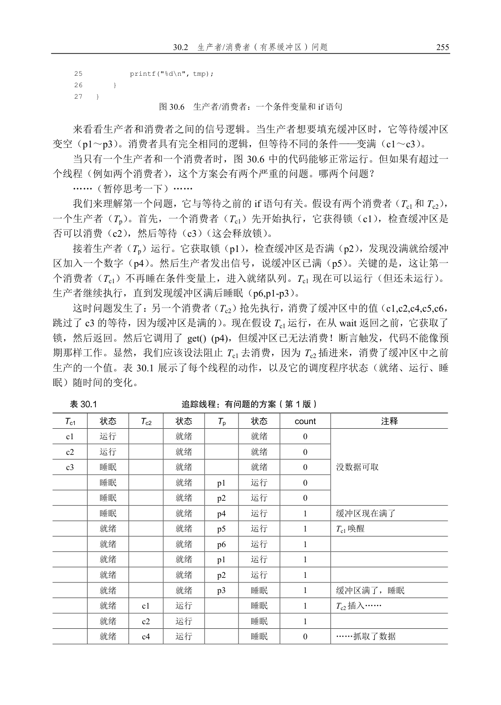
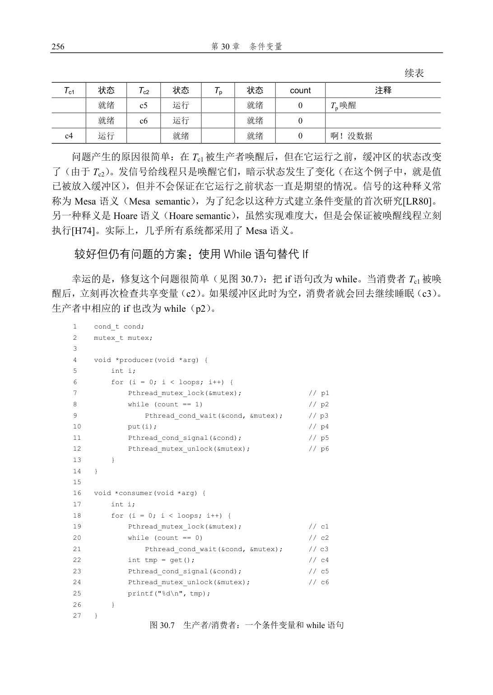
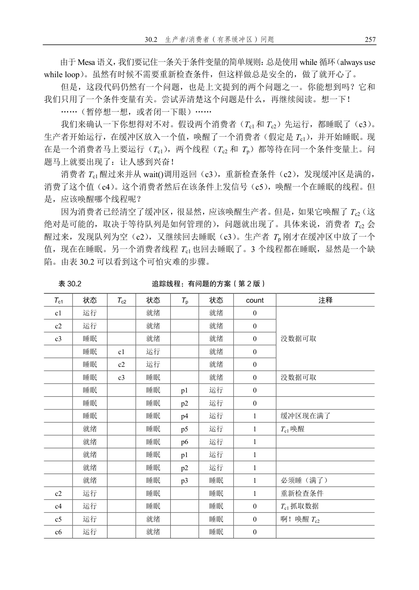
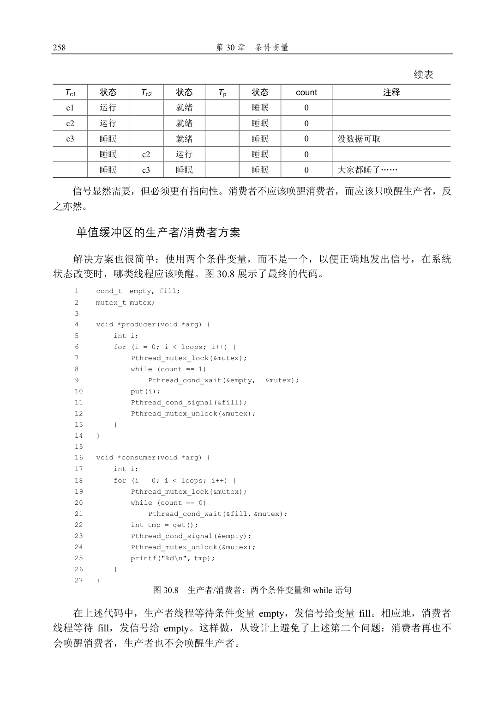

# 第30 章  条件变量

到目前为止，我们已经形成了锁的概念，看到了如何通过硬件和操作系统支持的正确组合来实现锁。然而，锁并不是并发程序设计所需的唯一原语。

具体来说，在很多情况下，线程需要检查某一条件（condition）满足之后，才会继续运行。例如，父线程需要检查子线程是否执行完毕 [这常被称为join()]。这种等待如何实现呢？我们来看如图30.1 所示的代码。

1    void *child(void *arg) {

2        printf("child\n");

3        // XXX how to indicate we are done?

4        return NULL;

5    }

6

7    int main(int argc, char *argv[]) {

8        printf("parent: begin\n");

9        pthread_t c;

10       Pthread_create(&c, NULL, child, NULL); // create child

11       // XXX how to wait for child?

12       printf("parent: end\n");

13       return 0;

14   } 图30.1  父线程等待子线程

我们期望能看到这样的输出：

parent: begin

child

parent: end  我们可以尝试用一个共享变量，如图30.2 所示。这种解决方案一般能工作，但是效率低下，因为主线程会自旋检查，浪费CPU 时间。我们希望有某种方式让父线程休眠，直到等待的条件满足（即子线程完成执行）。

1    volatile int done = 0;

2

3    void *child(void *arg) {

4        printf("child\n");

5        done = 1;

6        return NULL;

7    }

8

9    int main(int argc, char *argv[]) {

10       printf("parent: begin\n");

11       pthread_t c;

12       Pthread_create(&c, NULL, child, NULL); // create child

13       while (done == 0)

14           ; // spin

15       printf("parent: end\n");

16       return 0;

17   } 图30.2  父线程等待子线程：基于自旋的方案

关键问题：如何等待一个条件？

多线程程序中，一个线程等待某些条件是很常见的。简单的方案是自旋直到条件满足，这是极其低

效的，某些情况下甚至是错误的。那么，线程应该如何等待一个条件？

## 30.1  定义和程序

线程可以使用条件变量（condition variable），来等待一个条件变成真。条件变量是一个显式队列，当某些执行状态（即条件，condition）不满足时，线程可以把自己加入队列，等待（waiting）该条件。另外某个线程，当它改变了上述状态时，就可以唤醒一个或者多个等待线程（通过在该条件上发信号），让它们继续执行。Dijkstra 最早在“私有信号量”[D01]中提出这种思想。Hoare 后来在关于观察者的工作中，将类似的思想称为条件变量[H74]。

要声明这样的条件变量，只要像这样写：pthread_cond_t c;，这里声明c 是一个条件变量（注意：还需要适当的初始化）。条件变量有两种相关操作：wait()和signal()。线程要睡眠的时候，调用wait()。当线程想唤醒等待在某个条件变量上的睡眠线程时，调用signal()。具体来说，POSIX 调用如图30.3 所示。

pthread_cond_wait(pthread_cond_t *c, pthread_mutex_t *m);

pthread_cond_signal(pthread_cond_t  *c);

1    int done = 0;

2    pthread_mutex_t m = PTHREAD_MUTEX_INITIALIZER;

3    pthread_cond_t c = PTHREAD_COND_INITIALIZER;

4

5    void thr_exit() {

6        Pthread_mutex_lock(&m);

7        done = 1;

8        Pthread_cond_signal(&c);

9        Pthread_mutex_unlock(&m);

10    }

11

12    void *child(void *arg) {

13        printf("child\n");

14        thr_exit();

15        return NULL;

16   }

17

18   void thr_join() {

19       Pthread_mutex_lock(&m);

20       while (done == 0)

21           Pthread_cond_wait(&c, &m);

22       Pthread_mutex_unlock(&m);

23   }

24

25   int main(int argc, char *argv[]) {

26       printf("parent: begin\n");

27       pthread_t p;

28       Pthread_create(&p, NULL, child, NULL);

29       thr_join();

30       printf("parent: end\n");

31       return 0;

32   } 图30.3  父线程等待子线程：使用条件变量

我们常简称为wait()和signal()。你可能注意到一点，wait()调用有一个参数，它是互斥量。它假定在wait()调用时，这个互斥量是已上锁状态。wait()的职责是释放锁，并让调用线程休眠（原子地）。当线程被唤醒时（在另外某个线程发信号给它后），它必须重新获取锁，再返回调用者。这样复杂的步骤也是为了避免在线程陷入休眠时，产生一些竞态条件。我们观察一下图30.3 中join 问题的解决方法，以加深理解。

有两种情况需要考虑。第一种情况是父线程创建出子线程，但自己继续运行（假设只有一个处理器），然后马上调用thr_join()等待子线程。在这种情况下，它会先获取锁，检查子进程是否完成（还没有完成），然后调用wait()，让自己休眠。子线程最终得以运行，打印出“child”，并调用thr_exit()函数唤醒父进程，这段代码会在获得锁后设置状态变量done，然后向父线程发信号唤醒它。最后，父线程会运行（从wait()调用返回并持有锁），释放锁，打印出“parent:end”。

第二种情况是，子线程在创建后，立刻运行，设置变量done 为1，调用signal 函数唤醒其他线程（这里没有其他线程），然后结束。父线程运行后，调用thr_join()时，发现done已经是1 了，就直接返回。

最后一点说明：你可能看到父线程使用了一个while 循环，而不是if 语句来判断是否需要等待。虽然从逻辑上来说没有必要使用循环语句，但这样做总是好的（后面我们会加以说明）。

为了确保理解thr_exit()和thr_join()中每个部分的重要性，我们来看一些其他的实现。首先，你可能会怀疑状态变量done 是否需要。代码像下面这样如何？正确吗？

1    void thr_exit() {

2        Pthread_mutex_lock(&m);

3        Pthread_cond_signal(&c);

4        Pthread_mutex_unlock(&m);

5    }

6

7    void thr_join() {

8        Pthread_mutex_lock(&m);

9        Pthread_cond_wait(&c, &m);

10       Pthread_mutex_unlock(&m);

11   }  这段代码是有问题的。假设子线程立刻运行，并且调用thr_exit()。在这种情况下，子线程发送信号，但此时却没有在条件变量上睡眠等待的线程。父线程运行时，就会调用wait并卡在那里，没有其他线程会唤醒它。通过这个例子，你应该认识到变量done 的重要性，它记录了线程有兴趣知道的值。睡眠、唤醒和锁都离不开它。

下面是另一个糟糕的实现。在这个例子中，我们假设线程在发信号和等待时都不加锁。会发生什么问题？想想看！

1    void thr_exit() {

2        done = 1;

3        Pthread_cond_signal(&c);

4    }

5

6    void thr_join() {

7        if (done == 0)

8            Pthread_cond_wait(&c);

9    }  这里的问题是一个微妙的竞态条件。具体来说，如果父进程调用thr_join()，然后检查完done 的值为0，然后试图睡眠。但在调用wait 进入睡眠之前，父进程被中断。子线程修改变量done 为1，发出信号，同样没有等待线程。父线程再次运行时，就会长眠不醒，这就惨了。

提示：发信号时总是持有锁

尽管并不是所有情况下都严格需要，但有效且简单的做法，还是在使用条件变量发送信号时持有锁。

虽然上面的例子是必须加锁的情况，但也有一些情况可以不加锁，而这可能是你应该避免的。因此，为

了简单，请在调用signal 时持有锁（hold the lock when calling signal）。

这个提示的反面，即调用wait 时持有锁，不只是建议，而是wait 的语义强制要求的。因为wait 调

用总是假设你调用它时已经持有锁、调用者睡眠之前会释放锁以及返回前重新持有锁。因此，这个提示

的一般化形式是正确的：调用signal 和wait 时要持有锁（hold the lock when calling signal or wait），你会

保持身心健康的。

希望通过这个简单的join 示例，你可以看到使用条件变量的一些基本要求。为了确保你能理解，我们现在来看一个更复杂的例子：生产者/消费者（producer/consumer）或有界缓冲区（bounded-buffer）问题。

## 30.2  生产者/消费者（有界缓冲区）问题

本章要面对的下一个问题，是生产者/消费者（producer/consumer）问题，也叫作有界缓冲区（bounded buffer）问题。这一问题最早由Dijkstra 提出[D72]。实际上也正是通过研究这一问题，Dijkstra 和他的同事发明了通用的信号量（它可用作锁或条件变量）[D01]。

假设有一个或多个生产者线程和一个或多个消费者线程。生产者把生成的数据项放入

缓冲区；消费者从缓冲区取走数据项，以某种方式消费。

很多实际的系统中都会有这种场景。例如，在多线程的网络服务器中，一个生产者将HTTP 请求放入工作队列（即有界缓冲区），消费线程从队列中取走请求并处理。

我们在使用管道连接不同程序的输出和输入时，也会使用有界缓冲区，例如grep foo file.txt | wc -l。这个例子并发执行了两个进程，grep 进程从file.txt 中查找包括“foo”的行，写到标准输出；UNIX shell 把输出重定向到管道（通过pipe 系统调用创建）。管道的另一端是wc 进程的标准输入，wc 统计完行数后打印出结果。因此，grep 进程是生产者，wc 是进程是消费者，它们之间是内核中的有界缓冲区，而你在这个例子里只是一个开心的用户。

因为有界缓冲区是共享资源，所以我们必须通过同步机制来访问它，以免

①产生竞态条件。为了更好地理解这个问题，我们来看一些实际的代码。

首先需要一个共享缓冲区，让生产者放入数据，消费者取出数据。简单起见，我们就拿一个整数来做缓冲区（你当然可以想到用一个指向数据结构的指针来代替），两个内部函数将值放入缓冲区，从缓冲区取值。图30.4 为相关代码。

1    int buffer;

2    int count = 0; // initially, empty

3

4    void put(int value) {

5        assert(count == 0);

6        count = 1;

7        buffer = value;

8    }

9

10   int get() {

11       assert(count == 1);

12       count = 0;

13       return buffer;

14   } 图30.4  put 和get 函数（第1 版）

很简单，不是吗？put()函数会假设缓冲区是空的，把一个值存在缓冲区，然后把count设置为1 表示缓冲区满了。get()函数刚好相反，把缓冲区清空后（即将count 设置为0），并返回该值。不用担心这个共享缓冲区只能存储一条数据，稍后我们会一般化，用队列保存更多数据项，这会比听起来更有趣。

现在我们需要编写一些函数，知道何时可以访问缓冲区，以便将数据放入缓冲区或从缓冲区取出数据。条件是显而易见的：仅在count 为0 时（即缓冲器为空时），才将数据放入缓冲器中。仅在计数为1 时（即缓冲器已满时），才从缓冲器获得数据。如果我们编写同步代码，让生产者将数据放入已满的缓冲区，或消费者从空的数据获取数据，就做错了（在这段代码中，断言将触发）。

这项工作将由两种类型的线程完成，其中一类我们称之为生产者（producer）线程，另一类我们称之为消费者（consumer）线程。图30.5 展示了一个生产者的代码，它将一个整数放入共享缓冲区loops 次，以及一个消费者，它从该共享缓冲区中获取数据（永远不停），

① 这里我们用了某种严肃的古英语和虚拟语气形式。

每次打印出从共享缓冲区中提取的数据项。

1    void *producer(void *arg) {

2        int i;

3        int loops = (int) arg;

4        for (i = 0; i < loops; i++) {

5            put(i);

6        }

7    }

8 9    void *consumer(void *arg) {

10       int i;

11       while (1) {

12           int tmp = get();

13           printf("%d\n", tmp);

14       }

15   } 图30.5  生产者/消费者线程（第1 版）

有问题的方案

假设只有一个生产者和一个消费者。显然，put()和get()函数之中会有临界区，因为put()更新缓冲区，get()读取缓冲区。但是，给代码加锁没有用，我们还需别的东西。不奇怪，别的东西就是某些条件变量。在这个（有问题的）首次尝试中（见图30.6），我们用了条件变量cond 和相关的锁mutex。

1    cond_t cond;

2    mutex_t mutex;

3

4    void *producer(void *arg) {

5        int i;

6        for (i = 0; i < loops; i++) {

7            Pthread_mutex_lock(&mutex);           // p1

8            if (count == 1)                       // p2

9                Pthread_cond_wait(&cond, &mutex); // p3

10           put(i);                               // p4

11           Pthread_cond_signal(&cond);           // p5

12           Pthread_mutex_unlock(&mutex);         // p6

13       }

14   }

15

16   void *consumer(void *arg) {

17       int i;

18       for (i = 0; i < loops; i++) {

19           Pthread_mutex_lock(&mutex);           // c1

20           if (count == 0)                       // c2

21               Pthread_cond_wait(&cond, &mutex); // c3

22           int tmp = get();                      // c4

23           Pthread_cond_signal(&cond);           // c5

24           Pthread_mutex_unlock(&mutex);         // c6

最终的生产者/消费者方案

我们现在有了可用的生产者/消费者方案，但不太通用。我们最后的修改是提高并发和效率。具体来说，增加更多缓冲区槽位，这样在睡眠之前，可以生产多个值。同样，睡眠之前可以消费多个值。单个生产者和消费者时，这种方案因为上下文切换少，提高了效率。多个生产者和消费者时，它甚至支持并发生产和消费，从而提高了并发。幸运的是，和现有方案相比，改动也很小。

第一处修改是缓冲区结构本身，以及对应的put()和get()方法（见图30.9）。我们还稍稍修改了生产者和消费者的检查条件，以便决定是否要睡眠。图30.10 展示了最终的等待和信号逻辑。生产者只有在缓冲区满了的时候才会睡眠（p2），消费者也只有在队列为空的时候睡眠（c2）。至此，我们解决了生产者/消费者问题。

1    int buffer[MAX];

2    int fill = 0;

3    int use   = 0;

4    int count = 0;

5

6    void put(int value) {

7        buffer[fill] = value;

8        fill = (fill + 1) % MAX;

9        count++;

10   }

11

12   int get() {

13       int tmp = buffer[use];

14       use = (use + 1) % MAX;

15       count--;

16       return tmp;

17   } 图30.9  最终的put()和get()方法

1    cond_t empty, fill;

2    mutex_t mutex;

3 4    void *producer(void *arg) {

5        int i;

6        for (i = 0; i < loops; i++) {

7            Pthread_mutex_lock(&mutex);              // p1

8            while (count == MAX)                     // p2

9                Pthread_cond_wait(&empty, &mutex);   // p3

10           put(i);                                  // p4

11           Pthread_cond_signal(&fill);              // p5

12           Pthread_mutex_unlock(&mutex);            // p6

13       }

14   }

15 16   void *consumer(void *arg) {

17       int i;

18       for (i = 0; i < loops; i++) {

19           Pthread_mutex_lock(&mutex);            // c1

20           while (count == 0)                     // c2

21               Pthread_cond_wait(&fill, &mutex);  // c3

22           int tmp = get();                       // c4

23           Pthread_cond_signal(&empty);           // c5

24           Pthread_mutex_unlock(&mutex);          // c6

25           printf("%d\n", tmp);

26       }

27   } 图30.10  最终有效方案

提示：对条件变量使用while（不是if）

多线程程序在检查条件变量时，使用while 循环总是对的。if 语句可能会对，这取决于发信号的语

义。因此，总是使用while，代码就会符合预期。

对条件变量使用while 循环，这也解决了假唤醒（spurious wakeup）的情况。某些线程库中，由于

实现的细节，有可能出现一个信号唤醒两个线程的情况[L11]。再次检查线程的等待条件，假唤醒是另一

个原因。

## 30.3  覆盖条件

现在再来看条件变量的一个例子。这段代码摘自Lampson 和Redell 关于飞行员的论文[LR80]，同一个小组首次提出了上述的Mesa 语义（Mesa semantic，他们使用的语言是Mesa，因此而得名）。

他们遇到的问题通过一个简单的例子就能说明，在这个例子中，是一个简单的多线程内存分配库。图30.11 是展示这一问题的代码片段。

1    // how many bytes of the heap are free?

2    int bytesLeft = MAX_HEAP_SIZE;

3

4    // need lock and condition too

5    cond_t c;

6    mutex_t m;

7

8    void *

9    allocate(int size) {

10       Pthread_mutex_lock(&m);

11       while (bytesLeft < size)

12           Pthread_cond_wait(&c, &m);

13       void *ptr = ...; // get mem from heap

14       bytesLeft -= size;

15       Pthread_mutex_unlock(&m);

16       return ptr;

17   }

18

19   void free(void *ptr, int size) {

20       Pthread_mutex_lock(&m);

21       bytesLeft += size;

22       Pthread_cond_signal(&c); // whom to signal??

23       Pthread_mutex_unlock(&m);

24   } 图30.11  覆盖条件的例子

从代码中可以看出，当线程调用进入内存分配代码时，它可能会因为内存不足而等待。相应的，线程释放内存时，会发信号说有更多内存空闲。但是，代码中有一个问题：应该唤醒哪个等待线程（可能有多个线程）？

考虑以下场景。假设目前没有空闲内存，线程Ta 调用allocate(100)，接着线程Tb 请求较少的内存，调用allocate(10)。Ta 和Tb 都等待在条件上并睡眠，没有足够的空闲内存来满足它们的请求。

这时，假定第三个线程Tc 调用了free(50)。遗憾的是，当它发信号唤醒等待线程时，可能不会唤醒申请10 字节的Tb 线程。而Ta 线程由于内存不够，仍然等待。因为不知道唤醒哪个（或哪些）线程，所以图中代码无法正常工作。

Lampson 和Redell 的解决方案也很直接：用pthread_cond_broadcast()代替上述代码中的pthread_cond_signal()，唤醒所有的等待线程。这样做，确保了所有应该唤醒的线程都被唤醒。当然，不利的一面是可能会影响性能，因为不必要地唤醒了其他许多等待的线程，它们本来（还）不应该被唤醒。这些线程被唤醒后，重新检查条件，马上再次睡眠。

Lampson 和Redell 把这种条件变量叫作覆盖条件（covering condition），因为它能覆盖所有需要唤醒线程的场景（保守策略）。成本如上所述，就是太多线程被唤醒。聪明的读者可能发现，在单个条件变量的生产者/消费者问题中，也可以使用这种方法。但是，在这个例子中，我们有更好的方法，因此用了它。一般来说，如果你发现程序只有改成广播信号时才能工作（但你认为不需要），可能是程序有缺陷，修复它！但在上述内存分配的例子中，广播可能是最直接有效的方案。

## 30.4  小结

我们看到了引入锁之外的另一个重要同步原语：条件变量。当某些程序状态不符合要求时，通过允许线程进入休眠状态，条件变量使我们能够漂亮地解决许多重要的同步问题，包括著名的（仍然重要的）生产者/消费者问题，以及覆盖条件。

## 参考资料

[D72]“Information Streams Sharing a Finite Buffer”

E.W. Dijkstra

Information Processing Letters 1: 179180, 1972

这是一篇介绍生产者/消费者问题的著名文章。

[D01]“My recollections of operating system design”

E.W. Dijkstra April, 2001

如果你对这一领域的先驱们如何提出一些非常基本的概念（诸如“中断”和“栈”等概念）感兴趣，那么

它是一本很好的读物！

[H74]“Monitors: An Operating System Structuring Concept”

C.A.R. Hoare

Communications of the ACM, 17:10, pages 549–557, October 1974

Hoare 在并发方面做了大量的理论工作。不过，他最出名的工作可能还是快速排序算法，那是世上最酷的

排序算法，至少本书的作者这样认为。

[L11]“Pthread cond signal Man Page”

Linux 手册页展示了一个很好的简单例子，以说明为什么线程可能会发生假唤醒——因为信号/唤醒代码中

的竞态条件。

[LR80]“Experience with Processes and Monitors in Mesa”

B.W. Lampson, D.R. Redell

Communications of the ACM. 23:2, pages 105-117, February 1980

一篇关于如何在真实系统中实际实现信号和条件变量的极好论文，导致了术语“Mesa”语义，说明唤醒意

味着什么。较早的语义由Tony Hoare [H74]提出，于是被称为“Hoare”语义。