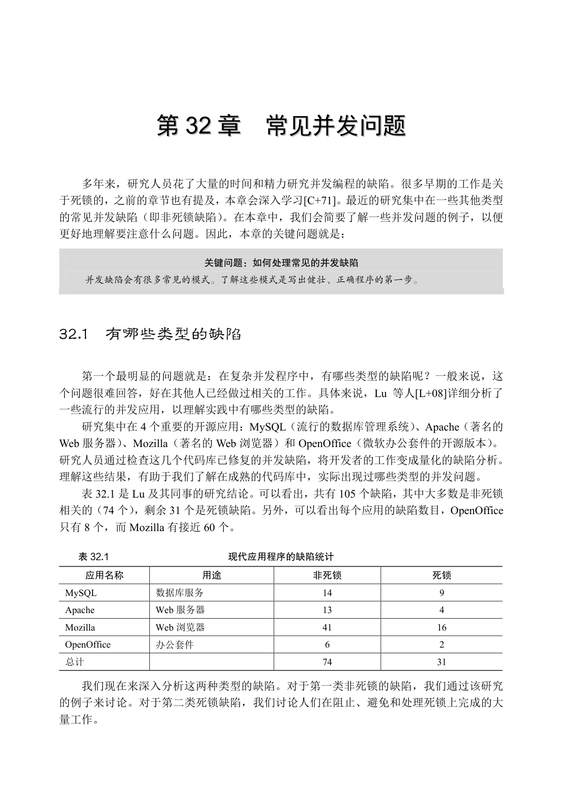
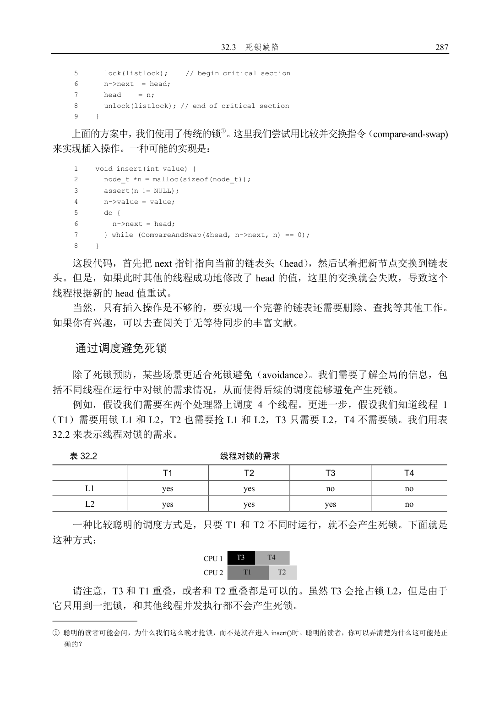
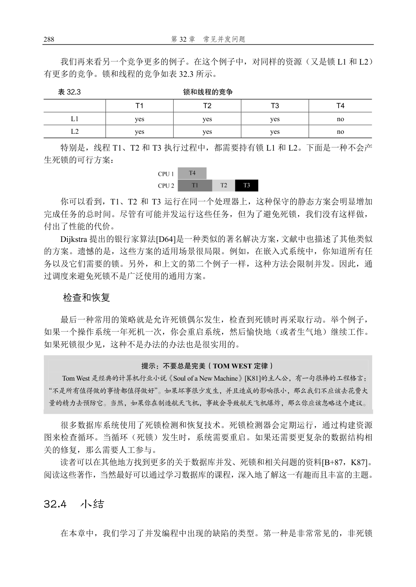

# 第32 章  常见并发问题

## 32.2  非死锁缺陷

Lu 的研究表明，非死锁问题占了并发问题的大多数。它们是怎么发生的？我们如何修复？我们现在主要讨论其中两种：违反原子性（atomicity violation）缺陷和错误顺序（order violation）缺陷。

违反原子性缺陷

第一种类型的问题叫作违反原子性。这是一个MySQL 中出现的例子。读者可以先自行找出其中问题所在。

1    Thread 1::

2    if (thd->proc_info) {

3      ...

4      fputs(thd->proc_info, ...);

5      ...

6    }

7

8    Thread 2::

9    thd->proc_info = NULL;  这个例子中，两个线程都要访问thd 结构中的成员proc_info。第一个线程检查proc_info非空，然后打印出值；第二个线程设置其为空。显然，当第一个线程检查之后，在fputs()调用之前被中断，第二个线程把指针置为空；当第一个线程恢复执行时，由于引用空指针，导致程序奔溃。

根据Lu 等人，更正式的违反原子性的定义是：“违反了多次内存访问中预期的可串行性（即代码段本意是原子的，但在执行中并没有强制实现原子性）”。在我们的例子中，proc_info 的非空检查和fputs()调用打印proc_info 是假设原子的，当假设不成立时，代码就出问题了。

这种问题的修复通常（但不总是）很简单。你能想到如何修复吗？ 在这个方案中，我们只要给共享变量的访问加锁，确保每个线程访问proc_info 字段时，都持有锁（proc_info_lock）。当然，访问这个结构的所有其他代码，也应该先获取锁。

1    pthread_mutex_t proc_info_lock = PTHREAD_MUTEX_INITIALIZER;

2

3    Thread 1::

4    pthread_mutex_lock(&proc_info_lock);

5    if (thd->proc_info) {

6      ...

7      fputs(thd->proc_info, ...);

8      ...

9    }

10    pthread_mutex_unlock(&proc_info_lock);

11

12   Thread 2::

13   pthread_mutex_lock(&proc_info_lock);

14   thd->proc_info = NULL;

15   pthread_mutex_unlock(&proc_info_lock);

违反顺序缺陷

Lu 等人提出的另一种常见的非死锁问题叫作违反顺序（order violation）。下面是一个简单的例子。同样，看看你是否能找出为什么下面的代码有缺陷。

1    Thread 1::

2    void init() {

3        ...

4        mThread = PR_CreateThread(mMain, ...);

5        ...

6    }

7

8    Thread 2::

9    void mMain(...) {

10       ...

11       mState = mThread->State;

12       ...

13   }  你可能已经发现，线程2 的代码中似乎假定变量mThread 已经被初始化了（不为空）。然而，如果线程1 并没有首先执行，线程2 就可能因为引用空指针奔溃（假设mThread初始值为空；否则，可能会产生更加奇怪的问题，因为线程2 中会读到任意的内存位置并引用）。

违反顺序更正式的定义是：“两个内存访问的预期顺序被打破了（即A 应该在B 之前执行，但是实际运行中却不是这个顺序）”[L+08]。

我们通过强制顺序来修复这种缺陷。正如之前详细讨论的，条件变量（condition variables）就是一种简单可靠的方式，在现代代码集中加入这种同步。在上面的例子中，我们可以把代码修改成这样：

1    pthread_mutex_t mtLock = PTHREAD_MUTEX_INITIALIZER;

2    pthread_cond_t mtCond = PTHREAD_COND_INITIALIZER;

3    int mtInit            = 0;

4

5    Thread 1::

6    void init() {

7       ...

8       mThread = PR_CreateThread(mMain, ...);

9

10      // signal that the thread has been created...

11      pthread_mutex_lock(&mtLock);

12      mtInit = 1;

13      pthread_cond_signal(&mtCond);

14      pthread_mutex_unlock(&mtLock);

15      ...

16   }

17

18   Thread 2::

19   void mMain(...) {

20      ...

21      // wait for the thread to be initialized...

22      pthread_mutex_lock(&mtLock);

23      while (mtInit == 0)

24          pthread_cond_wait(&mtCond,  &mtLock);

25      pthread_mutex_unlock(&mtLock);

26

27      mState = mThread->State;

28      ...

29   }  在这段修复的代码中，我们增加了一个锁（mtLock）、一个条件变量（mtCond）以及状态的变量（mtInit）。初始化代码运行时，会将mtInit 设置为1，并发出信号表明它已做了这件事。如果线程2 先运行，就会一直等待信号和对应的状态变化；如果后运行，线程2 会检查是否初始化（即mtInit 被设置为1），然后正常运行。请注意，我们可以用mThread 本身作为状态变量，但为了简洁，我们没有这样做。当线程之间的顺序很重要时，条件变量（或信号量）能够解决问题。

非死锁缺陷：小结

Lu 等人的研究中，大部分（97%）的非死锁问题是违反原子性和违反顺序这两种。因此，程序员仔细研究这些错误模式，应该能够更好地避免它们。此外，随着更自动化的代码检查工具的发展，它们也应该关注这两种错误，因为开发中发现的非死锁问题大部分都是这两种。

然而，并不是所有的缺陷都像我们举的例子一样，这么容易修复。有些问题需要对应用程序的更深的了解，以及大量代码及数据结构的调整。阅读Lu 等人的优秀（可读性强）的论文，了解更多细节。

## 32.3  死锁缺陷

除了上面提到的并发缺陷，死锁（deadlock）是一种在许多复杂并发系统中出现的经典问题。例如，当线程1 持有锁L1，正在等待另外一个锁L2，而线程2 持有锁L2，却在等待锁L1 释放时，死锁就产生了。以下的代码片段就可能出现这种死锁：

Thread 1:    Thread 2:

lock(L1);    lock(L2);

lock(L2);    lock(L1);

这段代码运行时，不是一定会出现死锁的。当线程1 占有锁L1，上下文切换到线程2。线程2 锁住L2，试图锁住L1。这时才产生了死锁，两个线程互相等待。如图32.1 所示，其中的圈（cycle）表明了死锁。

图32.1  死锁依赖图

该图应该有助于描述清楚问题。程序员在编写代码中应该如何处理死锁呢？

关键问题：如何对付死锁

我们在实现系统时，如何避免或者能够检测、恢复死锁呢？这是目前系统中的真实问题吗？

为什么发生死锁

你可能在想，上文提到的这个死锁的例子，很容易就可以避免。例如，只要线程1 和线程2 都用相同的抢锁顺序，死锁就不会发生。那么，死锁为什么还会发生？

其中一个原因是在大型的代码库里，组件之间会有复杂的依赖。以操作系统为例。虚拟内存系统在需要访问文件系统才能从磁盘读到内存页；文件系统随后又要和虚拟内存交互，去申请一页内存，以便存放读到的块。因此，在设计大型系统的锁机制时，你必须要仔细地去避免循环依赖导致的死锁。

另一个原因是封装（encapsulation）。软件开发者一直倾向于隐藏实现细节，以模块化的方式让软件开发更容易。然而，模块化和锁不是很契合。Jula 等人指出[J+08]，某些看起来没有关系的接口可能会导致死锁。以Java 的Vector 类和AddAll()方法为例，我们这样调用这个方法：

Vector v1, v2;

v1.AddAll(v2);  在内部，这个方法需要多线程安全，因此针对被添加向量（v1）和参数（v2）的锁都需要获取。假设这个方法，先给v1 加锁，然后再给v2 加锁。如果另外某个线程几乎同时在调用v2.AddAll(v1)，就可能遇到死锁。

产生死锁的条件

死锁的产生需要如下4 个条件[C+71]。

互斥：线程对于需要的资源进行互斥的访问（例如一个线程抢到锁）。    持有并等待：线程持有了资源（例如已将持有的锁），同时又在等待其他资源（例

如，需要获得的锁）。    非抢占：线程获得的资源（例如锁），不能被抢占。    循环等待：线程之间存在一个环路，环路上每个线程都额外持有一个资源，而这

个资源又是下一个线程要申请的。 如果这4 个条件的任何一个没有满足，死锁就不会产生。因此，我们首先研究一下预防死锁的方法；每个策略都设法阻止某一个条件，从而解决死锁的问题。

预防

循环等待

也许最实用的预防技术（当然也是经常采用的），就是让代码不会产生循环等待。最直接的方法就是获取锁时提供一个全序（total ordering）。假如系统共有两个锁（L1 和L2），那么我们每次都先申请L1 然后申请L2，就可以避免死锁。这样严格的顺序避免了循环等待，也就不会产生死锁。

当然，更复杂的系统中不会只有两个锁，锁的全序可能很难做到。因此，偏序（partial ordering）可能是一种有用的方法，安排锁的获取并避免死锁。Linux 中的内存映射代码就是一个偏序锁的好例子[T+94]。代码开头的注释表明了10 组不同的加锁顺序，包括简单的关系，比如i_mutex 早于i_mmap_mutex，也包括复杂的关系，比如i_mmap_mutex 早于private_lock，早于swap_lock，早于mapping->tree_lock。

你可以想到，全序和偏序都需要细致的锁策略的设计和实现。另外，顺序只是一种约定，粗心的程序员很容易忽略，导致死锁。最后，有序加锁需要深入理解代码库，了解各种函数的调用关系，即使一个错误，也会导致“D”字

①。

提示：通过锁的地址来强制锁的顺序

当一个函数要抢多个锁时，我们需要注意死锁。比如有一个函数：do_something(mutex t *m1, mutex

t *m2)，如果函数总是先抢m1，然后m2，那么当一个线程调用do_something(L1, L2)，而另一个线程调

用do_something(L2, L1)时，就可能会产生死锁。

为了避免这种特殊问题，聪明的程序员根据锁的地址作为获取锁的顺序。按照地址从高到低，或者

从低到高的顺序加锁，do_something()函数就可以保证不论传入参数是什么顺序，函数都会用固定的顺

序加锁。具体的代码如下：

if (m1 > m2) { // grab locks in high-to-low address order

pthread_mutex_lock(m1);

pthread_mutex_lock(m2);

} else {

pthread_mutex_lock(m2);

pthread_mutex_lock(m1);

① “D”表示“Deadlock”。

}

// Code assumes that m1 != m2 (it is not the same lock)  在获取多个锁时，通过简单的技巧，就可以确保简单有效的无死锁实现。

持有并等待

死锁的持有并等待条件，可以通过原子地抢锁来避免。实践中，可以通过如下代码来实现：

1    lock(prevention);

2    lock(L1);

3    lock(L2);

4    ...

5    unlock(prevention);  先抢到prevention 这个锁之后，代码保证了在抢锁的过程中，不会有不合时宜的线程切换，从而避免了死锁。当然，这需要任何线程在任何时候抢占锁时，先抢到全局的prevention锁。例如，如果另一个线程用不同的顺序抢锁L1 和L2，也不会有问题，因为此时，线程已经抢到了prevention 锁。

注意，出于某些原因，这个方案也有问题。和之前一样，它不适用于封装：因为这个方案需要我们准确地知道要抢哪些锁，并且提前抢到这些锁。因为要提前抢到所有锁（同时），而不是在真正需要的时候，所以可能降低了并发。

非抢占

在调用unlock 之前，都认为锁是被占有的，多个抢锁操作通常会带来麻烦，因为我们等待一个锁时，同时持有另一个锁。很多线程库提供更为灵活的接口来避免这种情况。具体来说，trylock()函数会尝试获得锁，或者返回−1，表示锁已经被占有。你可以稍后重试一下。

可以用这一接口来实现无死锁的加锁方法：

1    top:

2      lock(L1);

3      if (trylock(L2) == -1) {

4        unlock(L1);

5        goto top;

6    }  注意，另一个线程可以使用相同的加锁方式，但是不同的加锁顺序（L2 然后L1），程序仍然不会产生死锁。但是会引来一个新的问题：活锁（livelock）。两个线程有可能一直重复这一序列，又同时都抢锁失败。这种情况下，系统一直在运行这段代码（因此不是死锁），但是又不会有进展，因此名为活锁。也有活锁的解决方法：例如，可以在循环结束的时候，先随机等待一个时间，然后再重复整个动作，这样可以降低线程之间的重复互相干扰。

关于这个方案的最后一点：使用trylock 方法可能会有一些困难。第一个问题仍然是封

装：如果其中的某一个锁，是封装在函数内部的，那么这个跳回开始处就很难实现。如果代码在中途获取了某些资源，必须要确保也能释放这些资源。例如，在抢到L1 后，我们的代码分配了一些内存，当抢L2 失败时，并且在返回开头之前，需要释放这些内存。当然，在某些场景下（例如，之前提到的Java 的vector 方法），这种方法很有效。

互斥

最后的预防方法是完全避免互斥。通常来说，代码都会存在临界区，因此很难避免互斥。那么我们应该怎么做呢？

Herlihy 提出了设计各种无等待（wait-free）数据结构的思想[H91]。想法很简单：通过强大的硬件指令，我们可以构造出不需要锁的数据结构。

举个简单的例子，假设我们有比较并交换（compare-and-swap）指令，是一种由硬件提供的原子指令，做下面的事：

1    int CompareAndSwap(int *address, int expected, int new) {

2      if (*address == expected) {

3        *address = new;

4        return 1; // success

5      }

6      return 0;   // failure

7    }  假定我们想原子地给某个值增加特定的数量。我们可以这样实现：

1    void AtomicIncrement(int *value, int amount) {

2      do {

3        int old = *value;

4      } while (CompareAndSwap(value, old, old + amount) == 0);

5    }  无须获取锁，更新值，然后释放锁这些操作，我们使用比较并交换指令，反复尝试将值更新到新的值。这种方式没有使用锁，因此不会有死锁（有可能产生活锁）。

我们来考虑一个更复杂的例子：链表插入。这是在链表头部插入元素的代码：

1    void insert(int value) {

2      node_t *n = malloc(sizeof(node_t));

3      assert(n != NULL);

4      n->value = value;

5      n->next = head;

6      head     = n;

7    }  这段代码在多线程同时调用的时候，会有临界区（看看你是否能弄清楚原因）。当然，我们可以通过给相关代码加锁，来解决这个问题：

1    void insert(int value) {

2      node_t *n = malloc(sizeof(node_t));

3      assert(n != NULL);

4      n->value = value;

缺陷，通常也很容易修复。这种问题包括：违法原子性，即应该一起执行的指令序列没有一起执行；违反顺序，即两个线程所需的顺序没有强制保证。

同时，我们简要地讨论了死锁：为何会发生，以及如何处理。这个问题几乎和并发一样古老，已经有成百上千的相关论文了。实践中是自行设计抢锁的顺序，从而避免死锁发生。无等待的方案也很有希望，在一些通用库和系统中，包括Linux，都已经有了一些无等待的实现。然而，这种方案不够通用，并且设计一个新的无等待的数据结构极其复杂，以至于不够实用。也许，最好的解决方案是开发一种新的并发编程模型：在类似MapReduce（来自Google）[GD02]这样的系统中，程序员可以完成一些类型的并行计算，无须任何锁。

锁必然带来各种困难，也许我们应该尽可能地避免使用锁，除非确信必须使用。

## 参考资料

[B+87]“Concurrency Control and Recovery in Database Systems”Philip A. Bernstein, Vassos Hadzilacos, Nathan

Goodman Addison-Wesley, 1987

数据库管理系统中并发性的经典教材。如你所知，理解数据库领域的并发性、死锁和其他主题本身就是一

个世界。研究它，自己探索这个世界。

[C+71]“System Deadlocks”

E.G. Coffman, M.J. Elphick, A. Shoshani ACM Computing Surveys, 3:2, June 1971

这篇经典论文概述了死锁的条件以及如何处理它。当然有一些关于这个话题的早期论文，详细信息请参阅

该论文的参考文献。

[D64]“Een algorithme ter voorkoming van de dodelijke omarming”Circulated privately, around 1964

事实上，Dijkstra 不仅提出了死锁问题的一些解决方案，更重要的是他首先注意到了死锁的存在，至少是以

书面形式。然而，他称之为“致命的拥抱”，（幸好）没有流行起来。

[GD02]“MapReduce: Simplified Data Processing on Large Clusters”Sanjay Ghemawhat and Jeff Dean

OSDI ’04, San Francisco, CA, October 2004

MapReduce 论文迎来了大规模数据处理时代，提出了一个框架，在通常不可靠的机器群集上执行这样的

计算。

[H91]“Wait-free Synchronization”Maurice Herlihy

ACM TOPLAS, 13(1), pages 124-149, January 1991

Herlihy 的工作开创了无等待方式编写并发程序的想法。这些方法往往复杂而艰难，通常比正确使用锁更困

难，可能会限制它们在现实世界中的成功。

[J+08]“Deadlock Immunity: Enabling Systems To Defend Against Deadlocks”Horatiu Jula, Daniel Tralamazza,

Cristian Zamfir, George Candea

OSDI ’08, San Diego, CA, December 2008

最近的优秀文章，关于死锁以及如何避免在特定系统中一次又一次地陷入同一个问题。

[K81]“Soul of a New Machine”Tracy Kidder, 1980

任何系统建造者或工程师都必须阅读，详细介绍Tom West 领导的Data General（DG）内部团队如何制造“新

机器”的早期工作。Kidder 的其他图书也非常出色，其中包括《Mountains beyond Mountains》。 或者，也

许你不同意我们的观点？

[K87]“Deadlock Detection in Distributed Databases”Edgar Knapp

ACM Computing Surveys, Volume 19, Number 4, December 1987

分布式数据库系统中死锁检测的极好概述，也指出了一些其他相关的工作，因此是开始阅读的好文章。

[L+08]“Learning from Mistakes — A Comprehensive Study on Real World Concurrency Bug Characteristics”

Shan Lu, Soyeon Park, Eunsoo Seo, Yuanyuan Zhou

ASPLOS ’08, March 2008, Seattle, Washington

首次深入研究真实软件中的并发错误，也是本章的基础。参见Y.Y. Zhou 或Shan Lu 的网页，有许多关于缺

陷的更有趣的论文。

[T+94]“Linux File Memory Map Code”Linus Torvalds and many others

感谢Michael Walfish（纽约大学）指出这个宝贵的例子。真实的世界，就像你在这个文件中看到的那样，

可能比教科书中的简单、清晰更复杂一些。