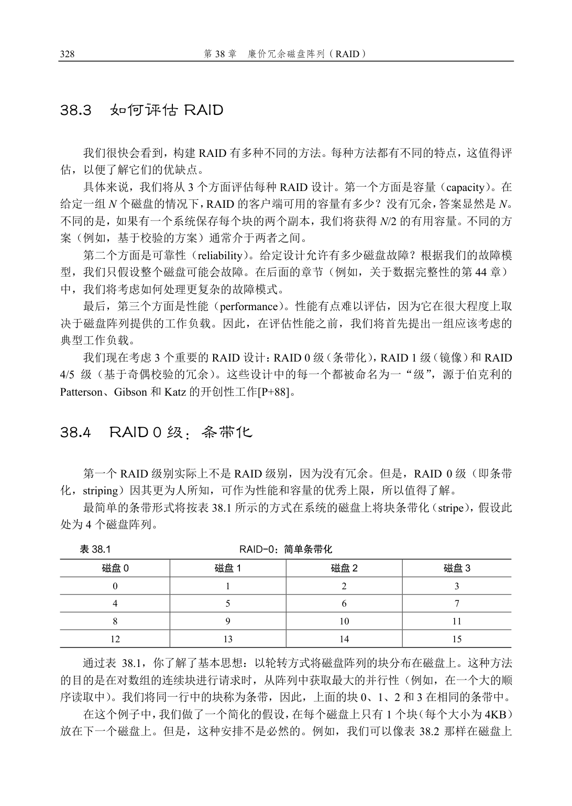
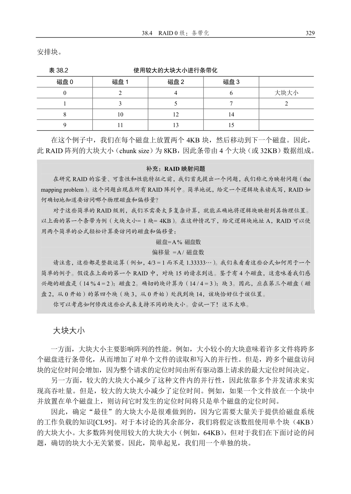
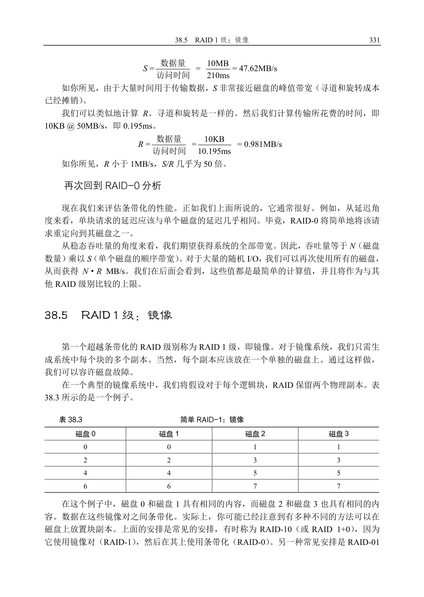
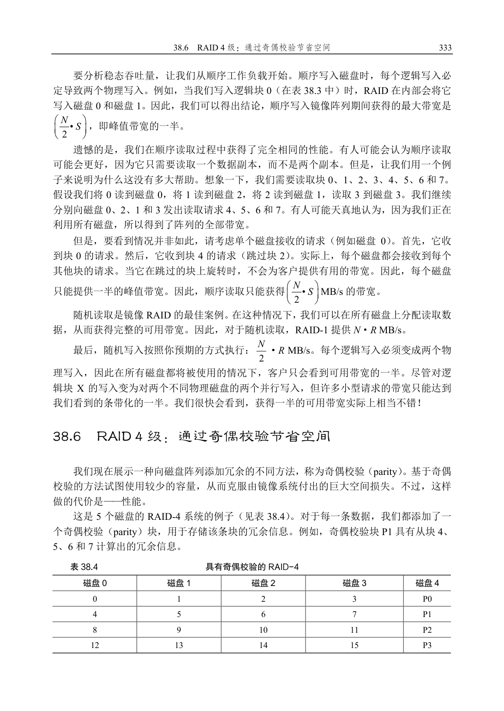
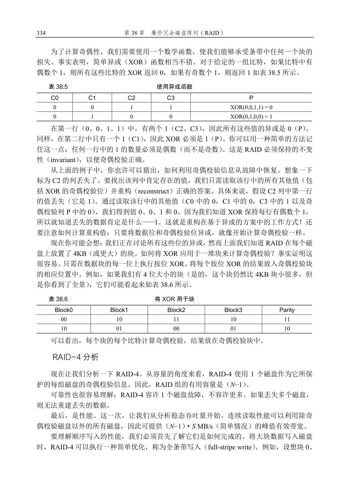
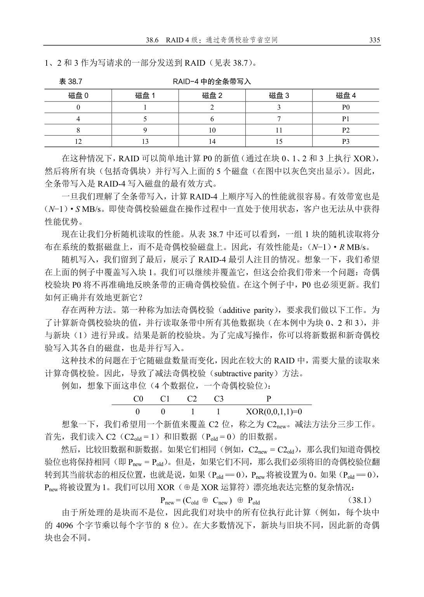
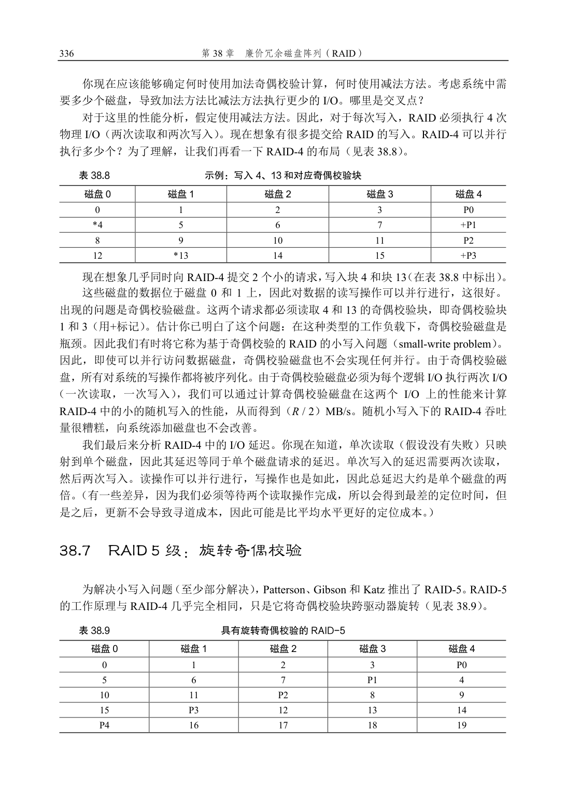
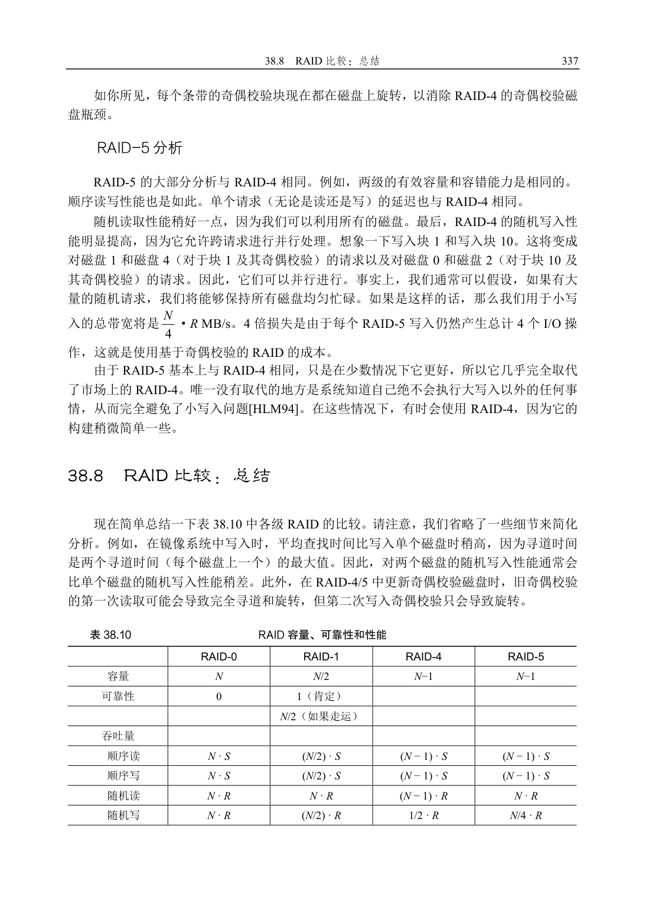
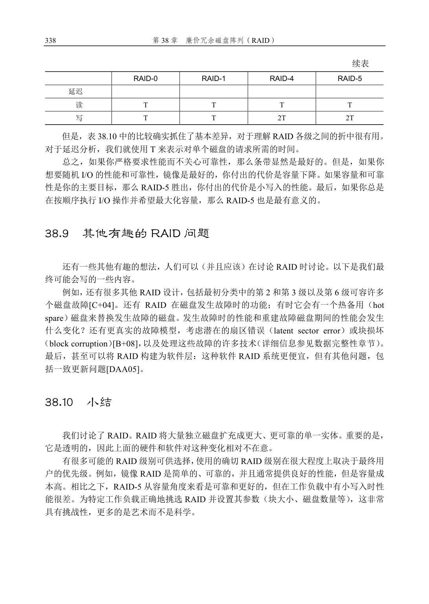

# 第38 章  廉价冗余磁盘阵列（RAID）

我们使用磁盘时，有时希望它更快。I/O 操作很慢，因此可能成为整个系统的瓶颈。我们使用磁盘时，有时希望它更大。越来越多的数据正在上线，因此磁盘变得越来越满。我们使用磁盘时，有时希望它更可靠。如果磁盘出现故障，而数据没有备份，那么所有有价值的数据都没了。

关键问题：如何得到大型、快速、可靠的磁盘

我们如何构建一个大型、快速和可靠的存储系统？关键技术是什么？不同方法之间的折中是什么？

本章将介绍廉价冗余磁盘阵列（Redundant Array of Inexpensive Disks），更多时候称为RAID [P+88]，这种技术使用多个磁盘一起构建更快、更大、更可靠的磁盘系统。这个词在20世纪80年代后期由U.C.伯克利的一组研究人员引入（由David Patterson教授和Randy Katz教授以及后来的学生Garth Gibson 领导）。大约在这个时候，许多不同的研究人员同时提出了使用多个磁盘来构建更好的存储系统的基本思想[BJ88，K86，K88，PB86，SG86]。

从外部看，RAID 看起来像一个磁盘：一组可以读取或写入的块。在内部，RAID 是一个复杂的庞然大物，由多个磁盘、内存（包括易失性和非易失性）以及一个或多个处理器来管理系统。硬件RAID 非常像一个计算机系统，专门用于管理一组磁盘。

与单个磁盘相比，RAID 具有许多优点。一个好处就是性能。并行使用多个磁盘可以大大加快I/O 时间。另一个好处是容量。大型数据集需要大型磁盘。最后，RAID 可以提高可靠性。在多个磁盘上传输数据（无RAID 技术）会使数据容易受到单个磁盘丢失的影响。通过某种形式的冗余（redundancy），RAID 可以容许损失一个磁盘并保持运行，就像没有错误一样。

提示：透明支持部署

在考虑如何向系统添加新功能时，应该始终考虑是否可以透明地（transparently）添加这样的功能，

而不需要对系统其余部分进行更改。要求彻底重写现有软件（或激进的硬件更改）会减少创意产生影响

的机会。RAID 就是一个很好的例子，它的透明肯定有助于它的成功。管理员可以安装基于SCSI 的RAID

存储阵列而不是SCSI 磁盘，系统的其他部分（主机，操作系统等）不必更改一位就可以开始使用它。

通过解决这个部署（deployment）问题，RAID 从第一天开始就取得了更大的成功。

令人惊讶的是，RAID 为使用它们的系统透明地（transparently）提供了这些优势，即RAID 对于主机系统看起来就像一个大磁盘。当然，透明的好处在于它可以简单地用RAID替换磁盘，而不需要更换一行软件。操作系统和客户端应用程序无须修改，就可以继续运行。通过这种方式，透明极大地提高了RAID 的可部署性（deployability），使用户和管理员可以使用RAID，而不必担心软件兼容性问题。

我们现在来讨论一些RAID 的重要方面。从接口、故障模型开始，然后讨论如何在 3个重要的方面评估RAID 设计：容量、可靠性和性能。然后我们讨论一些对RAID 设计和实现很重要的其他问题。

## 38.1  接口和RAID 内部

对于上面的文件系统，RAID 看起来像是一个很大的、（我们希望是）快速的、并且（希望是）可靠的磁盘。就像使用单个磁盘一样，它将自己展现为线性的块数组，每个块都可以由文件系统（或其他客户端）读取或写入。

当文件系统向RAID 发出逻辑I/O 请求时，RAID 内部必须计算要访问的磁盘（或多个磁盘）以完成请求，然后发出一个或多个物理I/O 来执行此操作。这些物理I/O 的确切性质取决于RAID 级别，我们将在下面详细讨论。但是，举一个简单的例子，考虑一个RAID，它保留每个块的两个副本（每个都在一个单独的磁盘上）。当写入这种镜像（mirrored）RAID系统时，RAID 必须为它发出的每一个逻辑I/O 执行两个物理I/O。

RAID 系统通常构建为单独的硬件盒，并通过标准连接（例如，SCSI 或SATA）接入主机。然而，在内部，RAID 相当复杂。它包括一个微控制器，运行固件以指导RAID 的操作。它还包括DRAM 这样的易失性存储器，在读取和写入时缓冲数据块。在某些情况下，还包括非易失性存储器，安全地缓冲写入。它甚至可能包含专用的逻辑电路，来执行奇偶校验计算（在某些RAID 级别中非常有用，下面会提到）。在很高的层面上，RAID 是一个非常专业的计算机系统：它有一个处理器，内存和磁盘。然而，它不是运行应用程序，而是运行专门用于操作RAID 的软件。

## 38.2  故障模型

要理解RAID 并比较不同的方法，我们必须考虑故障模型。RAID 旨在检测并从某些类型的磁盘故障中恢复。因此，准确地知道哪些故障对于实现工作设计至关重要。

我们假设的第一个故障模型非常简单，并且被称为故障—停止（fail-stop）故障模型[S84]。在这种模式下，磁盘可以处于两种状态之一：工作状态或故障状态。使用工作状态的磁盘时，所有块都可以读取或写入。相反，当磁盘出现故障时，我们认为它永久丢失。

故障—停止模型的一个关键方面是它关于故障检测的假定。具体来说，当磁盘发生故障时，我们认为这很容易检测到。例如，在RAID 阵列中，我们假设RAID 控制器硬件（或软件）可以立即观察磁盘何时发生故障。

因此，我们暂时不必担心更复杂的“无声”故障，如磁盘损坏。我们也不必担心在其他工作磁盘上无法访问单个块（有时称为潜在扇区错误）。稍后我们会考虑这些更复杂的（遗憾的是，更现实的）磁盘错误。

回到RAID-0 分析

现在让我们评估条带化的容量、可靠性和性能。从容量的角度来看，它是顶级的：给定N 个磁盘，条件化提供N 个磁盘的有用容量。从可靠性的角度来看，条带化也是顶级的，但是最糟糕：任何磁盘故障都会导致数据丢失。最后，性能非常好：通常并行使用所有磁盘来为用户I/O 请求提供服务。

评估RAID 性能

在分析RAID 性能时，可以考虑两种不同的性能指标。首先是单请求延迟。了解单个I/O 请求对RAID 的满意度非常有用，因为它可以揭示单个逻辑I/O 操作期间可以存在多少并行性。第二个是RAID 的稳态吞吐量，即许多并发请求的总带宽。由于RAID 常用于高性能环境，因此稳态带宽至关重要，因此将成为我们分析的主要重点。

为了更详细地理解吞吐量，我们需要提出一些感兴趣的工作负载。对于本次讨论，我们将假设有两种类型的工作负载：顺序（sequential）和随机（random）。对于顺序的工作负载，我们假设对阵列的请求大部分是连续的。例如，一个请求（或一系列请求）访问1MB数据，始于块（B），终于（B+1MB），这被认为是连续的。顺序工作负载在很多环境中都很常见（想想在一个大文件中搜索关键字），因此被认为是重要的。

对于随机工作负载，我们假设每个请求都很小，并且每个请求都是到磁盘上不同的随机位置。例如，随机请求流可能首先在逻辑地址10 处访问4KB，然后在逻辑地址550000处访问，然后在20100 处访问，等等。一些重要的工作负载（例如数据库管理系统（DBMS）上的事务工作负载）表现出这种类型的访问模式，因此它被认为是一种重要的工作负载。

当然，真正的工作负载不是那么简单，并且往往混合了顺序和类似随机的部分，行为介于两者之间。简单起见，我们只考虑这两种可能性。

你知道，顺序和随机工作负载会导致磁盘的性能特征差异很大。对于顺序访问，磁盘以最高效的模式运行，花费很少时间寻道并等待旋转，大部分时间都在传输数据。对于随机访问，情况恰恰相反：大部分时间花在寻道和等待旋转上，花在传输数据上的时间相对较少。为了在分析中捕捉到这种差异，我们将假设磁盘可以在连续工作负载下以S MB/s 传输数据，并且在随机工作负载下以R MB/s 传输数据。一般来说，S 比R 大得多。

为了确保理解这种差异，我们来做一个简单的练习。具体来说，给定以下磁盘特征，计算S 和R。假设平均大小为10MB 的连续传输，平均为10KB 的随机传输。另外，假设以下磁盘特征：  平均寻道时间7ms  平均旋转延迟3ms  磁盘传输速率50MB/s 要计算S，我们需要首先计算在典型的10MB 传输中花费的时间。首先，我们花7ms寻找，然后3ms 旋转。最后，传输开始。10MB @ 50MB/s 导致1/5s，即200ms 的传输时间。因此，对于每个10MB 的请求，花费了210ms 完成请求。要计算S，只需要除一下：

（或RAID 0+1），它包含两个大型条带化（RAID-0）阵列，然后是镜像（RAID-1）。目前，

我们的讨论只是假设上面布局的镜像。

从镜像阵列读取块时，RAID 有一个选择：它可以读取任一副本。例如，如果对RAID发出对逻辑块5 的读取，则可以自由地从磁盘2 或磁盘3 读取它。但是，在写入块时，不存在这样的选择：RAID 必须更新两个副本的数据，以保持可靠性。但请注意，这些写入可以并行进行。例如，对逻辑块5 的写入可以同时在磁盘2 和3 上进行。

RAID-1 分析

让我们评估一下RAID-1。从容量的角度来看，RAID-1 价格昂贵。在镜像级别=2 的情况下，我们只能获得峰值有用容量的一半。因此，对于N 个磁盘，镜像的有用容量为N/2。

从可靠性的角度来看，RAID-1 表现良好。它可以容许任何一个磁盘的故障。你也许会注意到RAID-1 实际上可以做得比这更好，只需要一点运气。想象一下，在表38.3 中，磁盘0 和磁盘2 都故障了。在这种情况下，没有数据丢失！更一般地说，镜像系统（镜像级别为2）肯定可以容许一个磁盘故障，最多可容许N/2 个磁盘故障，这取决于哪些磁盘故障。在实践中，我们通常不喜欢把这样的事情交给运气。因此，大多数人认为镜像对于处理单个故障是很好的。

最后，我们分析性能。从单个读取请求的延迟角度来看，我们可以看到它与单个磁盘上的延迟相同。所有RAID-1 都会将读取导向一个副本。写入有点不同：在完成写入之前，需要完成两次物理写入。这两个写入并行发生，因此时间大致等于单次写入的时间。然而，因为逻辑写入必须等待两个物理写入完成，所以它遭遇到两个请求中最差的寻道和旋转延迟，因此（平均而言）比写入单个磁盘略高。

补充：RAID 一致更新问题

在分析RAID-1 之前，让我们先讨论所有多磁盘RAID 系统都会出现的问题，称为一致更新问题

（consistent-update problem）[DAA05]。对于任何在单个逻辑操作期间必须更新多个磁盘的RAID，会出

现这个问题。在这里，假设考虑镜像磁盘阵列。

想象一下写入发送到RAID，然后RAID 决定它必须写入两个磁盘，即磁盘0 和磁盘1。然后，RAID

向磁盘0 写入数据，但在RAID 发出请求到磁盘1 之前，发生掉电（或系统崩溃）。在这个不幸的情况

下，让我们假设对磁盘0 的请求已完成（但对磁盘1 的请求显然没有完成，因为它从未发出）。

这种不合时宜的掉电，导致现在数据块的两个副本不一致（inconsistent）。磁盘0 上的副本是新版

本，而磁盘1 上的副本是旧的。我们希望的是两个磁盘的状态都原子地（atomically）改变，也就是说，

两者都应该最终成为新版本或者两者都不是。

解决此问题的一般方法，是使用某种预写日志（write-ahead log），在做之前首先记录RAID 将要执

行的操作（即用某个数据更新两个磁盘）。通过采取这种方法，我们可以确保在发生崩溃时，会发生正

确的事情。通过运行一个恢复（recovery）过程，将所有未完成的事务重新在RAID 上执行，我们可以

确保两个镜像副本（在RAID-1 情况下）同步。

最后一个注意事项：每次写入都在磁盘上记录日志，这个代价昂贵得不行，因此大多数RAID 硬件

都包含少量非易失性RAM（例如电池有备份的），用于执行此类记录。因此，既提供了一致的更新，又

不需要花费高昂的代价，将日志记录到磁盘。

## 参考资料

[B+08]“An Analysis of Data Corruption in the Storage Stack”

Lakshmi N. Bairavasundaram, Garth R. Goodson, Bianca Schroeder, Andrea C. Arpaci-Dusseau, Remzi H.

Arpaci-Dusseau

FAST ’08, San Jose, CA, February 2008

我们自己的工作分析了磁盘实际损坏数据的频率。不经常，但有时会发生！ 因此，一个可靠的存储系统必

须考虑。

[BJ88]“Disk Shadowing”

D. Bitton and J. Gray VLDB1988

首批讨论镜像的论文之一，这里称镜像为“影子”。

[CL95]“Striping in a RAID level 5 disk array”Peter M. Chen, Edward K. Lee

SIGMETRICS 1995

对RAID-5 磁盘阵列中的一些重要参数进行了很好的分析。

[C+04]“Row-Diagonal Parity for Double Disk Failure Correction”

P. Corbett, B. English, A. Goel, T. Grcanac, S. Kleiman, J. Leong, S. Sankar FAST ’04, February 2004

虽然不是第一篇关于带有两块磁盘以实现奇偶校验的RAID 系统的论文，但它是这个想法的最新和高度可

理解的版本。阅读它，了解更多信息。

[DAA05]“Journal-guided Resynchronization for Software RAID”Timothy E. Denehy, A. Arpaci-Dusseau, R.

Arpaci-Dusseau

FAST 2005

我们自己在一致更新问题上的研究工作。在这里，我们通过将上述文件系统的日志机制与其下的软件RAID

集成在一起，来解决它的软件RAID 问题。

[HLM94]“File System Design for an NFS File Server Appliance”Dave Hitz, James Lau, Michael Malcolm

USENIX Winter 1994, San Francisco, California, 1994

关于稀疏文件系统的论文，介绍了存储中的标志性产品，任意位置写入文件布局，即WAFL 文件系统，这

是NetApp 文件服务器的基础。

[K86]“Synchronized Disk Interleaving”

M.Y. Kim.

IEEE Transactions on Computers, Volume C-35: 11, November 1986

在这里可以找到关于RAID 的一些最早的工作。

[K88]“Small Disk Arrays - The Emerging Approach to High Performance”

F. Kurzweil.

Presentation at Spring COMPCON ’88, March 1, 1988, San Francisco, California

另一个早期的RAID 参考。

[P+88]“Redundant Arrays of Inexpensive Disks”

D．Patterson, G. Gibson, R. Katz. SIGMOD 1988

本论文由著名作者Patterson、Gibson 和Katz 撰写。此后，该论文赢得了众多奖项，宣告了RAID 时代的到

来，甚至RAID 这个名字本身也源于此文。

[PB86]“Providing Fault Tolerance in Parallel Secondary Storage Systems”

A．Park and K. Balasubramaniam

Department of Computer Science, Princeton, CS-TR-O57-86, November 1986

另一项关于RAID 的早期研究工作。

[SG86]“Disk Striping”

K. Salem and H. Garcia-Molina.

IEEE International Conference on Data Engineering, 1986

是的，另一项早期的RAID 研究工作。当那篇RAID 论文在SIGMOD 发布时，有很多这类论文公开发表。

[S84]“Byzantine Generals in Action: Implementing Fail-Stop Processors”

F.B. Schneider.

ACM Transactions on Computer Systems, 2(2):145154, May 1984

一篇不是关于RAID 的文章！本文实际上是关于系统如何发生故障，以及如何让某些运行变成故障就停止。

## 作业

本节引入raid.py，这是一个简单的RAID 模拟器，你可以使用它来增强你对RAID 系统工作方式的了解。详情请参阅README 文件。

## 问题

1．使用模拟器执行一些基本的RAID 映射测试。运行不同的级别（0、1、4、5），看看你是否可以找出一组请求的映射。对于RAID-5，看看你是否可以找出左对称（left-symmetric）和左不对称（left-asymmetric）布局之间的区别。使用一些不同的随机种子，产生不同于上面的问题。

2．与第一个问题一样，但这次使用-C 来改变大块的大小。大块的大小如何改变映射？ 3．执行上述测试，但使用-r 标志来反转每个问题的性质。 4．现在使用反转标志，但用-S 标志增加每个请求的大小。尝试指定8KB、12KB 和16KB的大小，同时改变RAID 级别。当请求的大小增加时，底层I/O 模式会发生什么？请务必在

顺序工作负载上尝试此操作（-W sequential）。对于什么请求大小，RAID-4 和RAID-5 的I / O 效率更高？

5．使用模拟器的定时模式（-t）来估计100 次随机读取到RAID 的性能，同时改变RAID级别，使用4 个磁盘。

6．按照上述步骤操作，但增加磁盘数量。随着磁盘数量的增加，每个RAID 级别的性能如何变化？

7．执行上述操作，但全部用写入（-w 100），而不是读取。 每个RAID 级别的性能现在如何扩展？你能否粗略估计完成100 次随机写入所需的时间？

8．最后一次运行定时模式，但是这次用顺序的工作负载（-W sequential）。性能如何随RAID 级别而变化，在读取与写入时有何不同？如何改变每个请求的大小？使用RAID-4 或RAID-5 时应该写入RAID 大小是多少？