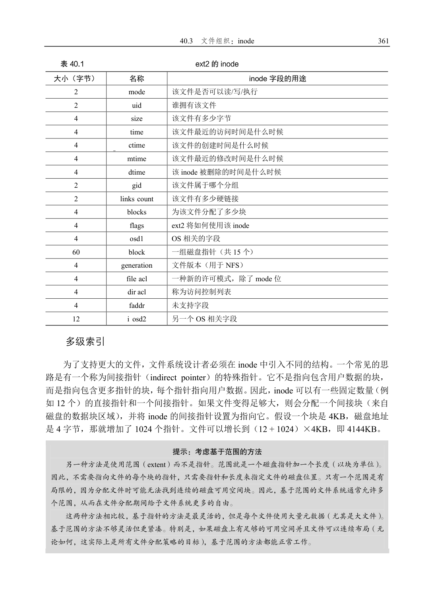
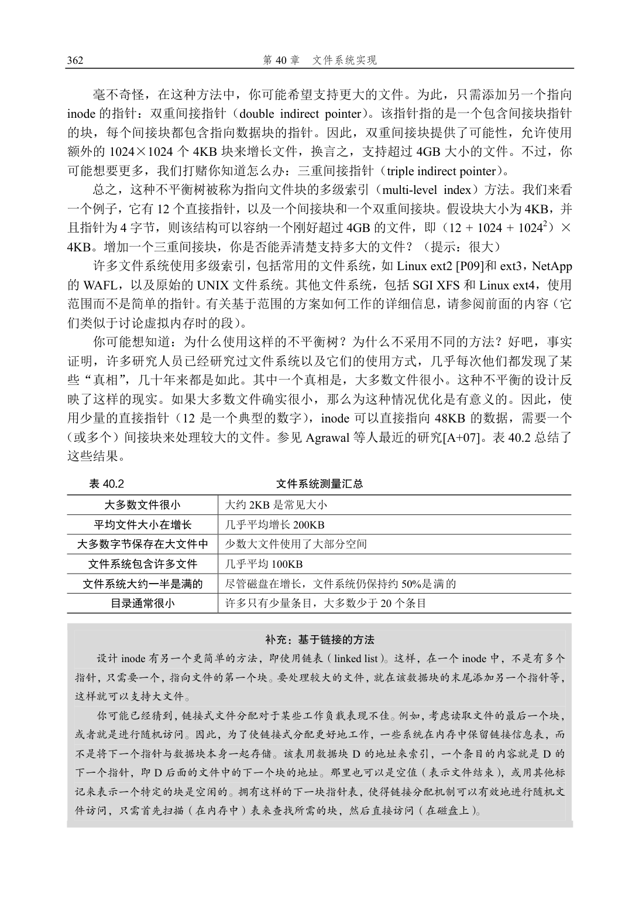
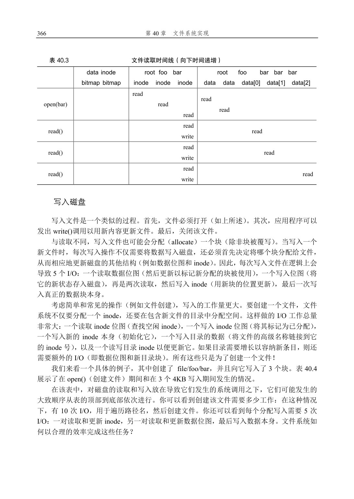
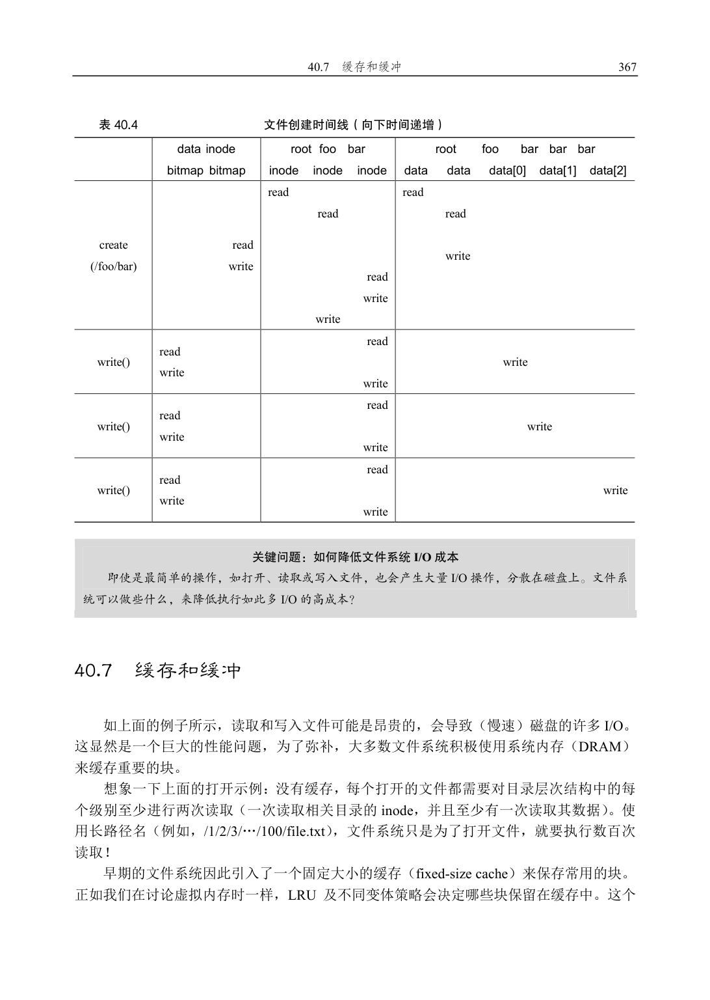

# 第40 章  文件系统实现

本章将介绍一个简单的文件系统实现，称为VSFS（Very Simple File System，简单文件系统）。它是典型UNIX 文件系统的简化版本，因此可用于介绍一些基本磁盘结构、访问方法和各种策略，你可以在当今许多文件系统中看到。

文件系统是纯软件。与CPU 和内存虚拟化的开发不同，我们不会添加硬件功能来使文件系统的某些方面更好地工作（但我们需要注意设备特性，以确保文件系统运行良好）。由于在构建文件系统方面具有很大的灵活性，因此人们构建了许多不同的文件系统，从AFS（Andrew 文件系统）[H+88]到ZFS（Sun 的Zettabyte 文件系统）[B07]。所有这些文件系统

都有不同的数据结构，在某些方面优于或逊于同类系统。因此，我们学习文件系统的方式是通过案例研究：首先，通过本章中的简单文件系统（VSFS）介绍大多数概念。然后，对真实文件系统进行一系列研究，以了解它们在实践中有何区别。

关键问题：如何实现简单的文件系统

如何构建一个简单的文件系统？磁盘上需要什么结构？它们需要记录什么？它们如何访问？

## 40.1  思考方式

考虑文件系统时，我们通常建议考虑它们的两个不同方面。如果你理解了这两个方面，可能就理解了文件系统基本工作原理。

第一个方面是文件系统的数据结构（data structure）。换言之，文件系统在磁盘上使用哪些类型的结构来组织其数据和元数据？我们即将看到的第一个文件系统（包括下面的VSFS）使用简单的结构，如块或其他对象的数组，而更复杂的文件系统（如SGI 的XFS）使用更复杂的基于树的结构[S+96]。

补充：文件系统的心智模型

正如我们之前讨论的那样，心智模型就是你在学习系统时真正想要发展的东西。对于文件系统，你

的心智模型最终应该包含以下问题的答案：磁盘上的哪些结构存储文件系统的数据和元数据？当一个进

程打开一个文件时会发生什么？在读取或写入期间访问哪些磁盘结构？通过研究和改进心智模型，你可

以对发生的事情有一个抽象的理解，而不是试图理解某些文件系统代码的细节（当然这也是有用的！）。

文件系统的第二个方面是访问方法（access method）。如何将进程发出的调用，如open()、read()、write()等，映射到它的结构上？在执行特定系统调用期间读取哪些结构？改写哪些结构？所有这些步骤的执行效率如何？

如果你理解了文件系统的数据结构和访问方法，就形成了一个关于它如何工作的良好

心智模型，这是系统思维的一个关键部分。在深入研究我们的第一个实现时，请尝试建立你的心智模型。

## 40.2  整体组织

我们现在来开发VSFS 文件系统在磁盘上的数据结构的整体组织。我们需要做的第一件事是将磁盘分成块（block）。简单的文件系统只使用一种块大小，这里正是这样做的。我们选择常用的4KB。

因此，我们对构建文件系统的磁盘分区的看法很简单：一系列块，每块大小为4KB。在大小为N 个4KB 块的分区中，这些块的地址为从0 到N−1。假设我们有一个非常小的磁盘，只有64 块：

现在让我们考虑一下，为了构建文件系统，需要在这些块中存储什么。当然，首先想到的是用户数据。实际上，任何文件系统中的大多数空间都是（并且应该是）用户数据。我们将用于存放用户数据的磁盘区域称为数据区域（data region），简单起见，将磁盘的固定部分留给这些块，例如磁盘上64 个块的最后56 个：

正如我们在第39 章中了解到的，文件系统必须记录每个文件的信息。该信息是元数据（metadata）的关键部分，并且记录诸如文件包含哪些数据块（在数据区域中）、文件的大小，

其所有者和访问权限、访问和修改时间以及其他类似信息的事情。为了存储这些信息，文件系统通常有一个名为inode 的结构（后面会详细介绍inode）。

为了存放inode，我们还需要在磁盘上留出一些空间。我们将这部分磁盘称为inode 表（inode table），它只是保存了一个磁盘上inode 的数组。因此，假设我们将64 个块中的5 块

用于inode，磁盘映像现在看起来如下：

在这里应该指出，inode 通常不是那么大，例如，只有128 或256 字节。假设每个inode有256 字节，一个4KB 块可以容纳16 个inode，而我们上面的文件系统则包含80 个inode。在我们简单的文件系统中，建立在一个小小的64 块分区上，这个数字表示文件系统中可以

拥有的最大文件数量。但是请注意，建立在更大磁盘上的相同文件系统可以简单地分配更大的inode 表，从而容纳更多文件。

到目前为止，我们的文件系统有了数据块（D）和inode（I），但还缺一些东西。你可能已经猜到，还需要某种方法来记录inode 或数据块是空闲还是已分配。因此，这种分配结构（allocation structure）是所有文件系统中必需的部分。

当然，可能有许多分配记录方法。例如，我们可以用一个空闲列表（free list），指向第一个空闲块，然后它又指向下一个空闲块，依此类推。我们选择一种简单而流行的结构，称为位图（bitmap），一种用于数据区域（数据位图，data bitmap），另一种用于inode 表（inode位图，inode bitmap）。位图是一种简单的结构：每个位用于指示相应的对象/块是空闲（0）还是正在使用（1）。因此新的磁盘布局如下，包含inode 位图（i）和数据位图（d）：

你可能会注意到，对这些位图使用整个4KB 块是有点杀鸡用牛刀。这样的位图可以记录32KB 对象是否分配，但我们只有80 个inode 和56 个数据块。但是，简单起见，我们就为每个位图使用整个4KB 块。

细心的读者可能已经注意到，在极简文件系统的磁盘结构设计中，还有一块。我们将它保留给超级块（superblock），在下图中用S 表示。超级块包含关于该特定文件系统的信息，包括例如文件系统中有多少个inode 和数据块（在这个例子中分别为80 和56）、inode 表的开始位置（块3）等等。它可能还包括一些幻数，来标识文件系统类型（在本例中为VSFS）。

因此，在挂载文件系统时，操作系统将首先读取超级块，初始化各种参数，然后将该卷添加到文件系统树中。当卷中的文件被访问时，系统就会知道在哪里查找所需的磁盘上的结构。

## 40.3  文件组织：inode

文件系统最重要的磁盘结构之一是inode，几乎所有的文件系统都有类似的结构。名称inode 是index node（索引节点）的缩写，它是由UNIX 开发人员Ken Thompson [RT74]给出的历史性名称，因为这些节点最初放在一个数组中，在访问特定inode 时会用到该数组的索引。

补充：数据结构—— inode

inode 是许多文件系统中使用的通用名称，用于描述保存给定文件的元数据的结构，例如其长度、

权限以及其组成块的位置。这个名称至少可以追溯到UNIX（如果不是早期的系统，可能还会追溯到

Multics）。它是index node（索引节点）的缩写，因为inode 号用于索引磁盘上的inode 数组，以便查找

该inode 号对应的inode。我们将看到，inode 的设计是文件系统设计的一个关键部分。大多数现代系统

对于它们记录的每个文件都有这样的结构，但也许用了不同的名字（如dnodes、fnodes 等）。

每个inode 都由一个数字（称为inumber）隐式引用，我们之前称之为文件的低级名称（low-level name）。在VSFS（和其他简单的文件系统）中，给定一个inumber，你应该能够

直接计算磁盘上相应节点的位置。例如，如上所述，获取VSFS 的inode 表：大小为20KB（5 个4KB 块），因此由80 个inode（假设每个inode 为256 字节）组成。进一步假设inode

区域从12KB 开始（即超级块从0KB 开始，inode 位图在4KB 地址，数据位图在8KB，因此inode 表紧随其后）。因此，在VSFS 中，我们为文件系统分区的开头提供了以下布局（特写视图）：

要读取inode 号32，文件系统首先会计算inode 区域的偏移量（32×inode 的大小，即8192），将它加上磁盘inode 表的起始地址（inodeStartAddr = 12KB），从而得到希望的inode块的正确字节地址：20KB。回想一下，磁盘不是按字节可寻址的，而是由大量可寻址扇区组成，通常是512 字节。因此，为了获取包含索引节点32 的索引节点块，文件系统将向节点（即40）发出一个读取请求，取得期望的inode 块。更一般地说，inode 块的扇区地址iaddr可以计算如下：

blk    = (inumber * sizeof(inode_t)) / blockSize;

sector = ((blk * blockSize) + inodeStartAddr) / sectorSize;  在每个inode 中，实际上是所有关于文件的信息：文件类型（例如，常规文件、目录等）、大小、分配给它的块数、保护信息（如谁拥有该文件以及谁可以访问它）、一些时间信息（包括文件创建、修改或上次访问的时间文件下），以及有关其数据块驻留在磁盘上的位置的信息（如某种类型的指针）。我们将所有关于文件的信息称为元数据（metadata）。实际上，文件系统中除了纯粹的用户数据外，其他任何信息通常都称为元数据。表40.1 所示的是ext2 [P09]的inode 的例子。

设计inode 时，最重要的决定之一是它如何引用数据块的位置。一种简单的方法是在inode 中有一个或多个直接指针（磁盘地址）。每个指针指向属于该文件的一个磁盘块。这种方法有局限：例如，如果你想要一个非常大的文件（例如，大于块的大小乘以直接指针数），那就不走运了。

这样的表听起来很熟悉吗？我们描述的是所谓的文件分配表（File Allocation Table，FAT）—文件

系统的基本结构。是的，在NTFS [C94]之前，这款经典的旧Windows 文件系统基于简单的基于链接的

分配方案。它与标准UNIX 文件系统还有其他不同之处。例如，本身没有inode，而是存储关于文件的

元数据的目录条目，并且直接指向所述文件的第一个块，这导致不可能创建硬链接。参见Brouwer 的著

作 [B02]，了解更多不够优雅的细节。

当然，在inode 设计的空间中，存在许多其他可能性。毕竟，inode 只是一个数据结构，任何存储相关信息并可以有效查询的数据结构就足够了。由于文件系统软件很容易改变，如果工作负载或技术发生变化，你应该愿意探索不同的设计。

## 40.4  目录组织

在VSFS 中（像许多文件系统一样），目录的组织很简单。一个目录基本上只包含一个二元组（条目名称，inode 号）的列表。对于给定目录中的每个文件或目录，目录的数据块中都有一个字符串和一个数字。对于每个字符串，可能还有一个长度（假定采用可变大小的名称）。

例如，假设目录dir（inode 号是5）中有3 个文件（foo、bar 和foobar），它们的inode号分别为12、13 和24。dir 在磁盘上的数据可能如下所示：

inum | reclen | strlen | name

5       4        2     .

2       4        3     ..

12       4        4     foo

13       4        4     bar

24       8        7     foobar  在这个例子中，每个条目都有一个inode 号，记录长度（名称的总字节数加上所有的剩余空间），字符串长度（名称的实际长度），最后是条目的名称。请注意，每个目录有两个额外的条目：.（点）和..（点点）。点目录就是当前目录（在本例中为dir），而点点是父目录（在本例中是根目录）。

删除一个文件（例如调用unlink()）会在目录中间留下一段空白空间，因此应该有一些方法来标记它（例如，用一个保留的inode 号，比如0）。这种删除是使用记录长度的一个原因：新条目可能会重复使用旧的、更大的条目，从而在其中留有额外的空间。

你可能想知道确切的目录存储在哪里。通常，文件系统将目录视为特殊类型的文件。因此，目录有一个inode，位于inode 表中的某处（inode 表中的inode 标记为“目录”的类型字段，而不是“常规文件”）。该目录具有由inode 指向的数据块（也可能是间接块）。这些数据块存在于我们的简单文件系统的数据块区域中。我们的磁盘结构因此保持不变。

我们还应该再次指出，这个简单的线性目录列表并不是存储这些信息的唯一方法。像以前一样，任何数据结构都是可能的。例如，XFS [S+96]以B 树形式存储目录，使文件创建操作（必须确保文件名在创建之前未被使用）快于使用简单列表的系统，因为后者必须扫描其中的条目。

## 40.5  空闲空间管理

文件系统必须记录哪些inode 和数据块是空闲的，哪些不是，这样在分配新文件或目录时，就可以为它找到空间。因此，空闲空间管理（free space management）对于所有文件系统都很重要。在VSFS 中，我们用两个简单的位图来完成这个任务。

补充：空闲空间管理

管理空闲空间可以有很多方法，位图只是其中一种。一些早期的文件系统使用空闲列表（free list），

其中超级块中的单个指针保持指向第一个空闲块。在该块内部保留下一个空闲指针，从而通过系统的空

闲块形成列表。在需要块时，使用头块并相应地更新列表。

现代文件系统使用更复杂的数据结构。例如，SGI 的XFS [S+96]使用某种形式的B 树（B-tree）来

紧凑地表示磁盘的哪些块是空闲的。与所有数据结构一样，不同的时间-空间折中也是可能的。

例如，当我们创建一个文件时，我们必须为该文件分配一个inode。文件系统将通过位图搜索一个空闲的内容，并将其分配给该文件。文件系统必须将inode 标记为已使用（用1），并最终用正确的信息更新磁盘上的位图。分配数据块时会发生类似的一组活动。

为新文件分配数据块时，还可能会考虑其他一些注意事项。例如，一些Linux 文件系统（如ext2 和ext3）在创建新文件并需要数据块时，会寻找一系列空闲块（如8 块）。通过找

到这样一系列空闲块，然后将它们分配给新创建的文件，文件系统保证文件的一部分将在磁盘上并且是连续的，从而提高性能。因此，这种预分配（pre-allocation）策略，是为数据块分配空间时的常用启发式方法。

## 40.6  访问路径：读取和写入

现在我们已经知道文件和目录如何存储在磁盘上，我们应该能够明白读取或写入文件的操作过程。理解这个访问路径（access path）上发生的事情，是开发人员理解文件系统如何工作的第二个关键。请注意！

对于下面的例子，我们假设文件系统已经挂载，因此超级块已经在内存中。其他所有内容（如inode、目录）仍在磁盘上。

从磁盘读取文件

在这个简单的例子中，让我们先假设你只是想打开一个文件（例如/foo/bar，读取它，然后关闭它）。对于这个简单的例子，假设文件的大小只有4KB（即1 块）。

当你发出一个open("/foo/bar", O_RDONLY)调用时，文件系统首先需要找到文件bar 的inode，从而获取关于该文件的一些基本信息（权限信息、文件大小等等）。为此，文件系统

必须能够找到inode，但它现在只有完整的路径名。文件系统必须遍历（traverse）路径名，从而找到所需的inode。

所有遍历都从文件系统的根开始，即根目录（root directory），它就记为/。因此，文件系统的第一次磁盘读取是根目录的inode。但是这个inode 在哪里？要找到inode，我们必须知道它的i-number。通常，我们在其父目录中找到文件或目录的i-number。根没有父目录（根据定义）。因此，根的inode 号必须是“众所周知的”。在挂载文件系统时，文件系统必须知道它是什么。在大多数UNIX 文件系统中，根的inode 号为2。因此，要开始该过程，文件系统会读入inode 号2 的块（第一个inode 块）。

一旦inode 被读入，文件系统可以在其中查找指向数据块的指针，数据块包含根目录的内容。因此，文件系统将使用这些磁盘上的指针来读取目录，在这个例子中，寻找foo 的条目。通过读入一个或多个目录数据块，它将找到foo 的条目。一旦找到，文件系统也会找到下一个需要的foo 的inode 号（假定是44）。

下一步是递归遍历路径名，直到找到所需的inode。在这个例子中，文件系统读取包含foo 的inode 及其目录数据的块，最后找到bar 的inode 号。open()的最后一步是将bar 的inode读入内存。然后文件系统进行最后的权限检查，在每个进程的打开文件表中，为此进程分配一个文件描述符，并将它返回给用户。

打开后，程序可以发出read()系统调用，从文件中读取。第一次读取（除非lseek()已被调用，则在偏移量0 处）将在文件的第一个块中读取，查阅inode 以查找这个块的位置。它也会用新的最后访问时间更新inode。读取将进一步更新此文件描述符在内存中的打开文件表，更新文件偏移量，以便下一次读取会读取第二个文件块，等等。

补充：读取不会访问分配结构

我们曾见过许多学生对分配结构（如位图）感到困惑。特别是，许多人经常认为，只是简单地读取

文件而不分配任何新块时，也会查询位图。不是这样的！分配结构（如位图）只有在需要分配时才会访

问。inode、目录和间接块具有完成读请求所需的所有信息。inode 已经指向一个块，不需要再次确认它

已分配。

在某个时候，文件将被关闭。这里要做的工作要少得多。很明显，文件描述符应该被释放，但现在，这就是FS 真正要做的。没有磁盘I/O 发生。

整个过程如表40.3 所示（向下时间递增）。在该表中，打开导致了多次读取，以便最终找到文件的inode。之后，读取每个块需要文件系统首先查询inode，然后读取该块，再使用写入更新inode 的最后访问时间字段。花一些时间，试着理解发生了什么。

另外请注意，open 导致的I/O 量与路径名的长度成正比。对于路径中的每个增加的目录，我们都必须读取它的inode 及其数据。更糟糕的是，会出现大型目录。在这里，我们只需要读取一个块来获取目录的内容，而对于大型目录，我们可能需要读取很多数据块才能找到所需的条目。是的，读取文件时生活会变得非常糟糕。你会发现，写入一个文件（尤其是创建一个新文件）更糟糕。

固定大小的缓存通常会在启动时分配，大约占总内存的10%。

然而，这种静态的内存划分（static partitioning）可能导致浪费。如果文件系统在给定的时间点不需要10%的内存，该怎么办？使用上述固定大小的方法，文件高速缓存中的未使用页面不能被重新用于其他一些用途，因此导致浪费。

相比之下，现代系统采用动态划分（dynamic partitioning）方法。具体来说，许多现代操作系统将虚拟内存页面和文件系统页面集成到统一页面缓存中（unified page cache）[S00]。通过这种方式，可以在虚拟内存和文件系统之间更灵活地分配内存，具体取决于在给定时间哪种内存需要更多的内存。

现在想象一下有缓存的文件打开的例子。第一次打开可能会产生很多I/O 流量，来读取目录的inode 和数据，但是随后文件打开的同一文件（或同一目录中的文件），大部分会命中缓存，因此不需要I/O。

我们也考虑一下缓存对写入的影响。尽管可以通过足够大的缓存完全避免读取I/O，但写入流量必须进入磁盘，才能实现持久。因此，高速缓存不能减少写入流量，像对读取那样。虽然这么说，写缓冲（write buffering，人们有时这么说）肯定有许多优点。首先，通过延迟写入，文件系统可以将一些更新编成一批（batch），放入一组较小的I/O 中。例如，如果在创建一个文件时，inode 位图被更新，稍后在创建另一个文件时又被更新，则文件系统会在第一次更新后延迟写入，从而节省一次I/O。其次，通过将一些写入缓冲在内存中，系统可以调度（schedule）后续的I/O，从而提高性能。最后，一些写入可以通过拖延来完全避免。例如，如果应用程序创建文件并将其删除，则将文件创建延迟写入磁盘，可以完全避免（avoid）写入。在这种情况下，懒惰（在将块写入磁盘时）是一种美德。

提示：理解静态划分与动态划分

在不同客户端/用户之间划分资源时，可以使用静态划分（static partitioning）或动态划分（dynamic

partitioning）。静态方法简单地将资源一次分成固定的比例。例如，如果有两个可能的内存用户，则可以

给一个用户固定的内存部分，其余的则分配给另一个用户。动态方法更灵活，随着时间的推移提供不同

数量的资源。例如，一个用户可能会在一段时间内获得更高的磁盘带宽百分比，但是之后，系统可能会

切换，决定为不同的用户提供更大比例的可用磁盘带宽。

每种方法都有其优点。静态划分可确保每个用户共享一些资源，通常提供更可预测的性能，也更易

于实现。动态划分可以实现更好的利用率（通过让资源匮乏的用户占用其他空闲资源），但实现起来可

能会更复杂，并且可能导致空闲资源被其他用户占用，然后在需要时花费很长时间收回，从而导致这些

用户性能很差。像通常一样，没有最好的方法。你应该考虑手头的问题，并确定哪种方法最适合。实际

上，你不是应该一直这样做吗？

由于上述原因，大多数现代文件系统将写入在内存中缓冲5～30s，这代表了另一种折中：如果系统在更新传递到磁盘之前崩溃，更新就会丢失。但是，将内存写入时间延长，则可以通过批处理、调度甚至避免写入，提高性能。

某些应用程序（如数据库）不喜欢这种折中。因此，为了避免由于写入缓冲导致的意外数据丢失，它们就强制写入磁盘，通过调用fsync()，使用绕过缓存的直接I/O（direct I/O）

接口，或者使用原始磁盘（raw disk）接口并完全避免使用文件系统

①。虽然大多数应用程序能接受文件系统的折中，但是如果默认设置不能令人满意，那么有足够的控制可以让系统按照你的要求进行操作。

提示：了解耐用性/性能权衡

存储系统通常会向用户提供耐用性/性能折中。如果用户希望写入的数据立即持久，则系统必须尽

全力将新写入的数据提交到磁盘，因此写入速度很慢（但是安全）。但是，如果用户可以容忍丢失少量

数据，系统可以缓冲内存中的写入一段时间，然后将其写入磁盘（在后台）。这样做可以使写入快速完

成，从而提高感受到的性能。但是，如果发生崩溃，尚未提交到磁盘的写入操作将丢失，因此需要进行

折中。要理解如何正确地进行这种折中，最好了解使用存储系统的应用程序需要什么。例如，虽然丢失

网络浏览器下载的最后几张图像可以忍受，但丢失部分数据库交易、让你的银行账户不能增加资金，这

不能忍。当然，除非你很有钱。如果你很有钱，为什么要特别关心积攒每一分钱？

## 40.8  小结

我们已经看到了构建文件系统所需的基本机制。需要有关于每个文件（元数据）的一些信息，这通常存储在名为inode 的结构中。目录只是“存储名称→inode 号”映射的特定类型的文件。其他结构也是需要的。例如，文件系统通常使用诸如位图的结构，来记录哪些inode 或数据块是空闲的或已分配的。

文件系统设计的极好方面是它的自由。接下来的章节中探讨的文件系统，都利用了这种自由来优化文件系统的某些方面。显然，我们还有很多尚未探讨的策略决定。例如，创建一个新文件时，它应该放在磁盘上的什么位置？这一策略和其他策略会成为未来章节的主题吗？

## 参考资料

[A+07] Nitin Agrawal, William J. Bolosky, John R. Douceur, Jacob R. Lorch A Five-Year Study of File-System

Metadata

FAST ’07, pages 31–45, February 2007, San Jose, CA

最近对文件系统实际使用方式的一个很好的分析。利用其中的文献目录可以追溯到20 世纪80 年代早期的

文件系统分析论文。

[B07]“ZFS: The Last Word in File Systems”Jeff Bonwick and Bill Moore

最新的重要文件系统之一，功能丰富，性能卓越。我们应该为它写一章，也许很快就会有这么一章。

① 选修一选数据库选程，了解更多有关传统数据库的知识，以及它们过以对避开操作系统和自以控制一切的以持。 但要小心！

有些搞数据库的人总是试图说操作系统的坏话。

[B02]“The FAT File System”Andries Brouwer, September, 2002

关于FAT 的很好、很漂亮的描述。文件系统的类型，不是培根的类型。但你必须承认，培根可能味道更好。

[C94]“Inside the Windows NT File System”, Helen Custer

Microsoft Press, 1994

一本关于NTFS 的小书，其他书中可能有更多技术s 细节。

[H+88]“Scale and Performance in a Distributed File System”

John H. Howard, Michael L. Kazar, Sherri G. Menees, David A. Nichols, M. Satyanarayanan, Robert N.

Sidebotham, Michael J. West.

ACM Transactions on Computing Systems (ACM TOCS), page 51-81, Volume 6, Number 1, February 1988

经典的分布式文件系统，我们稍后会更多地了解它，不用担心。

[P09]“The Second Extended File System: Internal Layout”Dave Poirier, 2009

有关ext2 的详细信息，这是一个非常简单的基于FFS 的Linux 文件系统，即Berkeley Fast File System。我

们将在第41 章中详细解读。

[RT74]“The UNIX Time-Sharing System”

M．Ritchie and K. Thompson

CACM, Volume 17:7, pages 365-375, 1974

关于UNIX 的较早的论文。阅读它，能了解许多现代操作系统的基础知识。

[S00]“UBC: An Efficient Unified I/O and Memory Caching Subsystem for NetBSD”Chuck Silvers

FREENIX, 2000

一篇关于NetBSD 集成文件系统缓冲区缓存和虚拟内存页面缓存的好文章。许多其他系统做了同样的

事情。

[S+96]“Scalability in the XFS File System”

Adan Sweeney, Doug Doucette, Wei Hu, Curtis Anderson, Mike Nishimoto, Geoff Peck

USENIX ’96, January 1996, San Diego, CA

第一次尝试让操作具有可伸缩性，其中包括在目录中拥有数百万个文件这样的事情，这是核心关注点。

它是一个把想法推向极致的好例子。这个文件系统的关键思想是：一切都是树。我们也应该为这个文件

系统写一章内容。

## 作业

使用工具vsfs.py 来研究文件系统状态如何随着各种操作的发生而改变。文件系统以空状态开始，只有一个根目录。模拟发生时，会执行各种操作，从而慢慢改变文件系统的磁盘状态。详情请参阅README 文件。

## 问题

1．用一些不同的随机种子（比如17、18、19、20）运行模拟器，看看你是否能确定每次状态变化之间一定发生了哪些操作。

2．现在使用不同的随机种子（比如21、22、23、24），但使用-r 标志运行，这样做可以让你在显示操作时猜测状态的变化。关于inode 和数据块分配算法，根据它们喜欢分配的块，你可以得出什么结论？

3．现在将文件系统中的数据块数量减少到非常少（比如两个），并用100 个左右的请求来运行模拟器。在这种高度约束的布局中，哪些类型的文件最终会出现在文件系统中？什么类型的操作会失败？

4．现在做同样的事情，但针对inodes。只有非常少的inode，什么类型的操作才能成功？哪些通常会失败？文件系统的最终状态可能是什么？