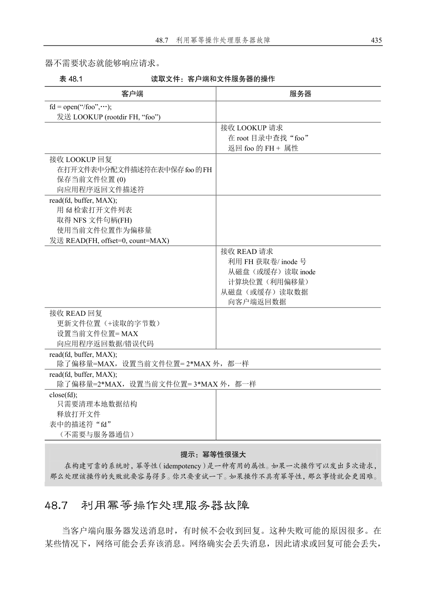

# 第48 章  Sun 的网络文件系统（NFS）

分布式客户端/服务器计算的首次使用之一，是在分布式文件系统领域。在这种环境中，有许多客户端机器和一个服务器（或几个）。服务器将数据存储在其磁盘上，客户端通过结构良好的协议消息请求数据。图48.1 展示了基本设置。

从图中可以看到，服务器有磁盘，发送消息的客户端通过网络，访问服务器磁盘上的目录和文件。为什么要麻烦，采用这种安排？（也就是说，为什么不就让客户端用它们的本地磁盘? ）好吧，这种设置允许在客户端之间轻松地共享（sharing）数据。因此，如果你在一台计算机上访问文件（客户端0），然后再使用另一台（客户端2），则你将拥有相同的文件系统视图。你可以在这些不同的机器上自然共享你的数据。第二个好处是集中管理（centralized administration）。例如，备份文件可以通过少数服务器机器完成，而不必通过众多客户端。另一个优点可能是安全（security），将所有服务器放在加锁的机房中。

图48.1  一般的客户端/服务器系统

关键问题：如何构建分布式文件系统

如何构建分布式文件系统？要考虑哪些关键方面？哪里容易出错？我们可以从现有系统中学到什么？

## 48.1  基本分布式文件系统

我们将研究分布式文件系统的体系结构。简单的客户端/服务器分布式文件系统，比之前研究的文件系统拥有更多的组件。在客户端，客户端应用程序通过客户端文件系统（client-side file system）来访问文件和目录。客户端应用程序向客户端文件系统发出系统调

用（system call，例如open()、read()、write()、close()、mkdir()等），以便访问保存在服务器上的文件。因此，对于客户端应用程序，该文件系统似乎与基于磁盘的文件系统没有任何不同，除了性能之外。这样，分布式文件系统提供了对文件的透明（transparent）访问，这是一个明显的目标。毕竟，谁想使用文件系统时需要不同的API，或者用起来很痛苦？

客户端文件系统的作用，是执行服务这些系统调用所需的操作如图48.2 所示。例如，如果客户端发出read()请求，则客户端文件系统可以向服务器端文件系统（server-side file system，或更常见的是文件服务器，file server）发送消息，以读取特定块。然后，文件服务器将从磁盘（或自己的内存缓存）中读取块，并发送消息，将请求的数据发送回客户端。然后，客户端文件系统将数据复制到用户的缓冲区中。请注意，客户端内存或客户端磁盘上

的后续read()可以缓存（cached）在客户端内存中，在最好的情况下，不需要产生网络流量。

图48.2  分布式文件系统体系结构

通过这个简单的概述，你应该了解客户端/服务器分布式文件系统中两个最重要的软件部分：客户端文件系统和文件服务器。它们的行为共同决定了分布式文件系统的行为。现在可以研究一个特定的系统：Sun 的网络文件系统（NFS）。

补充：为什么服务器会崩溃

在深入了解NFSv2 协议的细节之前，你可能想知道：为什么服务器会崩溃？好吧，你可能已经猜

到，有很多原因。服务器可能会遭遇停电（power outage，暂时的）。只有在恢复供电后才能重新启动机

器。服务器通常由数十万甚至数百万行代码组成。因此，它们有缺陷（bug，即使是好软件，每几百或

几千行代码中也有少量缺陷），因此它们最终会触发一个缺陷，导致崩溃。它们也有内存泄露。即使很

小的内存泄露也会导致系统内存不足并崩溃。最后，在分布式系统中，客户端和服务器之间存在网络。

如果网络行为异常 [例如，如果它被分割（partitioned），客户端和服务器在工作，但不能通信]，可能看

起来好像一台远程机器崩溃，但实际上只是目前无法通过网络访问。

## 48.2  交出NFS

最早且相当成功的分布式系统之一是由Sun Microsystems 开发的，被称为Sun 网络文件系统（或NFS）[S86]。在定义NFS 时，Sun 采取了一种不寻常的方法：Sun 开发了一种开放协议（open protocol），它只是指定了客户端和服务器用于通信的确切消息格式，而不是构建专有的封闭系统。不同的团队可以开发自己的NFS 服务器，从而在NFS 市场中竞争，同时保持互操作性。NFS 服务器（包括Oracle/Sun、NetApp [HLM94]、EMC、IBM 等）和NFS 的广泛成功可能要归功于这种“开放市场”的做法。

## 48.3  关注点：简单快速的服务器崩溃恢复

本章将讨论经典的NFS 协议（版本2，即NFSv2），这是多年来的标准。转向NFSv3时进行了小的更改，并且在转向NFSv4 时进行了更大规模的协议更改。然而，NFSv2 既精彩又令人沮丧，因此成为我们关注的焦点。

在NFSv2 中，协议的主要目标是“简单快速的服务器崩溃恢复”。在多客户端，单服务器环境中，这个目标非常有意义。服务器关闭（或不可用）的任何一分钟都会使所有客户端计算机（及其用户）感到不快和无效。因此，服务器不行，整个系统也就不行了。

## 48.4  快速崩溃恢复的关键：无状态

通过设计无状态（stateless）协议，NFSv2 实现了这个简单的目标。根据设计，服务器不会追踪每个客户端发生的事情。例如，服务器不知道哪些客户端正在缓存哪些块，或者哪些文件当前在每个客户端打开，或者文件的当前文件指针位置等。简而言之，服务器不会追踪客户正在做什么。实际上，该协议的设计要求在每个协议请求中提供所有需要的信息，以便完成该请求。如果现在还看不出，下面更详细地讨论该协议时，这种无状态的方法会更有意义。

作为有状态（stateful，非无状态）协议的示例，请考虑open()系统调用。给定一个路径名，open()返回一个文件描述符（一个整数）。此描述符用于后续的read()或write()请求，以访问各种文件块，如图48.3 所示的应用程序代码（请注意，出于篇幅原因，这里省略了对系统调用的正确错误检查）：

char buffer[MAX];

int fd = open("foo", O_RDONLY); // get descriptor "fd"

read(fd, buffer, MAX);         // read MAX bytes from foo (via fd)

read(fd, buffer, MAX);         // read MAX bytes from foo

...

read(fd, buffer, MAX);         // read MAX bytes from foo

close(fd);                     // close file

图48.3  客户端代码：从文件读取

现在想象一下，客户端文件系统向服务器发送协议消息“打开文件foo 并给我一个描述符”，从而打开文件。然后，文件服务器在本地打开文件，并将描述符发送回客户端。在后续读取时，客户端应用程序使用该描述符来调用read()系统调用。客户端文件系统然后在给文件服务器的消息中，传递该描述符，说“从我传给你的描述符所指的文件中，读一些字节”。

在这个例子中，文件描述符是客户端和服务器之间的一部分共享状态（shared state，Ousterhout 称为分布式状态，distributed state [O91]）。正如我们上面所暗示的那样，共享状态使崩溃恢复变得复杂。想象一下，在第一次读取完成后，但在客户端发出第二次读取之前，服务器崩溃。服务器启动并再次运行后，客户端会发出第二次读取。遗憾的是，服务器不知道fd 指的是哪个文件。该信息是暂时的（即在内存中），因此在服务器崩溃时丢失。要处理这种情况，客户端和服务器必须具有某种恢复协议（recovery protocol），客户端必须确保在内存中保存足够信息，以便能够告诉服务器，它需要知道的信息（在这个例子中，是文件描述符fd 指向文件foo）。

考虑到有状态的服务器必须处理客户崩溃的情况，事情会变得更糟。例如，想象一下，一个打开文件然后崩溃的客户端。open()在服务器上用掉了一个文件描述符，服务器怎么知道可以关闭给定的文件呢？在正常操作中，客户端最终将调用close()，从而通知服务器应该关闭该文件。但是，当客户端崩溃时，服务器永远不会收到close()，因此必须注意到客户端已崩溃，以便关闭文件。

出于这些原因，NFS 的设计者决定采用无状态方法：每个客户端操作都包含完成请求

所需的所有信息。不需要花哨的崩溃恢复，服务器只是再次开始运行，最糟糕的情况下，客户端可能必须重试请求。

## 48.5  NFSv2 协议

下面来看看NFSv2 的协议定义。问题很简单：

关键问题：如何定义无状态文件协议

如何定义网络协议来支持无状态操作？显然，像open()这样的有状态调用不应该讨论。但是，客户

端应用程序会调用open()、read()、write()、close()和其他标准API 调用，来访问文件和目录。因此，改

进该问题：如何定义协议，让它既无状态，又支持POSIX 文件系统API？

理解NFS 协议设计的一个关键是理解文件句柄（file handle）。文件句柄用于唯一地描述文件或目录。因此，许多协议请求包括一个文件句柄。

可以认为文件句柄有3 个重要组件：卷标识符、inode 号和世代号。这3 项一起构成客户希望访问的文件或目录的唯一标识符。卷标识符通知服务器，请求指向哪个文件系统（NFS服务器可以导出多个文件系统）。inode 号告诉服务器，请求访问该分区中的哪个文件。最后，复用inode 号时需要世代号。通过在复用inode 号时递增它，服务器确保具有旧文件句柄的客户端不会意外地访问新分配的文件。

图48.4 是该协议的一些重要部分的摘要。完整的协议可在其他地方获得（NFS 的优秀详细概述，请参阅Callaghan 的书[C00]）。

NFSPROC_GETATTR   expects: file handle   returns: attributes NFSPROC_SETATTR   expects: file handle, attributes   returns: nothing NFSPROC_LOOKUP   expects: directory file handle, name of file/directory to look up   returns: file handle NFSPROC_READ   expects: file handle, offset, count   returns: data, attributes NFSPROC_WRITE   expects: file handle, offset, count, data   returns: attributes NFSPROC_CREATE   expects: directory file handle, name of file, attributes   returns: nothing NFSPROC_REMOVE   expects: directory file handle, name of file to be removed   returns: nothing NFSPROC_MKDIR   expects: directory file handle, name of directory, attributes   returns: file handle NFSPROC_RMDIR   expects: directory file handle, name of directory to be removed   returns: nothing

NFSPROC_READDIR   expects: directory handle, count of bytes to read, cookie   returns: directory entries, cookie (to get more entries)

图48.4  NFS 协议：示例

我们简单强调一下该协议的重要部分。首先，LOOKUP 协议消息用于获取文件句柄，然后用于访问文件数据。客户端传递目录文件句柄和要查找的文件的名称，该文件（或目录）的句柄及其属性将从服务器传递回客户端。

例如，假设客户端已经有一个文件系统根目录的目录文件句柄（/）[实际上，这是NFS 挂载协议（mount protocol），它说明客户端和服务器开始如何连接在一起。简洁起见，在此不讨论挂载协议]。如果客户端上运行的应用程序打开文件/foo.txt，则客户端文件系统会向服务器发送查找请求，并向其传递根文件句柄和名称foo.txt。如果成功，将返回foo.txt 的文件句柄（和属性）。

属性就是文件系统追踪每个文件的元信息，包括文件创建时间、上次修改时间、大小、所有权和权限信息等，即对文件调用stat()会返回的信息。

有了文件句柄，客户端可以对一个文件发出READ 和WRITE 协议消息，读取和写入该文件。READ 协议消息要求传递文件句柄，以及文件中的偏移量和要读取的字节数。然后，服务器就能发出读取请求（毕竟，该文件句柄告诉了服务器，从哪个卷和哪个inode 读取，偏移量和字节数告诉它要读取该文件的哪些字节），并将数据返回给客户端 （如果有故障就返回错误代码）。除了将数据从客户端传递到服务器，并返回成功代码之外，WRITE 的处理方式类似。

最后一个有趣的协议消息是GETATTR 请求。给定文件句柄，它获取该文件的属性，包括文件的最后修改时间。我们将在NFSv2 中看到，为什么这个协议请求很重要（你能猜到吗）。

## 48.6  从协议到分布式文件系统

希望你已对该协议如何转换为文件系统有所了解。客户端文件系统追踪打开的文件，通常将应用程序的请求转换为相关的协议消息集。服务器只响应每个协议消息，每个协议消息都具有完成请求所需的所有信息。

例如，考虑一个读取文件的简单应用程序。表48.1 展示了应用程序进行的系统调用，以及客户端文件系统和文件服务器响应此类调用时的行为。

关于该表有几点说明。首先，请注意客户端如何追踪文件访问的所有相关状态（state），包括整数文件描述符到NFS 文件句柄的映射，以及当前的文件指针。这让客户端能够将每个读取请求（你可能注意到，读取请求没有显式地指定读取的偏移量），转换为正确格式的读取协议消息，该消息明确地告诉服务器，从文件中读取哪些字节。成功读取后，客户端更新当前文件位置，后续读取使用相同的文件句柄，但偏移量不同。

其次，你可能会注意到，服务器交互发生的位置。当文件第一次打开时，客户端文件系统发送LOOKUP 请求消息。实际上，如果必须访问一个长路径名（例如/home/remzi/foo.txt），客户端将发送3 个LOOKUP：一个在/目录中查找home，一个在home 中查找remzi，最后一个在remzi 中查找foo.txt。

第三，你可能会注意到，每个服务器请求如何包含完成请求所需的所有信息。这个设计对于从服务器故障中优雅地恢复的能力至关重要，接下来将更详细地讨论。这确保服务

所以客户端永远不会收到响应，如图48.5 所示。

也可能服务器已崩溃，因此无法响应消息。稍后，服务器将重新启动，并再次开始运行，但所有请求都已丢失。在所有这些情况下，客户端有一个问题：如果服务器没有及时回复，应该怎么做？

在NFSv2 中，客户端以唯一、统一和优雅的方式处理所有这些故障：就是重试请求。具体来说，在发送请求之后，客户端将计时器设置为在指定的时间之后关闭。如果在定时器关闭之前收到回复，则取消定时器，一切正常。但是，如果在收到任何回复之前计时器关闭，则客户端会假定请求尚未处理，并重新发送。如果服务器回复，一切都很好，客户端已经漂亮地处理了问题。

客户端之所以能够简单重试请求（不论什么情况导致了故障），是因为大多数NFS 请求有一个重要的特性：它们是幂等的（idempotent）。如果操作执行多次的效果与执行一次的效果相同，该操作就是幂等的。例如，如果将值在内存位置存储 3 次，与存储一次一样。因此“将值存储到内存中”是一种幂等操作。但是，如果将计数器递增 3 次，它的数量就会与递增一次不同。因此，递增计数器不是幂等的。更一般地说，任何只读取数据的操作显然都是幂等的。对更新数据的操作必须更仔细地考虑，才能确定它是否具有幂等性。

NFS 中崩溃恢复的核心在于，大多数常见操作具有幂等性。LOOKUP 和READ 请求是简单幂等的，因为它们只从文件服务器读取信息而不更新它。更有趣的是，WRITE 请求也是幂等的。例如，如果WRITE 失败，客户端可以简单地重试它。WRITE 消息包含数据、计数和（重要的）写入数据的确切偏移量。因此，可以重复多次写入，因为多次写入的结果与单次的结果相同。

图48.5  3 种类型的丢失

通过这种方式，客户端可以用统一的方式处理所有超时。如果WRITE 请求丢失（上面的第一种情况），客户端将重试它，服务器将执行写入，一切都会好。如果在请求发送时，服务器恰好关闭，但在第二个请求发送时，服务器已重启并继续运行，则又会如愿执行（第

二种情况）。最后，服务器可能实际上收到了WRITE 请求，发出写入磁盘并发送回复。此回复可能会丢失（第三种情况），导致客户端重新发送请求。当服务器再次收到请求时，它就会执行相同的操作：将数据写入磁盘，并回复它已完成该操作。如果客户端这次收到了回复，则一切正常，因此客户端以统一的方式处理了消息丢失和服务器故障。漂亮！

一点补充：一些操作很难成为幂等的。例如，当你尝试创建已存在的目录时，系统会通知你mkdir 请求已失败。因此，在NFS 中，如果文件服务器收到MKDIR 协议消息并成功执行，但回复丢失，则客户端可能会重复它并遇到该故障，实际上该操作第一次成功了，只是在重试时失败。所以，生活并不完美。

提示：完美是好的敌人（Voltaire 定律）

即使你设计了一个漂亮的系统，有时候并非所有的特殊情况都像你期望的那样。以上面的mkdir 为

例，你可以重新设计mkdir，让它具有不同的语义，从而让它成为幂等的（想想你会怎么做）。但是，为

什么要这么麻烦？NFS 的设计理念涵盖了大多数重要情况，它使系统设计在故障方面简洁明了。因此，

接受生活并不完美的事实，仍然构建系统，这是良好工程的标志。显然，这种智慧应该要感谢伏尔泰，

他说：“一个聪明的意大利人说，最好是好的敌人。”因此我们称之为Voltaire 定律。

## 48.8  提高性能：客户端缓存

分布式文件系统很多，这有很多原因，但将所有读写请求都通过网络发送，会导致严重的性能问题：网络速度不快，特别是与本地内存或磁盘相比。因此，另一个问题是：如何才能改善分布式文件系统的性能？

答案你可能已经猜到（看到上面的节标题），就是客户端缓存（caching）。NFS 客户端文件系统缓存文件数据（和元数据）。因此，虽然第一次访问是昂贵的（即它需要网络通信），但后续访问很快就从客户端内存中得到服务。

缓存还可用作写入的临时缓冲区。当客户端应用程序写入文件时，客户端会在数据写入服务器之前，将数据缓存在客户端的内存中（与数据从文件服务器读取的缓存一样）。这种写缓冲（write buffering）是有用的，因为它将应用程序的write()延迟与实际的写入性能分离，即应用程序对write()的调用会立即成功（只是将数据放入客户端文件系统的缓存中），只是稍后才会将数据写入文件服务器。

因此，NFS 客户端缓存数据和性能通常很好，我们成功了，对吧？遗憾的是，并没完全成功。在任何系统中添加缓存，导致包含多个客户端缓存，都会引入一个巨大且有趣的挑战，我们称之为缓存一致性问题（cache consistency problem）。

## 48.9  缓存一致性问题

利用两个客户端和一个服务器，可以很好地展示缓存一致性问题。想象一下客户端C1读取文件F，并将文件的副本保存在其本地缓存中。现在假设一个不同的客户端C2 覆盖文

件F，从而改变其内容。我们称该文件的新版本为F（版本2），或F [v2]，称旧版本为F [v1]，以便区分两者。最后，还有第三个客户端C3，尚未访问文件F。

你可能会看到即将发生的问题（见图48.6）。实际上，有两个子问题。第一个子问题是，客户端C2 可能将它的写入缓存一段时间，然后再将它们发送给服务器。在这种情况下，当F[v2]位于C2 的内存中时，来自另一个客户端（比如C3）的任何对F 的访问，都会获得旧版本的文件（F[v1]）。因此，在客户端缓冲写入，可能导致其他客户端获得文件的陈旧版本，这也许不是期望的结果。实际上，想象一下你登录机器C2，更新F，然后登录C3，并尝试读取文件：只得到了旧版本！这当然会令人沮丧。因此，我们称这个方面的缓存一致性问题为“更新可见性（update visibility）”。来自一个客户端的更新，什么时候被其他客户端看见？

图48.6  缓存一致性问题

缓存一致性的第二个子问题是陈旧的缓存（stale cache）。在这种情况下，C2 最终将它的写入发送给文件服务器，因此服务器具有最新版本（F[v2]）。但是，C1 的缓存中仍然是F[v1]。如果运行在C1 上的程序读了文件F，它将获得过时的版本（F [v1]），而不是最新的版本（F [v2]），这（通常）不是期望的结果。

NFSv2 实现以两种方式解决了这些缓存一致性问题。首先，为了解决更新可见性，客户端实现了有时称为“关闭时刷新”（flush-on-close，即close-to-open）的一致性语义。具体来说，当应用程序写入文件并随后关闭文件时，客户端将所有更新（即缓存中的脏页面）刷新到服务器。通过关闭时刷新的一致性，NFS 可确保后续从另一个节点打开文件，会看到最新的文件版本。

其次，为了解决陈旧的缓存问题，NFSv2 客户端会先检查文件是否已更改，然后再使用其缓存内容。具体来说，在打开文件时，客户端文件系统会发出GETATTR 请求，以获取文件的属性。重要的是，属性包含有关服务器上次修改文件的信息。如果文件修改的时间晚于文件提取到客户端缓存的时间，则客户端会让文件无效（invalidate），因此将它从客户端缓存中删除，并确保后续的读取将转向服务器，取得该文件的最新版本。另外，如果客户端看到它持有该文件的最新版本，就会继续使用缓存的内容，从而提高性能。

当Sun 最初的团队实现陈旧缓存问题的这个解决方案时，他们意识到一个新问题。突然，NFS 服务器充斥着GETATTR 请求。一个好的工程原则，是为常见情况而设计，让它运作良好。这里，尽管常见情况是文件只由一个客户端访问（可能反复访问），但该客户端必须一直向服务器发送GETATTR 请求，以确没人改变该文件。客户因此“轰炸”了服务器，不断询问“有没有人修改过这个文件？”，大部分时间都没有人修改。

为了解决这种情况（在某种程度上），为每个客户端添加了一个属性缓存（attribute cache）。客户端在访问文件之前仍会验证文件，但大多数情况下只会查看属性缓存以获取属性。首次访问某文件时，该文件的属性被放在缓存中，然后在一定时间（例如3s）后超时。

因此，在这3s 内，所有文件访问都会断定使用缓存的文件没有问题，并且没有与服务器的网络通信。

## 48.10  评估NFS 的缓存一致性

关于NFS 的缓存一致性还有几句话。加入关闭时刷新的行为是因为“有意义”，但带来了一定的性能问题。具体来说，如果在客户端上创建临时或短期文件，然后很快删除，它仍将被强制写到服务器。更理想的实现可能会将这些短暂的文件保留在内存中，直到它们被删除，从而完全消除服务器交互，提高性能。

更重要的是，NFS 加入属性缓存让它很难知道或推断出得到文件的确切版本。有时你会得到最新版本，有时你会得到旧版本，因为属性缓存没有超时，因此客户端很高兴地提供了客户端内存中的内容。虽然这在大多数情况下都没问题，但它偶尔会（现在仍然如此！）导致奇怪的行为。

我们已经描述了NFS 客户端缓存的奇怪之处。它是一个有趣的例子，其中实现的细节致力于定义用户可观察的语义，而不是相反。

## 48.11  服务器端写缓冲的隐含意义

我们的重点是客户端缓存，这是最有趣的问题出现的地方。但是，NFS 服务器也往往配备了大量内存，因此它们也存在缓存问题。从磁盘读取数据（和元数据）时，NFS 服务器会将其保留在内存中，后续读取这些数据（和元数据）不会访问磁盘，这可能对性能有（小）提升。

更有趣的是写缓冲的情况。在强制写入稳定存储（即磁盘或某些其他持久设备）之前，NFS服务器绝对不会对WRITE 协议请求返回成功。虽然他们可以将数据的拷贝放在服务器内存中，但对WRITE 协议请求向客户端返回成功，可能会导致错误的行为。你能搞清楚为什么吗？

答案在于我们对客户端如何处理服务器故障的假设。想象一下客户端发出以下写入序列：

write(fd, a_buffer, size); // fill first block with a's

write(fd, b_buffer, size); // fill second block with b's

write(fd, c_buffer, size); // fill third block with c's  这些写入覆盖了文件的3 个块，先是a，然后是b，最后是c。因此，如果文件最初看起来像这样：

xxxxxxxxxxxxxxxxxxxxxxxxxxxxxxxxxxxxxxxxxxxxxxxxxxxxxxxxxxxx

yyyyyyyyyyyyyyyyyyyyyyyyyyyyyyyyyyyyyyyyyyyyyyyyyyyyyyyyyyyy

zzzzzzzzzzzzzzzzzzzzzzzzzzzzzzzzzzzzzzzzzzzzzzzzzzzzzzzzzzzz  我们可能期望这些写入之后的最终结果是这样：x、y 和z 分别用a、b 和c 覆盖。  aaaaaaaaaaaaaaaaaaaaaaaaaaaaaaaaaaaaaaaaaaaaaaaaaaaaaaaaaaaa

bbbbbbbbbbbbbbbbbbbbbbbbbbbbbbbbbbbbbbbbbbbbbbbbbbbbbbbbbbbb

cccccccccccccccccccccccccccccccccccccccccccccccccccccccccccc

现在假设，在这个例子中，客户端的3 个写入作为3 个不同的WRITE 协议消息，发送给服务器。假设服务器接收到第一个WRITE 消息，将它发送到磁盘，并向客户端通知成功。现在假设第二次写入只是缓冲在内存中，服务器在强制写入磁盘之前，也向客户端报告成功。遗憾的是，服务器在写入磁盘之前崩溃了。服务器快速重启，并接收第三个写请求，该请求也成功了。

因此，对于客户端，所有请求都成功了，但我们很惊讶文件的内容如下：  aaaaaaaaaaaaaaaaaaaaaaaaaaaaaaaaaaaaaaaaaaaaaaaaaaaaaaaaaaaa

yyyyyyyyyyyyyyyyyyyyyyyyyyyyyyyyyyyyyyyyyyyyyyyyyyyyyyyyyyyy  <---  oops

cccccccccccccccccccccccccccccccccccccccccccccccccccccccccccc  因为服务器在提交到磁盘之前，告诉客户端第二次写入成功，所以文件中会留下一个旧块，这对于某些应用程序，可能是灾难性的。

为了避免这个问题，NFS 服务器必须在通知客户端成功之前，将每次写入提交到稳定（持久）存储。这样做可以让客户端在写入期间检测服务器故障，从而重试，直到它最终成

功。这样做确保了不会导致前面例子中混合的文件内容。

这个需求，对NFS 服务器的实现带来一个问题，即写入性能，如果不小心，会成为主要的性能瓶颈。实际上，一些公司（例如Network Appliance）的出现，只是为了构建一个可以快速执行写入的NFS 服务器。一个技巧是先写入有电池备份的内存，从而快速报告WRITE 请求成功，而不用担心丢失数据，也没有必须立即写入磁盘的成本。第二个技巧是采用专门为快速写入磁盘而设计的文件系统，如果你最后需要这样做[HLM94，RO91]。

## 48.12  小结

我们已经介绍了NFS 分布式文件系统。NFS 的核心在于，服务器的故障要能简单快速地恢复。操作的幂等性至关重要，因为客户端可以安全地重试失败的操作，不论服务器是否已执行该请求，都可以这样做。

我们还看到，将缓存引入多客户端、单服务器的系统，如何会让事情变得复杂。具体来说，系统必须解决缓存一致性问题，才能合理地运行。但是，NFS 以稍微特别的方式来解决这个问题，偶尔会导致你看到奇怪的行为。最后，我们看到了服务器缓存如何变得棘手：对服务器的写入，在返回成功之前，必须强制写入稳定存储（否则数据可能会丢失）。

我们还没有谈到其他一些问题，这些问题肯定有关，尤其是安全问题。早期NFS 实现中，安全性非常宽松。客户端的任何用户都可以轻松伪装成其他用户，并获得对几乎任何文件的访问权限。后来集成了更严肃的身份验证服务（例如，Kerberos [NT94]），解决了这些明显的缺陷。

## 参考资料

[S86]“The Sun Network File System: Design, Implementation and Experience”Russel Sandberg

USENIX Summer 1986

最初的NFS 论文。阅读这些美妙的想法是个好主意。

[NT94]“Kerberos: An Authentication Service for Computer Networks”

B. Clifford Neuman, Theodore Ts’o

IEEE Communications, 32(9):33-38, September 1994

Kerberos 是一种早期且极具影响力的身份验证服务。我们可能应该在某个时候为它写上一章……

[P+94]“NFS Version 3: Design and Implementation”

Brian Pawlowski, Chet Juszczak, Peter Staubach, Carl Smith, Diane Lebel, Dave Hitz USENIX Summer 1994,

pages 137-152

NFS 版本3 的小修改。

[P+00]“The NFS version 4 protocol”

Brian Pawlowski, David Noveck, David Robinson, Robert Thurlow

2nd International System Administration and Networking Conference (SANE 2000)

毫无疑问，这是有史以来关于NFS 的优秀论文。

[C00]“NFS Illustrated”Brent Callaghan

Addison-Wesley Professional Computing Series, 2000

一个很棒的NFS 参考，每个协议都讲得非常彻底和详细。

[Sun89]“NFS: Network File System Protocol Specification”

Sun Microsystems, Inc. Request for Comments: 1094, March 1989

可怕的规范。如果你必须读，就读它。

[O91]“The Role of Distributed State”John K. Ousterhout

很少引用的关于分布式状态的讨论，对问题和挑战有更广的视角。

[HLM94]“File System Design for an NFS File Server Appliance”Dave Hitz, James Lau, Michael Malcolm

USENIX Winter 1994. San Francisco, California, 1994

Hitz 等人受到以前日志结构文件系统工作的极大影响。

[RO91]“The Design and Implementation of the Log-structured File System”Mendel Rosenblum, John Ousterhout

Symposium on Operating Systems Principles (SOSP), 1991

又是LFS。不，LFS，学无止境。