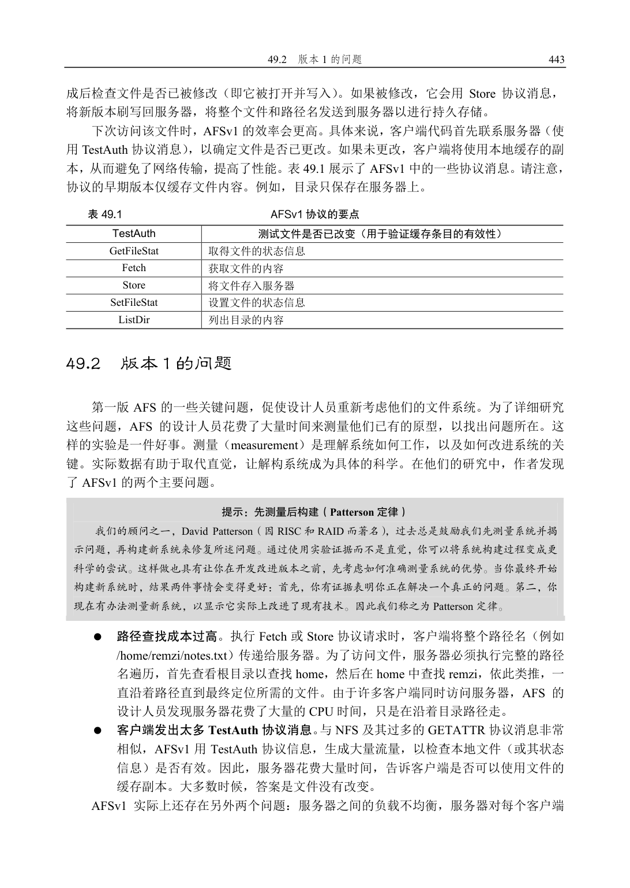
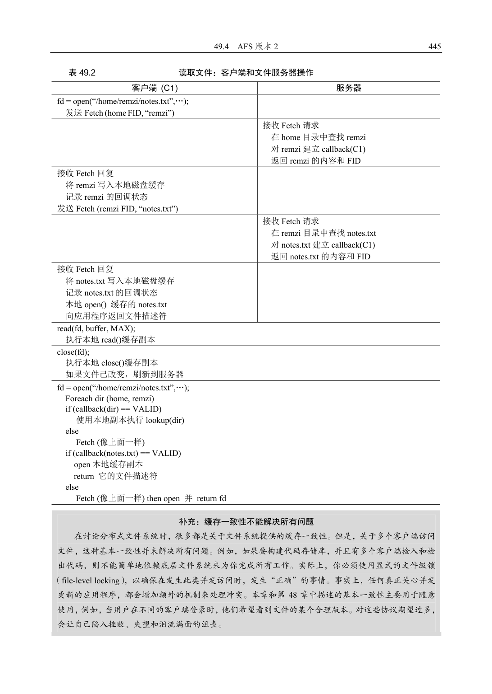
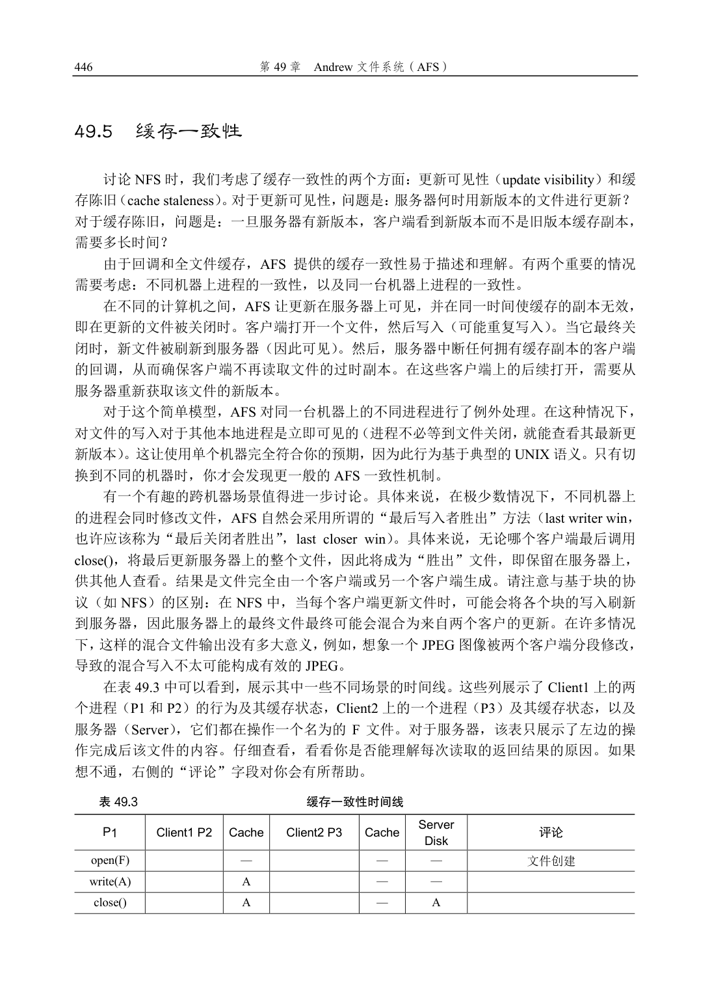
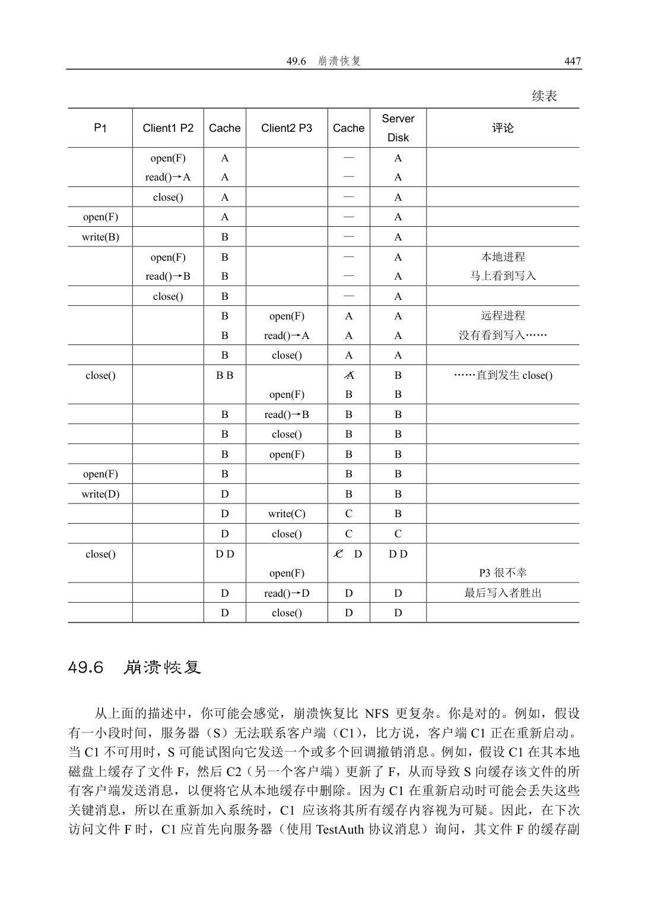
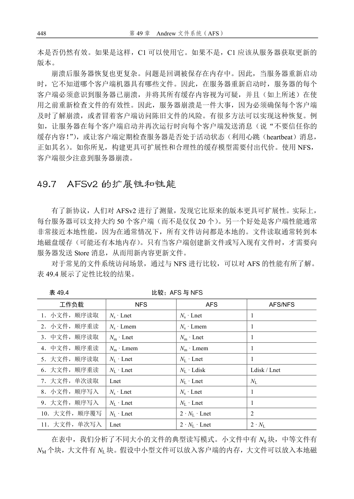

# 第49 章  Andrew 文件系统（AFS）

Andrew 文件系统由卡内基梅隆大学（CMU）的研究人员于20 世纪80 年代[H+88]引入。该项目由卡内基梅隆大学著名教授M. Satyanarayanan（简称为Satya）领导，主要目标很简单：扩展（scale）。具体来说，如何设计分布式文件系统（如服务器）可以支持尽可能多的客户端？

有趣的是，设计和实现的许多方面都会影响可扩展性。最重要的是客户端和服务器之间的协议（protocol）设计。例如，在NFS 中，协议强制客户端定期检查服务器，以确定缓存的内容是否已更改。因为每次检查都使用服务器资源（包括CPU 和网络带宽），所以频繁的检查会限制服务器响应的客户端数量，从而限制可扩展性。

AFS 与NFS 的不同之处也在于，从一开始，合理的、用户可见的行为就是首要考虑的问题。在NFS 中，缓存一致性很难描述，因为它直接依赖于低级实现细节，包括客户端缓存超时间隔。在AFS 中，缓存一致性很简单且易于理解：当文件打开时，客户端通常会从服务器接收最新的一致副本。

## 49.1  AFS 版本1

我们将讨论两个版本的AFS [H+88，S+85]。第一个版本（我们称之为AFSv1，但实际上原来的系统被称为ITC 分布式文件系统[S+85]）已经有了一些基本的设计，但没有像期望那样可扩展，这导致了重新设计和最终协议（我们称之为AFSv2，或就是AFS）[H+88]。现在讨论第一个版本。

所有AFS 版本的基本原则之一，是在访问文件的客户端计算机的本地磁盘（local disk）上，进行全文件缓存（whole-file caching）。当open()文件时，将从服务器获取整个文件（如果存在），并存储在本地磁盘上的文件中。后续应用程序read()和write()操作被重定向到存储文件的本地文件系统。因此，这些操作不需要网络通信，速度很快。最后，在close()时，文件（如果已被修改）被写回服务器。注意，与NFS 的明显不同，NFS 缓存块（不是整个文件，虽然NFS 当然可以缓存整个文件的每个块），并且缓存在客户端内存（不是本地磁盘）中。

让我们进一步了解细节。当客户端应用程序首次调用open()时，AFS 客户端代码（AFS设计者称之为Venus）将向服务器发送Fetch 协议消息。Fetch 协议消息会将所需文件的整个路径名（例如/home/remzi/notes.txt）传递给文件服务器（它们称为Vice 的组），然后将沿着路径名，查找所需的文件，并将整个文件发送回客户端。然后，客户端代码将文件缓存在客户端的本地磁盘上（将它写入本地磁盘）。如上所述，后续的read()和write()系统调用在AFS中是严格本地的（不与服务器进行通信）。它们只是重定向到文件的本地副本。因为read()和write()调用就像调用本地文件系统一样，一旦访问了一个块，它也可以缓存在客户端内存中。因此，AFS 还使用客户端内存来缓存它在本地磁盘中的块副本。最后，AFS 客户端完

使用一个不同的进程，从而导致上下文切换和其他开销。通过引入卷（volume），解决了负载不平衡问题。管理员可以跨服务器移动卷，以平衡负载。通过使用线程而不是进程构建服务器，在AFSv2 中解决了上下文切换问题。但是，限于篇幅，这里集中讨论上述主要的两个协议问题，这些问题限制了系统的扩展。

## 49.3  改进协议

上述两个问题限制了AFS 的可扩展性。服务器CPU 成为系统的瓶颈，每个服务器只能服务20 个客户端而不会过载。服务器收到太多的TestAuth 消息，当他们收到Fetch 或Store消息时，花费了太多时间查找目录层次结构。因此，AFS 设计师面临一个问题。

关键问题：如何设计一个可扩展的文件协议

如何重新设计协议，让服务器交互最少，即如何减少TestAuth 消息的数量？进一步，如何设计协议，

让这些服务器交互高效？通过解决这两个问题，新的协议将导致可扩展性更好的AFS 版本。

## 49.4  AFS 版本2

AFSv2 引入了回调（callback）的概念，以减少客户端/服务器交互的数量。回调就是服务器对客户端的承诺，当客户端缓存的文件被修改时，服务器将通知客户端。通过将此状态（state）添加到服务器，客户端不再需要联系服务器，以查明缓存的文件是否仍然有效。实际

上，它假定文件有效，直到服务器另有说明为止。这里类似于轮询（polling）与中断（interrupt）。

AFSv2 还引入了文件标识符（File Identifier，FID）的概念（类似于NFS 文件句柄），替代路径名，来指定客户端感兴趣的文件。AFS 中的FID 包括卷标识符、文件标识符和“全局唯一标识符”（用于在删除文件时复用卷和文件ID）。因此，不是将整个路径名发送到服务器，并让服务器沿着路径名来查找所需的文件，而是客户端会沿着路径名查找，每次一个，缓存结果，从而有望减少服务器上的负载。

例如，如果客户端访问文件/home/remzi/notes.txt，并且home 是挂载在/上的AFS 目录（即/是本地根目录，但home 及其子目录在AFS 中），则客户端将先获取home 的目录内容，

将它们放在本地磁盘缓存中，然后在home 上设置回调。然后，客户端将获取目录remzi，将其放入本地磁盘缓存，并在服务器上设置remzi 的回调。最后，客户端将获取notes.txt，将此常规文件缓存在本地磁盘中，设置回调，最后将文件描述符返回给调用应用程序。有关摘要，参见表49.2。

然而，与NFS 的关键区别在于，每次获取目录或文件时，AFS 客户端都会与服务器建立回调，从而确保服务器通知客户端，其缓存状态发生变化。好处是显而易见的：尽管第一次访问/home/remzi/notes.txt 会生成许多客户端—服务器消息（如上所述），但它也会为所有目录以及文件notes.txt 建立回调，因此后续访问完全是本地的，根本不需要服务器交互。因此，在客户端缓存文件的常见情况下，AFS 的行为几乎与基于本地磁盘的文件系统相同。如果多次访问一个文件，则第二次访问应该与本地访问文件一样快。

盘，但不能放入客户端内存。

为了便于分析，我们还假设，跨网络访问远程服务器上的文件块，需要的时间为Lnet。访问本地内存需要Lmem，访问本地磁盘需要Ldisk。一般假设是Lnet > Ldisk > Lmem。

最后，我们假设第一次访问文件没有任何缓存命中。如果相关高速缓存具有足够容量来保存文件，则假设后续文件访问（即“重新读取”）将在高速缓存中命中。

该表的列展示了特定操作（例如，小文件顺序读取）在NFS 或AFS 上的大致时间。最右侧的列展示了AFS 与NFS 的比值。

我们有以下观察结果。首先，在许多情况下，每个系统的性能大致相当。例如，首次读取文件时（即工作负载1、3、5），从远程服务器获取文件的时间占主要部分，并且两个系统上差不多。在这种情况下，你可能会认为AFS 会更慢，因为它必须将文件写入本地磁盘。但是，这些写入由本地（客户端）文件系统缓存来缓冲，因此上述成本可能不明显。同样，你可能认为从本地缓存副本读取AFS 会更慢，因为AFS 会将缓存副本存储在磁盘上。但是，AFS 再次受益于本地文件系统缓存。读取AFS 可能会命中客户端内存缓存，性能与NFS 类似。

其次，在大文件顺序重新读取时（工作负载6），出现了有趣的差异。由于AFS 具有大型本地磁盘缓存，因此当再次访问该文件时，它将从磁盘缓存中访问该文件。相反，NFS只能在客户端内存中缓存块。结果，如果重新读取大文件（即比本地内存大的文件），则NFS客户端将不得不从远程服务器重新获取整个文件。因此，假设远程访问确实比本地磁盘慢，AFS 在这种情况下比NFS 快一倍。我们还注意到，在这种情况下，NFS 会增加服务器负载，这也会对扩展产生影响。

第三，我们注意到，（新文件的）顺序写入应该在两个系统上性能差不多（工作负载8、9）。在这种情况下，AFS 会将文件写入本地缓存副本。当文件关闭时，AFS 客户端将根据协议强制写入服务器。NFS 将缓冲写入客户端内存，可能由于客户端内存压力，会强制将某些块写入服务器，但在文件关闭时肯定会将它们写入服务器，以保持NFS 的关闭时刷新的一致性。你可能认为AFS 在这里会变慢，因为它会将所有数据写入本地磁盘。但是，要意识到它正在写入本地文件系统。这些写入首先提交到页面缓存，并且只是稍后（在后台）提交到磁盘，因此AFS 利用了客户端操作系统内存缓存基础结构的优势，提高了性能。

第四，我们注意到AFS 在顺序文件覆盖（工作负载10）上表现较差。之前，我们假设写入的工作负载也会创建一个新文件。在这种情况下，文件已存在，然后被覆盖。对于AFS来说，覆盖可能是一个特别糟糕的情况，因为客户端先完整地提取旧文件，只是为了后来覆盖它。相反，NFS 只会覆盖块，从而避免了初始的（无用）读取

①。 最后，访问大型文件中的一小部分数据的工作负载，在NFS 上比AFS 执行得更好（工作负载7、11）。在这些情况下，AFS 协议在文件打开时获取整个文件。遗憾的是，只进行了一次小的读写操作。更糟糕的是，如果文件被修改，整个文件将被写回服务器，从而使性能影响加倍。NFS 作为基于块的协议，执行的I/O 与读取或写入的大小成比例。

总的来说，我们看到NFS 和AFS 做出了不同的假设，并且因此实现了不同的性能结果，这不意外。这些差异是否重要，总是要看工作负载。

① 我们假设NFS 读取是按照块大小和块对齐的。如果不是，NFS 客户端也必须先读取该块。我们还假设文件未使用O_TRUNC

标志打开。如果是，AFS 中的初始打开也不会获取即将被截断的文件内容。

## 49.8  AFS：其他改进

就像我们在介绍Berkeley FFS（添加了符号链接和许多其他功能）时看到的那样，AFS的设计人员在构建系统时借此机会添加了许多功能，使系统更易于使用和管理。例如，AFS为客户端提供了真正的全局命名空间，从而确保所有文件在所有客户端计算机上以相同的方式命名。相比之下，NFS 允许每个客户端以它们喜欢的任何方式挂载NFS 服务器，因此只有通过公约（以及大量的管理工作），才能让文件在不同客户端上有相似的名字。

补充：工作负载的重要性

评估任何系统都有一个挑战：选择工作负载（workload）。由于计算机系统以多种不同的方式使用，

因此有多种工作负载可供选择。存储系统设计人员应该如何确定哪些工作负载很重要，以便做出合理的

设计决策？

鉴于他们在测量文件系统使用方式方面的经验，AFS 的设计者做出了某些工作负载假设。具体来说，

他们认为大多数文件不会经常共享，而是按顺序完整地访问。鉴于这些假设，AFS 设计非常有意义。

但是，这些假设并非总是正确。例如，想象一个应用程序，它定期将信息追加到日志中。这些小的

日志写入会将少量数据添加到现有的大型文件中，这对AFS 来说是个问题。还存在许多其他困难的工

作负载，例如，事务数据库中的随机更新。

要了解什么类型的工作负载常见，一种方法是通过人们已经进行的各种研究。请参考这些研究

[B+91，H+11，R+00，V99]，看看工作量分析得好例子，包括AFS 的回顾[H+88]。

AFS 也认真对待安全性，采用了一些机制来验证用户，确保如果用户需要，可以让一组文件保持私密。相比之下，NFS 在多年里对安全性的支持非常原始。

AFS 还包含了灵活的、用户管理的访问控制功能。因此，在使用AFS 时，用户可以很好地控制谁可以访问哪些文件。与大多数UNIX 文件系统一样，NFS 对此类共享的支持要少得多。

最后，如前所述，AFS 添加了一些工具，让系统管理员可以更简单地管理服务器。在考虑系统管理方面，AFS 遥遥领先。

## 49.9  小结

AFS 告诉我们，构建分布式文件系统与我们在NFS 中看到的完全不同。AFS 的协议设计特别重要。通过让服务器交互最少（通过全文件缓存和回调），每个服务器可以支持许多客户端，从而减少管理特定站点所需的服务器数量。许多其他功能，包括单一命名空间、安全性和访问控制列表，让AFS 非常好用。AFS 提供的一致性模型易于理解和推断，不会导致偶尔在NFS 中看到的奇怪行为。

也许很不幸，AFS 可能在走下坡路。由于NFS 是一个开放标准，许多不同的供应商都

支持它，它与CIFS（基于Windows 的分布式文件系统协议）一起，在市场上占据了主导地位。虽然人们仍不时看到AFS 安装（例如在各种教育机构，包括威斯康星大学），但唯一持久的影响可能来自AFS 的想法，而不是实际的系统本身。实际上，NFSv4 现在添加了服务器状态（例如，“open”协议消息），因此与基本AFS 协议越来越像。

## 参考资料

[B+91]“Measurements of a Distributed File System”

Mary Baker, John Hartman, Martin Kupfer, Ken Shirriff, John Ousterhout SOSP ’91, Pacific Grove, California,

October 1991

早期的论文，测量人们如何使用分布式文件系统，符合AFS 中的大部分直觉。

[H+11]“A File is Not a File: Understanding the I/O Behavior of Apple Desktop Applications”Tyler Harter, Chris

Dragga, Michael Vaughn,

Andrea C. Arpaci-Dusseau, Remzi H. Arpaci-Dusseau

SOSP ’11, New York, New York, October 2011

我们自己的论文，研究Apple Desktop 工作负载的行为。事实证明，它们与系统研究社区通常关注的许多基

于服务器的工作负载略有不同。本文也是一篇优秀的参考文献，指出了很多相关的工作。

[H+88]“Scale and Performance in a Distributed File System”

John H. Howard, Michael L. Kazar, Sherri G. Menees, David A. Nichols, M. Satyanarayanan, Robert N.

Sidebotham, Michael J. West

ACM Transactions on Computing Systems (ACM TOCS), page 51-81, Volume 6, Number 1, February 1988

著名的AFS 系统的期刊长版本，该系统仍然在全世界的许多地方使用，也可能是关于如何构建分布式文件

系统的最早的清晰思考。它是测量科学和原理工程的完美结合。

[R+00]“A Comparison of File System Workloads”Drew Roselli, Jacob R. Lorch, Thomas E. Anderson

USENIX ’00, San Diego, California, June 2000

与Baker 的论文[B+91]相比，有最近的一些记录。

[S+85]“The ITC Distributed File System: Principles and Design”

M．Satyanarayanan, J.H. Howard, D.A. Nichols, R.N. Sidebotham, A. Spector, M.J. West SOSP ’85, Orcas Island,

Washington, December 1985

关于分布式文件系统的较早的文章。AFS 的许多基本设计都在这个较早的系统中实现，但没有对扩展进行

改进。

[V99]“File system usage in Windows NT 4.0”Werner Vogels

SOSP '99, Kiawah Island Resort, South Carolina, December 1999

对Windows 工作负载的一项很酷的研究，与之前已经完成的许多基于UNIX 的研究相比，它在本质上是不

同的。

## 作业

本节引入了afs.py，这是一个简单的AFS 模拟器，可用于增强你对Andrew 文件系统工作原理的理解。阅读README 文件，以获取更多详细信息。

## 问题

1．运行一些简单的场景，以确保你可以预测客户端将读取哪些值。改变随机种子标志（-s），看看是否可以追踪并预测存储在文件中的中间值和最终值。还可以改变文件数（-f），

客户端数（-C）和读取比率（-r，介于0 到1 之间），这样更有挑战。你可能还想生成稍长的追踪，记录更有趣的交互，例如（-n 2 或更高）。

2．现在执行相同的操作，看看是否可以预测AFS 服务器发起的每个回调。尝试使用不同的随机种子，并确保使用高级别的详细反馈（例如，-d 3），来查看当你让程序计算答案时（使用-c），何时发生回调。你能准确猜出每次回调发生的时间吗？发生一次回调的确切条件是什么？

3．与上面类似，运行一些不同的随机种子，看看你是否可以预测每一步的确切缓存状态。用-c 和-d 7 运行，可以观察到缓存状态。

4．现在让我们构建一些特定的工作负载。用-A oa1:w1:c1,oa1:r1:c1 标志运行该模拟程序。在用随机调度程序运行时，客户端1 在读取文件a 时，观察到的不同可能值是什么（尝试不同的随机种子，看看不同的结果）？在两个客户端操作的所有可能的调度重叠中，有多少导致客户端1 读取值1，有多少读取值0？

5．现在让我们构建一些具体的调度。当使用-A oa1:w1:c1,oa1:r1:c1 标志运行时，也用以下调度方案来运行：-S 01, -S 100011, -S 011100，以及其他你可以想到的调度方案。客户端1 读到什么值？

6．现在使用此工作负载来运行：-A oa1:w1:c1,oa1:w1:c1，并按上述方式更改调度方式。用-S 011100 运行时会发生什么？用-S 010011 时怎么样？确定文件的最终值有什么重要意义？