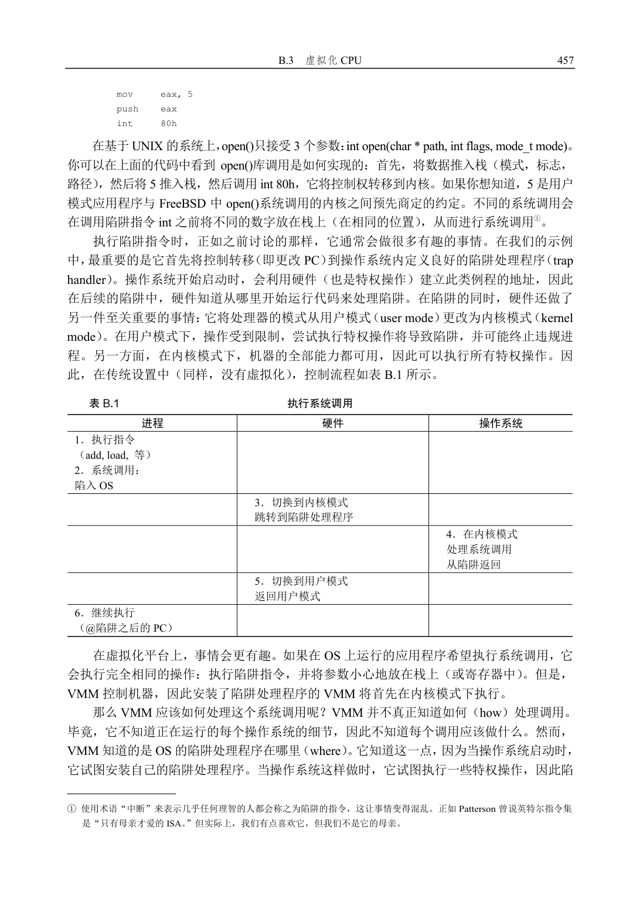
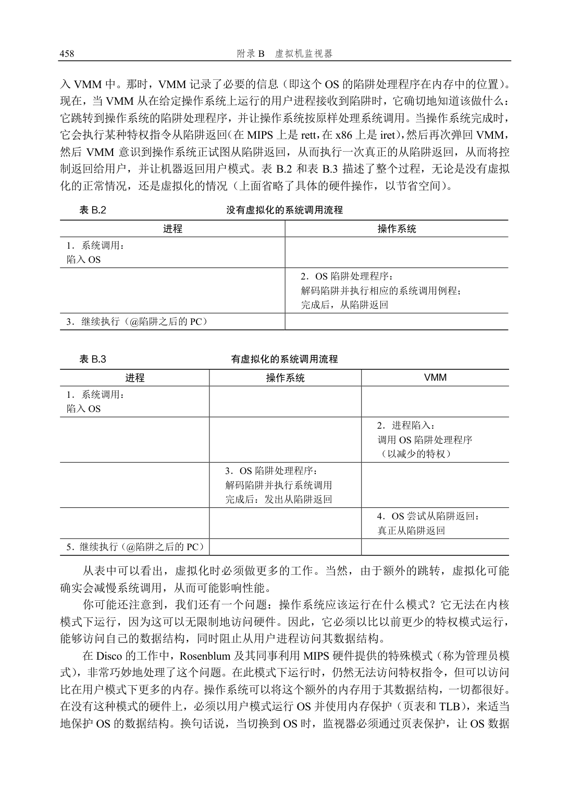
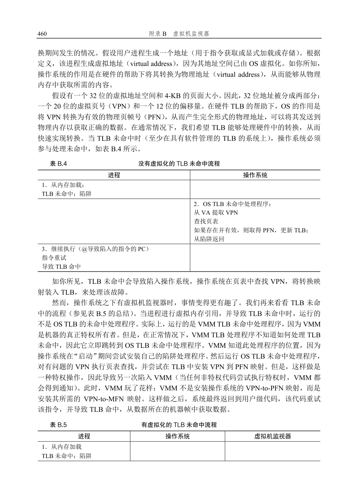
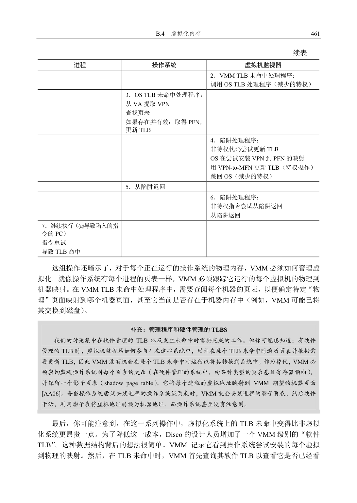

# 附录B  虚拟机监视器

## B.1  简介

多年前，IBM 将昂贵的大型机出售给大型组织，出现了一个问题：如果组织希望同时在机器上运行不同的操作系统，该怎么办？有些应用程序是在一个操作系统上开发的，有些是在其他操作系统上开发的，因此出现了该问题。作为一种解决方案，IBM 以虚拟机监视器（Virtual Machine Monitor，VMM）（也称为管理程序，hypervisor）[G74]的形式，引入了另一个间接层。

具体来说，监视器位于一个或多个操作系统和硬件之间，并为每个运行的操作系统提供控制机器的假象。然而，在幕后，实际上是监视器在控制硬件，并必须在机器的物理资源上为运行的OS 提供多路复用。实际上，VMM 作为操作系统的操作系统，但在低得多层次上。操作系统仍然认为它与物理硬件交互。因此，透明度（transparency）是VMM 的主要目标。

因此，我们发现自己处于一个有趣的位置：到目前为止操作系统已经成为假象提供大师，欺骗毫无怀疑的应用程序，让它们认为拥有自己私有的CPU 和大型虚拟内存，同时在应用程序之间进行切换，并共享内存。现在，我们必须再次这样做，但这次是在操作系统之下，它曾经拥有控制权。VMM 如何为每个运行在其上的操作系统创建这种假象？

关键问题：如何在操作系统之下虚拟化机器

虚拟机监视器必须透明地虚拟化操作系统下的机器。这样做需要什么技术？

## B.2  动机：为何用VMM

今天，由于多种原因，VMM 再次流行起来。服务器合并就是一个原因。在许多设置中，人们在运行不同操作系统（甚至OS 版本）的不同机器上运行服务，但每台机器的利用率都不高。在这种情况下，虚拟化使管理员能够将多个操作系统合并（consolidate）到更少的硬件平台上，从而降低成本并简化管理。

虚拟化在桌面上也变得流行，因为许多用户希望运行一个操作系统（比如Linux 或macOS X），但仍然可以访问不同平台上的本机应用程序（比如Windows）。这种功能（functionality）上的改进也是一个很好的理由。

另一个原因是测试和调试。当开发者在一个主平台上编写代码时，他们通常希望在许多不同平台上进行调试和测试。在实际环境中，他们要将软件部署到这些平台上。因此，通过让开发人员能够在一台计算机上运行多种操作系统类型和版本，虚拟化可以轻松实现这一点。

虚拟化的复兴始于20 世纪90 年代中后期，由Mendel Rosenblum 教授领导的斯坦福大学的一组研究人员推动。他的团队在用于MIPS 处理器的虚拟机监视器Disco [B+97]上的工作是早期的努力，它使VMM 重新焕发活力，并最终使该团队成为VMware [V98]的创始人，该公司现在是虚拟化技术的市场领导者。在本章中，我们将讨论Disco 的主要技术，并尝试通过该窗口来了解虚拟化的工作原理。

## B.3  虚拟化CPU

为了在虚拟机监视器上运行虚拟机（virtual machine，即OS 及其应用程序），使用的基本技术是受限直接执行（limited direct execution），这是我们在讨论操作系统如何虚拟化CPU时看到的技术。因此，如果想在VMM 之上“启动”新操作系统，只需跳转到第一条指令的地址，并让操作系统开始运行，就这么简单。

假设我们在单个处理器上运行，并且希望在两个虚拟机之间进行多路复用，即在两个操作系统和它们各自的应用程序之间进行多路复用。非常类似于操作系统在运行进程之间切换的方式（上下文切换，context switch），虚拟机监视器必须在运行的虚拟机之间执行机器切换（machine switch）。因此，当执行这样的切换时，VMM 必须保存一个OS 的整个机器状态（包括寄存器，PC，并且与上下文切换不同，包括所有特权硬件状态），恢复待运行虚拟机的机器状态，然后跳转到待运行虚拟机的PC，完成切换。注意，待运行VM 的PC可能在OS 本身内（系统正在执行系统调用），或可能就在该OS 上运行的进程内（用户模式应用程序）。

当正在运行的应用程序或操作系统尝试执行某种特权操作（privileged operation）时，我们会遇到一些稍微棘手的问题。例如，在具有软件管理的TLB 的系统上，操作系统将使用特殊的特权指令，用一个地址转换来更新TLB，再重新执行遇到TLB 未命中的指令。在虚拟化环境中，不允许操作系统执行特权指令，因为它控制机器而不是其下的VMM。因此，VMM 必须以某种方式拦截执行特权操作的尝试，从而保持对机器的控制。

如果在给定OS 上的运行进程尝试进行系统调用，会出现VMM 必须如何介入某些操作的简单场景。例如，进程可能尝试对一个文件调用open()，或者可能调用read()，从中获取数据，或者可能正在调用fork()来创建新进程。在没有虚拟化的系统中，通过特殊指令实现系统调用。在MIPS 上，它是一个陷阱（trap）指令。在x86 上，它是带有参数0x80 的int（中断）指令。下面是FreeBSD 上的open 库调用[B00]（回想一下，你的C 代码首先对C 库

进行库调用，然后执行正确的汇编序列，实际发出陷阱指令并进行系统调用）：

open:

push    dword mode

push    dword flags

push    dword path

结构的内存对OS 可用。当切换回正在运行的应用程序时，必须删除读取和写入内核的能力。

## B.4  虚拟化内存

你现在应该对处理器的虚拟化方式有了基本的了解：VMM 就像一个操作系统，安排不同的虚拟机运行。当特权级别发生变化时，会发生一些有趣的交互。但我们忽略了很大一部分：VMM 如何虚拟化内存？

每个操作系统通常将物理内存视为一个线性的页面数组，并将每个页面分配给自己或用户进程。当然，操作系统本身已经为其运行的进程虚拟化了内存，因此每个进程都有自己的私有地址空间的假象。现在我们必须添加另一层虚拟化，以便多个操作系统可以共享机器的实际物理内存，我们必须透明地这样做。

这个额外的虚拟化层使“物理”内存成为一个虚拟化层，在VMM 所谓的机器内存（machine memory）之上，机器内存是系统的真实物理内存。因此，我们现在有一个额外

的间接层：每个操作系统通过其每个进程的页表映射虚拟到物理地址，VMM 通过它的每个OS 页面表，将生成的物理地址映射到底层机器地址。图B.1 描述了这种额外的间接层。

图B.1  VMM 内存虚拟化

在该图中，只有一个虚拟地址空间，包含4 个页面，其中3 个是有效的（0、2 和3）。操作系统使用其页面表将这些页面映射到3 个底层物理帧（分别为10、3 和8）。在OS 之下，VMM 提供进一步的间接级别，将PFN 3、8 和10 分别映射到机器帧6、10 和5。当然，这张图简化了一些事情。在真实系统上，会运行V 个操作系统（V 可能大于1），因有此V个VMM 页表。此外，在每个运行的操作系统OSi 之上，将有许多进程Pi 运行（Pi 可能是数十或数百），因此OSi 内有Pi 个（每进程）页表。

为了理解它如何更好地工作，让我们回想一下地址转换（address translation）在现代分页系统中的工作原理。具体来说，让我们讨论在具有软件管理的TLB 的系统上，在地址转

到此虚拟到物理映射，以及VMM 所需的虚拟到机器的映射应该是什么。如果VMM 在其软件TLB 中找到转换，就将虚拟到机器的映射直接装入硬件TLB 中，因此跳过了上面控制流中的所有来回[B+97]。

## B.5  信息沟

操作系统不太了解应用程序的真正需求，因此通常必须制定通用的策略，希望对所有程序都有效。类似地，VMM 通常不太了解操作系统正在做什么或想要什么，这种知识缺乏有时被称为VMM 和OS 之间的信息沟（information gap），可能导致各种低效率[B+97]。例如，当OS 没有其他任何东西可以运行时，它有时会进入空循环（idle loop），只是自旋并等待下一个中断发生：

while (1)

; // the idle loop  如果操作系统负责整个机器，因此知道没有其他任务需要运行，这样旋转是有意义的。但是，如果VMM 在两个不同的操作系统下运行，一个在空循环中，另一个在运行有用的用户进程，那么VMM 知道一个操作系统处于空闲状态会很有用，这样可以为做有用工作的操作系统提供更多的CPU 时间。

补充：半虚拟化

在许多情况下，最好是假定，无法为了更好地使用虚拟机监视器而修改操作系统（例如，因为你在

不友好的竞争对手的操作系统下运行VMM）。但是，情况并非总是如此。如果可以修改操作系统（正如

我们在页面按需置零的示例中所见），它可能在VMM 上更高效地运行。运行修改后的操作系统，以便

在VMM 上运行，这通常称为半虚拟化（para-virtualization）[WSG02]，因为VMM 提供的虚拟化不是

完整的虚拟化，而是需要操作系统更改才能有效运行的部分虚拟化。研究表明，一个设计合理的半虚拟

化系统，只需要正确的操作系统更改，就可以接近没有VMM 时的效率[BD+03]。

另一个例子是页面按需置零。大多数操作系统在将物理帧映射到进程的地址空间之前将其置零。这样做的原因很简单：安全性。如果操作系统为一个进程提供了另一个已经使用的页面，但没有将其置零，则可能会发生跨进程的信息泄露，从而可能泄露敏感信息。遗憾的是，出于同样的原因，VMM 必须将它提供给每个操作系统的页面置零，因此很多时候页面将置零两次，一次由VMM 分配给操作系统，一次由操作系统分配给操作系统的一个进程。Disco 的作者没有很好地解决这个问题的方法：他们只是简单地将操作系统（IRIX）改为不对页面置零，因为知道已被底层VMM [B+97]置零。

类似这样的问题，这里描述的还有很多。一种解决方案是VMM 使用推理（一种隐含信息，implicit information）来克服该问题。例如，VMM 可以通过注意到OS 切换到低功率模式来检测空闲循环。在半虚拟化（para-virtualized）系统中，还有另一种方法，需要更改操作系统。这种更明确的方法虽然难以实施，但却非常有效。

## B.6  小结

虚拟化正在复兴。出于多种原因，用户和管理员希望同时在同一台计算机上运行多个操作系统。关键是VMM 通常透明地（transparently）提供服务，上面的操作系统完全不知道它实际上并没有控制机器的硬件。VMM 使用的关键方法是扩展受限直接执行的概念。通过设置硬件，让VMM 能够介入关键事件（例如陷阱），VMM 可以完全控制机器资源的分配方式，同时保留操作系统所需的假象。

提示：使用隐含信息

隐含信息可以成为分层系统中的一个强大工具，在这种系统中很难改变系统之间的接口，但需要更

多关于系统不同层的信息。例如，基于块的磁盘设备，可能想了解更多关于它上面的文件系统如何使用

它的信息。同样，应用程序可能想知道文件系统页面缓存中当前有哪些页面，但操作系统不提供访问此

信息的API。在这两种情况下，研究人员都开发了强大的推理技术，来隐式收集所需的信息，而无需在

层[AD+01，S+03]之间建立明确的接口。这些技术在虚拟机监视器中非常有用，它希望了解有关在其上

运行的OS 的更多信息，而无需在两个层之间使用显式API。

你可能已经注意到，操作系统为进程执行的操作与VMM 为操作系统执行的操作之间存在一些相似之处。它们毕竟都是虚拟化硬件，因此做了一些相同的事情。但是，有一个关键的区别：通过操作系统虚拟化，提供了许多新的抽象和漂亮的接口。使用VMM 级虚拟化，抽象与硬件相同（因此不是很好）。虽然OS 和VMM 都虚拟化硬件，但它们通过提供完全不同的接口来实现。与操作系统不同，VMM 没有特别打算让硬件更易于使用。

如果你想了解有关虚拟化的更多信息，还有许多其他主题需要研究。例如，我们甚至没有讨论I/O 会发生什么，这个主题在虚拟化平台方面有一些有趣的新问题。我们也没有讨论操作系统“作为兼职”运行在有时称为“托管”配置中，虚拟化如何工作。如果你感兴趣，请阅读有关这两个主题的更多信息[SVL01]。我们也没有讨论，如果VMM 上运行的一些操作系统占用太多内存，会发生什么。

最后，硬件支持改变了平台支持虚拟化的方式。英特尔和AMD 等公司现在直接支持额外的虚拟化层，从而避免了本章中的许多软件技术。也许，在尚未撰写的一章中，我们会更详细地讨论这些机制。

## 参考资料

[AA06]“A Comparison of Software and Hardware Techniques for x86 Virtualization”

Keith Adams and Ole Agesen

ASPLOS ’06, San Jose, California

来自两位VMware 工程师的一篇优秀的论文，讲述了为虚拟化提供硬件支持所带来的惊人的小优势。此外，

还有关于VMware 虚拟化的一般性讨论，包括为了虚拟化难以虚拟化的x86 平台，而必须采用的疯狂的二

进制翻译技巧。

[AD+01] “ Information and Control in Gray-box Systems ” Andrea C. Arpaci-Dusseau and Remzi H.

Arpaci-Dusseau SOSP ’01, Banff, Canada

我们自己的工作是如何推断信息，甚至从应用程序级别对操作系统施加控制，而不对操作系统进行任何更

改。其中最好的例子：使用基于概率探测器的技术确定在OS 中缓存哪些文件块。这样做可以让应用程序

更好地利用缓存，优先安排会导致命中的工作。

[B00]“FreeBSD Developers’ Handbook:

Chapter 11 x86 Assembly Language Programming”

一本BSD 开发者手册中关于系统调用的很好的教程。

[BD+03]“Xen and the Art of Virtualization”

Paul Barham, Boris Dragovic, Keir Fraser, Steven Hand, Tim Harris, Alex Ho, Rolf Neuge- bauer, Ian Pratt,

Andrew Warfield

SOSP ’03, Bolton Landing, New York

该论文表明，对于半虚拟化系统，虚拟化系统的开销可以低得令人难以置信。这篇关于Xen 虚拟机监视器

的论文如此成功，导致了一家公司的诞生。

[B+97]“Disco: Running Commodity Operating Systems on Scalable Multiprocessors”

Edouard Bugnion, Scott Devine, Kinshuk Govil, Mendel Rosenblum

SOSP ’97

将系统社区重新带回虚拟机研究的论文。好吧，也许这是不公平的，因为Bressoud 和Schneider [BS95]也

做了，但在这里我们开始理解为什么虚拟化会回来。然而更令人瞩目的是，这群优秀的研究人员创立了

VMware，赚取了数十亿美元。

[BS95]“Hypervisor-based Fault-tolerance”Thomas C. Bressoud, Fred B. Schneider SOSP ’95

最早引入虚拟机管理程序（hypervisor，这只是虚拟机监视器的另一个术语）的论文之一。然而，在这项工

作中，这些管理程序用于提高硬件故障的系统容忍度，这可能不如本章讨论的一些更实际的场景有用。但

它本身仍然是一篇非常有趣的论文。

[G74]“Survey of Virtual Machine Research”

R.P. Goldberg

IEEE Computer, Volume 7, Number 6

一份对许多老的虚拟机研究的调查。

[SVL01]“Virtualizing I/O Devices on VMware Workstation’s Hosted Virtual Machine Monitor”

Jeremy Sugerman, Ganesh Venkitachalam and Beng-Hong Lim

USENIX ’01, Boston, Massachusetts

本文很好地概述了在使用托管体系结构的VMware 中I/O 的工作方式。该体系结构利用了许多操作系统自

身的功能，避免了在VMM 中重新实现它们。

[V98] VMware corporation.

这可能是本书中最无价值的参考资料，因为你可以自己阅读一下。但无论如何，该公司成立于1998 年，是

虚拟化领域的领导者。

[S+03]“Semantically-Smart Disk Systems”

Muthian Sivathanu, Vijayan Prabhakaran, Florentina I. Popovici, Timothy E. Denehy, Andrea

C. Arpaci-Dusseau, Remzi H. Arpaci-Dusseau FAST ’03, San Francisco, California, March 2003

又是我们的工作，这次展示了一个基于块的设备如何能够推断出它上面的文件系统正在做什么，例如删除

文件。其中使用的技术在块设备内实现了有趣的新功能，例如安全删除或更可靠的存储。

[WSG02]“Scale and Performance in the Denali Isolation Kernel”Andrew Whitaker, Marianne Shaw, and Steven D.

Gribble

OSDI ’02, Boston, Massachusetts

介绍术语半虚拟化的论文。虽然人们可以争辩说Bugnion 等人[B+97]在Disco 论文中介绍了半虚拟化的概

念，但Whitaker 等人进一步说明，这个想法的通用性如何超出以前的想象。